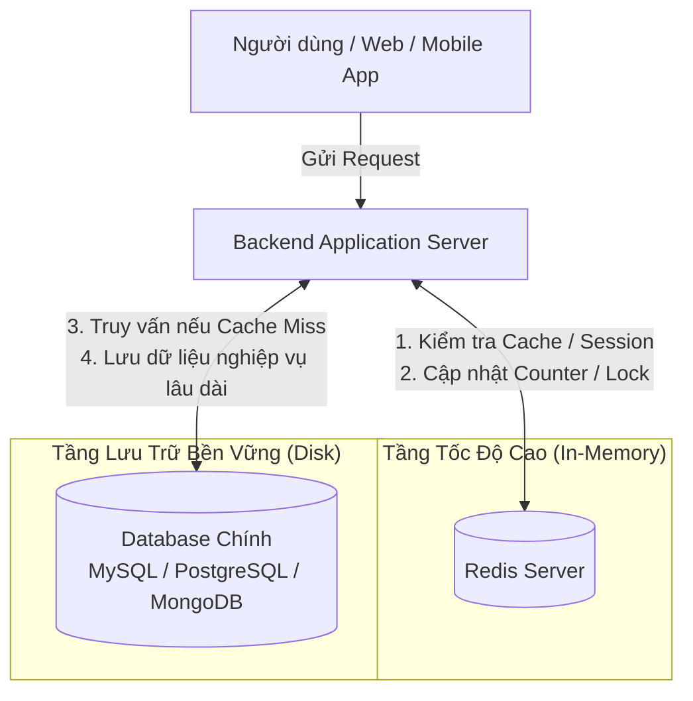

# 1. Overview Redis

Redis (viết tắt của Remote Dictionary Server) được định nghĩa là một "Kho lưu trữ cấu trúc dữ liệu trên bộ nhớ chính (In-memory Data Structure Store), mã nguồn mở, có thể được sử dụng như một Cơ sở dữ liệu (Database), Bộ nhớ đệm (Cache) và Trạm trung chuyển tin nhắn (Message Broker)."

## 1.1. Ngoài RAM thì còn thứ khác — Cơ chế ghi xuống ổ cứng (Persistence)

Đây là điểm khác biệt sống còn của Redis so với các hệ thống cache cũ (như Memcached). RAM có một điểm yếu chí mạng: mất điện là mất hết dữ liệu.

Nếu Redis chỉ dùng RAM, nó sẽ không bao giờ được tin tưởng để làm một Database thực thụ. Để giải quyết việc này, Redis sử dụng thêm ổ cứng (Disk) qua 2 cơ chế:

##### RDB (Redis Database)

Cứ sau một khoảng thời gian (ví dụ 5 phút, 15 phút), Redis sẽ "chụp ảnh" (snapshot) toàn bộ dữ liệu đang có trên RAM và lưu thành một file trên ổ cứng.

##### AOF (Append Only File)

Mỗi khi có một lệnh ghi/sửa/xóa dữ liệu, Redis sẽ ghi log lệnh đó vào một file text trên ổ cứng.

Nhờ có ổ cứng "chống lưng", khi server bị sập hoặc khởi động lại, Redis sẽ tự động đọc dữ liệu từ ổ cứng, load ngược trở lại RAM, giúp hệ thống không bị mất mát thông tin.

## 1.2. Đâu chỉ làm mỗi việc tăng tốc độ truy vấn — Cấu trúc dữ liệu và Ứng dụng

Nếu chỉ để tăng tốc truy vấn, hệ thống chỉ cần lưu dữ liệu dạng Key: Value đơn giản (kiểu như User_1: "Nguyễn Văn A"). Nhưng chữ "Data Structure" (Cấu trúc dữ liệu) trong định nghĩa của Redis mới là thứ ăn tiền.

Nó cung cấp sẵn các cấu trúc phức tạp để giải quyết các bài toán hệ thống rất cụ thể:

- **Lists (Danh sách)**: Có thể đẩy và lấy dữ liệu ở cả hai đầu (đầu hoặc cuối hàng). Rất hay dùng để làm Message Queue (hàng đợi tin nhắn) như: xử lý gửi email hàng loạt, xử lý đơn hàng theo thứ tự ai mua trước phục vụ trước (FIFO).
- **Sorted Sets (Tập hợp sắp xếp - ZSet)**: Mỗi phần tử đi kèm một điểm số (score), Redis tự động duy trì thứ tự cực nhanh. Chuyên dùng để làm Bảng xếp hạng (Leaderboard) trong game hoặc top trending bài viết với hàng triệu user cập nhật liên tục.
- **Pub/Sub (Publish/Subscribe)**: Không dùng để lưu trữ lâu dài, mà dùng để truyền tin thời gian thực (Real-time Messaging). Ứng dụng điển hình là ứng dụng chat, thông báo realtime (khi tài xế nhận cuốc, app điện thoại của khách hàng nảy thông báo tức thì).
- **Sets (Tập hợp không trùng lặp)**: Dùng để tìm kiếm các tập hợp và phép toán giao/hợp, ví dụ như tính năng "Bạn chung" (Mutual Friends) trên mạng xã hội.
- **Hashes**: Lưu trữ dữ liệu dạng đối tượng (key-value lồng nhau), cực kỳ phù hợp để lưu thông tin Profile người dùng hoặc Giỏ hàng (Cart) mà không cần serialize thành JSON chuỗi.

---

## 2. Redis làm việc ở đâu trong kiến trúc hệ thống?

Redis không sinh ra để **thay thế** cơ sở dữ liệu chính (như MySQL, PostgreSQL hay MongoDB), mà sinh ra để **đứng cạnh và bọc lót** cho chúng. 

Trong một hệ thống chuẩn, Redis thường đóng 4 vai trò tại các vị trí sau:

### 4 Vị trí làm việc kinh điển của Redis:
1. **Lớp đệm trung gian (Cache Layer):**
   * Đứng ngay giữa Backend và Database chính.
   * Khi người dùng xem thông tin sản phẩm, Backend hỏi Redis trước. Nếu có (Cache Hit), trả về ngay lập tức (dưới 1 mili-giây). Nếu chưa có (Cache Miss), Backend mới xuống Database chính lấy lên rồi ghi ngược lại vào Redis để phục vụ người tiếp theo.
2. **Kho lưu trữ phiên đăng nhập (Session Store / Token Blacklist):**
   * Thay vì lưu session vào bộ nhớ của từng server (gây lỗi khi chạy nhiều server load balancing), session được gom vào một cụm Redis tập trung. Người dùng gọi đến bất kỳ server nào cũng kiểm tra được đăng nhập.
3. **Trạm trung chuyển & Xử lý hàng đợi (Message Broker / Task Queue):**
   * Đóng vai trò là ống dẫn tin nhắn giữa các dịch vụ (Microservices) hoặc đưa các tác vụ nặng (như gửi email, resize ảnh, tính toán báo cáo) vào hàng đợi để Worker xử lý ngầm dưới nền.
4. **Bộ đếm thời gian thực & Khóa phân tán (Rate Limiter & Distributed Lock):**
   * Đếm số request để chặn người dùng spam API (Rate Limiting).
   * Khóa tài nguyên dùng chung trong môi trường phân tán (Distributed Lock) để đảm bảo tại một thời điểm chỉ có 1 tiến trình được phép trừ tồn kho hay trừ tiền ví.

---

## 3. Tại sao Redis lại nhanh "bàn thờ" đến vậy? (How it works)

Redis có thể dễ dàng đạt được hàng chục nghìn đến hàng trăm nghìn lượt đọc/ghi mỗi giây (Operations Per Second - OPS) với độ trễ chỉ tính bằng phần nhỏ của mili-giây (sub-millisecond). Tốc độ thần thánh này đến từ **3 nguyên nhân kiến trúc cốt lõi**:

### 3.1. Toàn bộ dữ liệu nằm trên RAM (In-Memory)
* **Ổ cứng (HDD/SSD):** Dù là SSD xịn (NVMe), việc đọc ghi vẫn chịu giới hạn cơ học hoặc giao tiếp bus, tốc độ truy cập đo bằng **Microseconds ($\mu s$)** hoặc **Milliseconds ($ms$)**.
* **RAM:** Truy xuất trực tiếp qua bus bộ nhớ với tốc độ đo bằng **Nanoseconds ($ns$)** (nhanh hơn từ 100 đến 1.000 lần so với đọc ghi ổ cứng).

### 3.2. Mô hình Đơn luồng kết hợp I/O Multiplexing (Single-Threaded Event Loop)
Nhiều người nghĩ rằng: *"Hệ thống phải đa luồng (Multi-threading) thì mới xử lý nhanh chứ?"*. Nhưng với bài toán của Redis, đơn luồng lại là vũ khí tối thượng:

* **Không có chi phí Context Switch:** CPU không cần phải liên tục nhảy qua nhảy lại giữa hàng nghìn luồng, tiết kiệm hàng triệu chu kỳ CPU.
* **Không bao giờ bị tranh chấp tài nguyên (No Locks / Race Conditions):** Bạn không bao giờ phải lo lắng về việc 2 luồng cùng tranh nhau sửa một biến (không cần dùng Mutex, Semaphore hay Read/Write Lock). Mọi lệnh trong Redis được thực thi tuần tự từng lệnh một, đảm bảo tính nguyên tử (Atomicity) 100%.
* **Xử lý I/O bất đồng bộ (I/O Multiplexing - epoll/kqueue):** Redis chỉ dùng 1 luồng chính để thực thi lệnh, nhưng nó giám sát hàng ngàn kết nối mạng cùng lúc bằng cơ chế của hệ điều hành (như `epoll` trên Linux). Khi nào socket nào có dữ liệu gửi đến thì nó mới nhấc ra xử lý, không bị block chờ đợi mạng.

> [!NOTE]
> Từ phiên bản Redis 6.0 trở lên, Redis có hỗ trợ thêm các luồng phụ (Threaded I/O) để chuyên làm nhiệm vụ đọc/ghi dữ liệu trên card mạng. Tuy nhiên, **luồng thực thi logic nghiệp vụ và thao tác trên dữ liệu cốt lõi vẫn giữ nguyên là Single-Threaded**.

### 3.3. Tối ưu hóa cấu trúc dữ liệu ở cấp độ mã nguồn C
Redis được viết hoàn toàn bằng C thuần. Từng cấu trúc dữ liệu đều được các kỹ sư tối ưu đến từng byte bộ nhớ:
* Chuỗi không dùng chuỗi chuẩn của C mà dùng **SDS (Simple Dynamic String)** để lấy độ dài chuỗi chỉ mất thời gian $O(1)$ thay vì phải quét hết chuỗi $O(N)$.
* Khi dữ liệu còn ít, Redis dùng **ZipList** hoặc **ListPack** (nén chặt dữ liệu trong các ô nhớ liền kề nhau để tận dụng bộ nhớ đệm CPU Cache L1/L2). Khi dữ liệu lớn mới chuyển sang HashTable hoặc SkipList.

---

## 4. Bảng so sánh nhanh: Redis vs RDBMS vs Memcached

| Tiêu chí | Redis | Database Quan Hệ (MySQL, PostgreSQL) | Memcached |
| :--- | :--- | :--- | :--- |
| **Vị trí lưu trữ chính** | RAM (In-memory) | Ổ đĩa (Disk / SSD) | RAM (In-memory) |
| **Tốc độ phản hồi** | Siêu nhanh (< 1ms) | Nhanh vừa (vài ms đến vài trăm ms) | Siêu nhanh (< 1ms) |
| **Cấu trúc dữ liệu** | Đa dạng: String, Hash, List, Set, ZSet, Stream, Geo... | Bảng (Tables), Hàng, Cột | Chỉ có duy nhất Key - Value (Chuỗi / Binary) |
| **Độ bền dữ liệu (Persistence)** | Có (RDB snapshot & AOF log) | Rất mạnh (ACID, WAL log) | Không (Mất điện / Tắt server là mất sạch) |
| **Đa luồng vs Đơn luồng** | Đơn luồng (Single-thread Event Loop) | Đa luồng (Multi-threading / Process) | Đa luồng (Multi-threading) |
| **Tính năng mở rộng** | Pub/Sub, Streams, Lua script, Geospatial | Quan hệ (Foreign Key), Transaction phức tạp, JOIN | Đơn giản chỉ lưu và lấy cache |

---

## 5. Khi nào NÊN và KHÔNG NÊN dùng Redis?

### ✅ Khi nào NÊN dùng:
* Cần tốc độ phản hồi cực đoan: Tải trang web trong chớp mắt, giảm tải cho Database chính.
* Dữ liệu có tính chất tạm thời, có hạn sử dụng (TTL) như: OTP, Session, Cache dữ liệu API.
* Cần cấu trúc dữ liệu chuyên biệt: Bảng xếp hạng game (ZSet), lọc phần tử không trùng lặp (Set), hàng đợi công việc (List / Stream).
* Cần kiểm soát lượng truy cập: Rate limit 1 IP chỉ được gọi 100 lần/phút.

### ❌ Khi nào KHÔNG NÊN dùng:
* **Dữ liệu tài chính, sổ cái kế toán phức tạp:** Cần bảo đảm nghiêm ngặt tuyệt đối về quan hệ ràng buộc khóa ngoại, ACID phức tạp nhiều bảng $\rightarrow$ Dùng PostgreSQL hoặc MySQL.
* **Tập dữ liệu quá khổng lồ nhưng ít khi đọc:** Ví dụ bạn có 50TB dữ liệu log lịch sử 5 năm trước. Đưa 50TB này lên RAM của Redis là cực kỳ lãng phí tiền bạc $\rightarrow$ Dùng ổ cứng, Data Warehouse hoặc Cold Storage (S3).
* **Cần tìm kiếm Full-text Search phức tạp đa ngôn ngữ:** Dù Redis có RedisSearch nhưng nếu hệ thống tìm kiếm nặng thì ElasticSearch/OpenSearch vẫn là chuyên gia hàng đầu.

---

*Tiếp tục sang bài tiếp theo: [2-redis-types-overview.md](./2-redis-types-overview.md) để tìm hiểu bức tranh toàn cảnh hệ sinh thái Redis.*