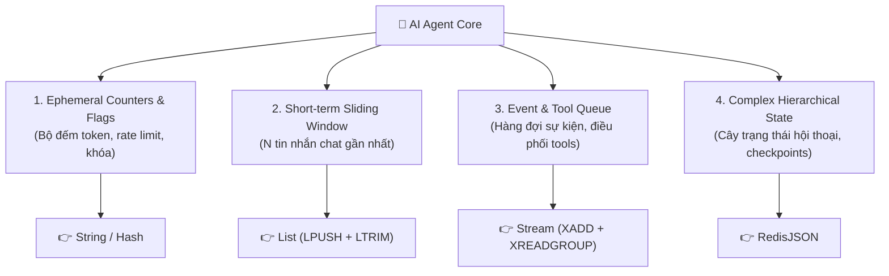

<!--
name: 1-data-structure-decision-guide.md
description: Comprehensive decision guide on selecting the optimal Redis data structure (String, Hash, List, RedisJSON, Stream, Set, ZSet) for different AI Agent memory and state layers.
-->

# 1.1 — Hướng dẫn chọn cấu trúc dữ liệu Redis cho AI Agent (Decision Guide)

Khi bắt đầu đưa Redis vào hệ thống AI Agent, một sai lầm cực kỳ phổ biến của các kỹ sư là: **"Cái gì cũng tống vào RedisJSON"** hoặc **"Cái gì cũng `JSON.stringify` rồi lưu vào Redis String"**.

Trong thực tế, một AI Agent không chỉ có một loại bộ nhớ duy nhất. Một Agent hoàn chỉnh gồm nhiều tầng dữ liệu khác nhau: từ bộ đếm token, danh sách tin nhắn trượt (sliding-window buffer), hàng đợi sự kiện điều phối tool calls, cho đến cây trạng thái phức tạp (state graph).

Chọn sai cấu trúc dữ liệu sẽ dẫn tới:
- Lãng phí RAM nghiêm trọng (Redis lưu trữ trên RAM, chi phí tính bằng GB).
- Tăng độ trễ (latency) không đáng có do I/O và CPU parsing.
- Thiếu các tính năng chuyên dụng (ví dụ: cố tình dùng JSON làm hàng đợi thay vì Stream dẫn đến mất tin nhắn, không có Consumer Group).

Bài học này là **kim chỉ nam** giúp bạn chọn chính xác cấu trúc dữ liệu tối ưu nhất cho từng thành phần của AI Agent.

---

## 1. Phân loại các tầng bộ nhớ trong AI Agent

Một Agent điển hình có 4 tầng lưu trữ dữ liệu chính:



---

## 2. Bảng so sánh tổng quan & Ứng dụng thực tế

| Cấu trúc dữ liệu | Khi nào NÊN dùng cho AI Agent? | Lệnh tiêu biểu | Khi nào KHÔNG NÊN dùng? |
| :--- | :--- | :--- | :--- |
| **String** | • Đếm token tiêu thụ (`INCRBY`).<br>• Cờ bật/tắt tính năng (Feature flags).<br>• Khóa phân tán đơn giản (`SET NX EX`). | `INCRBY`, `SET`, `GET`, `EXPIRE` | Không dùng để lưu trữ danh sách hoặc object lồng nhau nhiều cấp có cập nhật thường xuyên. |
| **Hash** | • Metadata phẳng của phiên làm việc (User ID, Model name, Status, Timestamps).<br>• Cập nhật độc lập các trường không phân cấp. | `HSET`, `HGET`, `HINCRBY`, `HGETALL` | Không dùng khi cấu trúc dữ liệu có mảng lồng nhau phức tạp (nested array of objects). |
| **List** | • **Sliding-window Conversation Buffer**: Cần giữ cố định $N$ tin nhắn gần nhất đưa vào Context Window.<br>• Hàng đợi tác vụ FIFO đơn giản 1-worker. | `LPUSH`, `LTRIM`, `LRANGE`, `RPOP` | Không dùng làm hàng đợi nhiều worker phân tán phức tạp (không có ACK, không có replay). |
| **RedisJSON** | • Cây trạng thái phức tạp (Hierarchical State) của LangGraph, AutoGen.<br>• Lịch sử chat đầy đủ chứa cả `tool_calls` và `tool_results` lồng nhau. | `JSON.SET`, `JSON.ARRAPPEND`, `JSON.GET` | Không dùng cho các thao tác đếm số đơn giản hoặc sliding window cố định (quá lãng phí overhead cây nhị phân). |
| **Stream** | • **Agent Event Loop**: Hàng đợi sự kiện điều phối luồng suy nghĩ (Thought) $\to$ Hành động (Action) $\to$ Quan sát (Observation).<br>• Xử lý tool bất đồng bộ với Consumer Groups & ACK. | `XADD`, `XREADGROUP`, `XACK`, `XPENDING` | Không dùng cho dữ liệu tra cứu ngẫu nhiên (random-access key/value). |
| **Sorted Set (ZSet)** | • Hàng đợi tác vụ ưu tiên (Priority Tool Queue) theo độ khẩn cấp (Score).<br>• Thuật toán Sliding-window Rate Limiting cho API LLM. | `ZADD`, `ZRANGEBYSCORE`, `ZREMRANGEBYSCORE` | Không dùng khi thứ tự dữ liệu không dựa trên điểm số (Score). |
| **Set** | • Danh sách các Tool/Skill mà Agent được phép gọi (Permission validation).<br>• Danh sách các User Tag độc nhất. | `SADD`, `SISMEMBER`, `SMEMBERS` | Không dùng khi cần giữ nguyên thứ tự xuất hiện của phần tử. |

---

## 3. Phân tích chuyên sâu: Khi nào KHÔNG NÊN dùng RedisJSON?

RedisJSON cực kỳ mạnh mẽ, nhưng việc lạm dụng nó là "cái bẫy chi phí" lớn nhất trong kiến trúc Agent:

### ❌ Anti-pattern 1: Dùng RedisJSON để lưu Sliding-Window Buffer
* **Vấn đề**: Bạn chỉ muốn giữ 10 tin nhắn gần nhất của user để gửi cho LLM. Nếu dùng RedisJSON, bạn phải `JSON.ARRAPPEND` rồi tính toán index để `JSON.ARRPOP`. Mỗi phần tử trong cây nhị phân RedisJSON tốn metadata quản lý node.
* **Giải pháp chuẩn**: Dùng **Redis List**. 
  Chỉ với đúng 2 lệnh nguyên tử $O(1)$:
  ```redis
  LPUSH session:buffer:001 "Tin nhắn mới"
  LTRIM session:buffer:001 0 9   # Luôn chỉ giữ đúng 10 tin nhắn mới nhất!
  ```
  *Tốc độ nhanh gấp bội, tốn ít hơn 60% RAM so với RedisJSON.*

### ❌ Anti-pattern 2: Dùng RedisJSON làm Message Queue cho Tool Execution
* **Vấn đề**: Agent đẩy một tool task vào mảng `$.pending_tools` trong JSON, rồi worker poll về chạy.
  * Nếu worker bị crash giữa chừng khi đang chạy tool? $\to$ **Mất việc, không phát hiện được**.
  * Nếu nhiều worker cùng lấy việc? $\to$ **Dễ trùng lặp tác vụ**.
* **Giải pháp chuẩn**: Dùng **Redis Streams**.
  * Có **Consumer Groups**: Chia tải tự động cho nhiều worker tool.
  * Có **PEL (Pending Entries List)** và lệnh `XACK`: Nếu worker crash, worker khác có thể claim lại task để chạy tiếp (`XAUTOCLAIM`).

### ❌ Anti-pattern 3: Dùng RedisJSON chỉ để đếm Token tiêu thụ
* **Vấn đề**: Tạo 1 file JSON chỉ để lưu `{"total_tokens": 1200}`.
* **Giải pháp chuẩn**: Dùng **Redis String** với lệnh `INCRBY usage:tokens:user_123 120` hoặc trường trong **Hash**. Tốc độ phần cứng tuyệt đối, tiết kiệm từng byte RAM.

---

## 4. Decision Tree: Cây quyết định chọn cấu trúc dữ liệu cho Agent

Hãy tự hỏi 4 câu hỏi sau khi thiết kế bộ nhớ cho Agent:

```
Dữ liệu của bạn thuộc loại nào?
 │
 ├── 1. Chỉ là con số đếm, cờ bật tắt, hoặc chuỗi token?
 │     └── 👉 Dùng STRING (`INCRBY`, `SET`, `GET`)
 │
 ├── 2. Thông tin phẳng gồm nhiều thuộc tính (User Profile, Session Info)?
 │     └── 👉 Dùng HASH (`HSET`, `HGETALL`)
 │
 ├── 3. Lịch sử hội thoại?
 │     ├── Chỉ cần N tin nhắn gần nhất đưa vào LLM Context?
 │     │     └── 👉 Dùng LIST (`LPUSH` + `LTRIM`)
 │     └── Cần lưu toàn bộ cây trạng thái, tool calls, checkpoints phức tạp?
 │           └── 👉 Dùng REDISJSON (`JSON.SET`, `JSON.ARRAPPEND`)
 │
 ├── 4. Hàng đợi sự kiện, điều phối tác vụ giữa các Agent / Tool Workers?
 │     ├── Cần độ tin cậy cao, xác nhận hoàn thành (ACK), chống mất tác vụ?
 │     │     └── 👉 Dùng STREAM (`XADD`, `XREADGROUP`)
 │     └── Ưu tiên tác vụ theo điểm khẩn cấp (Priority Queue)?
 │           └── 👉 Dùng SORTED SET (ZSET) (`ZADD`, `BZMPOP`)
```

---

## 5. Thực hành Lab: Code mẫu đa cấu trúc dữ liệu cho Agent

Hãy xem file code mẫu [1_data_structures_for_agents.py](./code-examples/1_data_structures_for_agents.py) đi kèm. File này mô phỏng cách kết hợp nhịp nhàng các cấu trúc dữ liệu trên trong một Agent thu nhỏ:

1. **Token Counter (String)**: `INCRBY` theo dõi chi phí theo thời gian thực.
2. **Session Profile (Hash)**: Quản lý thông tin user và model name.
3. **Sliding Window Buffer (List)**: Tự động trượt và giữ đúng $N$ tin nhắn mới nhất bằng `LPUSH + LTRIM`.
4. **Hierarchical State (RedisJSON)**: Lưu toàn bộ state chi tiết phiên làm việc.

Chạy file code mẫu bằng terminal:
```powershell
py .\1-redis-foundations-and-memory\code-examples\1_data_structures_for_agents.py
```

---

*← Quay lại: [0.3 - Setup Redis & Redis Insight](../0-getting-started/3-how-to-start.md) | Tiếp theo: [1.2 - RedisJSON làm Agent State Store](./2-redis-json-state-store.md) →*
