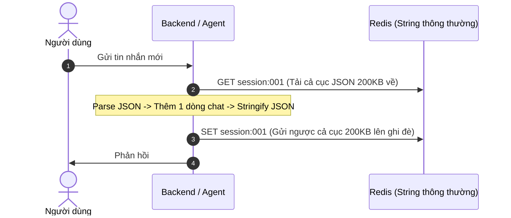
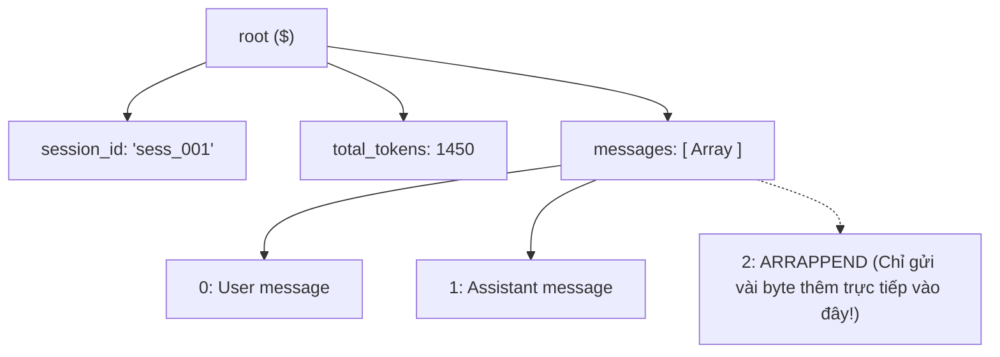

<!--
name: 2-redis-json-state-store.md
description: Practical guide to using RedisJSON as a high-performance state store for AI Agents, covering JSONPath, atomic partial updates, memory footprint, and Python integration.
-->

# 1.2 — RedisJSON làm Agent State Store: Quản lý bộ nhớ phiên làm việc

Trong kiến trúc của bất kỳ **AI Agent** nào (từ chatbot hỏi đáp đơn giản đến hệ thống multi-agent phức tạp như LangGraph, CrewAI hay AutoGen), **State Store (Kho lưu trữ trạng thái)** là trái tim của hệ thống. 

Nó lưu giữ mọi thứ: Agent đang nói chuyện với ai, lịch sử chat có những gì, các công cụ (tools) nào vừa được gọi và kết quả trả về ra sao.

Bài học này sẽ giúp bạn hiểu tận gốc:
1. **Tại sao cách lưu JSON truyền thống lại là "thảm họa" cho AI Agent?**
2. **RedisJSON giải quyết bài toán này như thế nào?**
3. **Thực hành các lệnh RedisJSON trực tiếp trên Redis Insight.**
4. **Code mẫu Python hoàn chỉnh xây dựng một `AgentStateStore` thực chiến.**

---

## 1. Đặt vấn đề: Nỗi đau khi lưu State của Agent

Giả sử bạn đang xây dựng một AI Agent hỗ trợ khách hàng. Mỗi phiên trò chuyện (`session`) cần lưu lại một cấu trúc dữ liệu JSON như sau:

```json
{
  "session_id": "sess_001",
  "user_id": "usr_99",
  "total_tokens": 1450,
  "status": "in_progress",
  "messages": [
    {"role": "user", "content": "Kiểm tra đơn hàng #12345 giúp tôi."},
    {"role": "assistant", "content": "Đang tra cứu hệ thống...", "tool_call": "check_order"}
  ]
}
```

### Cách làm cũ (Dùng Redis String thông thường)
Bạn dùng lệnh `SET` và `GET` cơ bản:
- Khi muốn lưu: `json_str = json.dumps(state)` rồi `SET session:sess_001 json_str`.
- Khi Agent vừa sinh ra một câu trả lời mới, bạn muốn thêm tin nhắn đó vào danh sách `messages`:
  1. **Bước 1**: Tải **toàn bộ** chuỗi JSON từ Redis về Backend (`GET session:sess_001`).
  2. **Bước 2**: Backend giải mã chuỗi thành Object (`json.loads()`).
  3. **Bước 3**: Thêm phần tử mới vào mảng `messages.append(...)`.
  4. **Bước 4**: Mã hóa ngược lại thành chuỗi (`json.dumps()`).
  5. **Bước 5**: Gửi **toàn bộ** chuỗi JSON đè lại lên Redis (`SET session:sess_001 json_str`).



### 🔴 Vấn đề nảy sinh:
1. **Lãng phí băng thông mạng**: Hội thoại càng dài (vài chục lượt chat), file JSON càng phình to (100KB - 1MB). Mỗi lần AI nói 1 câu ngắn, bạn phải trung chuyển cả megabyte dữ liệu qua lại giữa Backend và Redis.
2. **Nghẽn CPU**: Backend phải liên tục parse và stringify chuỗi JSON lớn.
3. **Nguy cơ Race Condition**: Nếu 2 công cụ (tools) của Agent chạy song song và cùng muốn cập nhật State, việc đọc-sửa-ghi đè toàn bộ sẽ khiến tool này vô tình xóa mất dữ liệu của tool kia!

---

## 2. Giải pháp: RedisJSON — Cập nhật từng phần (Atomic Partial Update)

**RedisJSON** là một module mở rộng chính thức của Redis (đã tích hợp sẵn trong Docker `redis-stack` mà bạn đã dựng ở [0.3](../0-getting-started/3-how-to-start.md)). 

Thay vì xem JSON là một chuỗi văn bản vô tri, RedisJSON lưu trữ JSON dưới dạng **cây nhị phân phân cấp trực tiếp trên RAM**. Nhờ đó, nó hỗ trợ cú pháp **JSONPath** để tương tác với từng nhánh con cụ thể.



### 🟢 Lợi ích vượt trội cho AI Agent:
- **Tối ưu băng thông mạng ($O(1)$ payload)**: Muốn thêm tin nhắn mới? Dùng lệnh `JSON.ARRAPPEND` — chỉ gửi đúng vài chục byte của tin nhắn mới qua mạng thay vì tải-đẩy cả megabyte lịch sử hội thoại.
- **Tốc độ xử lý cao (Amortized $O(1)$)**: Redis tự cấp phát và chèn trực tiếp phần tử vào đuôi mảng nhị phân trên RAM.
- **Tăng giảm bộ đếm token tức thì**: Dùng `JSON.NUMINCRBY` để cộng dồn token mà không cần đọc state.
- **Không bao giờ bị race condition**: Từng thao tác trên từng trường con là **Atomic** (nguyên tử), nhiều tools/agent chạy song song vẫn an toàn tuyệt đối.

---

## 3. Các lệnh RedisJSON cốt lõi (Cheatsheet)

Dưới đây là các lệnh quan trọng nhất mà bạn sẽ dùng hàng ngày khi làm việc với Agent State:

| Lệnh | Cú pháp | Công dụng cho AI Agent |
| :--- | :--- | :--- |
| **`JSON.SET`** | `JSON.SET <key> <path> <json_data>` | Khởi tạo State mới hoặc cập nhật một trường cụ thể. |
| **`JSON.GET`** | `JSON.GET <key> [path...]` | Đọc toàn bộ State, hoặc chỉ lấy đúng mảng `messages` để gửi cho LLM. |
| **`JSON.ARRAPPEND`**| `JSON.ARRAPPEND <key> <path> <value...>`| **Cực quan trọng**: Đẩy tin nhắn mới của User/AI vào đuôi mảng. |
| **`JSON.NUMINCRBY`** | `JSON.NUMINCRBY <key> <path> <number>` | Cộng dồn số token đã tiêu thụ sau mỗi lượt gọi LLM. |
| **`JSON.ARRPOP`** | `JSON.ARRPOP <key> <path> [index]` | Cắt bớt tin nhắn cũ nhất khi context window của LLM bị tràn. |
| **`JSON.MERGE`** | `JSON.MERGE <key> <path> <json_data>` | **RFC 7396 Merge Patch**: Cập nhật đồng thời nhiều field metadata (`status`, `last_tool`, `updated_at`) trong 1 lệnh duy nhất mà không ghi đè mất các trường khác. |

> [!NOTE]
> Ký hiệu `$` đại diện cho nút gốc (Root) của tài liệu JSON. Ví dụ: `$.messages` nghĩa là mảng messages nằm ở cấp ngoài cùng.

> [!WARNING]
> **Lưu ý về JSONPath trong RedisJSON (JSONPath v2):**
> RedisJSON **không hỗ trợ** cú pháp slice chỉ số âm theo kiểu Python (như `$.messages[-3:]`). Do đó, cách an toàn và chuẩn mực nhất khi cần lấy $N$ tin nhắn gần nhất là lấy mảng `$.messages` về và thực hiện slice an toàn ở tầng code ứng dụng (Python/TypeScript).

---

## 4. Thực hành Lab 1: Thao tác bằng lệnh trên Redis Insight / CLI

Hãy mở **Redis Insight** (trình duyệt truy cập: `http://localhost:8001`) hoặc mở terminal chạy `redis-cli`, sau đó gõ thử lần lượt các lệnh sau:

### Bước 1: Khởi tạo một phiên làm việc của Agent
```redis
JSON.SET agent:session:001 $ '{"user_id": "usr_42", "status": "active", "total_tokens": 0, "messages": []}'
```
*Kết quả trả về: `OK`*

---

### Bước 2: User gửi tin nhắn đầu tiên — Thêm vào mảng `messages`
Không cần đọc toàn bộ dữ liệu về, đẩy trực tiếp vào mảng:
```redis
JSON.ARRAPPEND agent:session:001 $.messages '{"role": "user", "content": "Chào bạn, hãy tóm tắt nội dung tài liệu này giúp tôi."}'
```
*Kết quả trả về: `(integer) 1` (Độ dài mới của mảng messages là 1)*

---

### Bước 3: AI trả lời & Tiêu tốn 120 tokens
Ta thực hiện 2 thao tác cập nhật độc lập mà không cần load dữ liệu:
```redis
# 1. Đẩy câu trả lời của AI vào danh sách hội thoại
JSON.ARRAPPEND agent:session:001 $.messages '{"role": "assistant", "content": "Vâng, xin vui lòng gửi tài liệu hoặc đường link ạ."}'

# 2. Cộng dồn số token sử dụng
JSON.NUMINCRBY agent:session:001 $.total_tokens 120
```
*Kết quả trả về: `(integer) 2` cho mảng messages, và `"120"` cho total_tokens.*

---

### Bước 4: Cập nhật đồng loạt Metadata bằng `JSON.MERGE` (RFC 7396)
Khi Agent chuyển sang gọi Tool, ta cần cập nhật trạng thái `status`, tên tool vừa gọi và thời gian cập nhật mà **không muốn xóa mất mảng messages hay total_tokens**:
```redis
JSON.MERGE agent:session:001 $ '{"status": "executing_tool", "last_tool": "calculator", "updated_at": 1725960000}'
```
*Kết quả trả về: `OK`. Lệnh này chỉ gộp (merge patch) các trường mới vào object root mà bảo toàn nguyên vẹn các trường còn lại!*

---

### Bước 5: Lấy dữ liệu để tiếp tục trò chuyện
Khi gửi dữ liệu vào prompt của LLM, ta chỉ cần danh sách `messages`, không cần các metadata khác:
```redis
JSON.GET agent:session:001 $.messages
```

> [!NOTE]
> *Một số phiên bản Redis Stack mới cho phép lấy phần tử cuối qua cú pháp `$.messages[-1]`. Tuy nhiên, với các thao tác lấy một khoảng (slice) như lấy $N$ tin nhắn gần nhất (`$.messages[-N:]`), cú pháp JSONPath v2 không hỗ trợ hoặc chạy không ổn định trên các phiên bản khác nhau. Do đó, phương án chuẩn mực và an toàn nhất trong production là kéo mảng `$.messages` về và thực hiện slice an toàn ở tầng code ứng dụng (Python/TypeScript).*

Hãy mở tab **Database** trên Redis Insight, nhấp vào key `agent:session:001` — bạn sẽ thấy cây thư mục JSON hiển thị trực quan và cập nhật theo thời gian thực!

---

## 5. Thực hành Lab 2: Code mẫu Python hoàn chỉnh

Dưới đây là mã nguồn Python chuẩn mực, đóng gói thành class `AgentStateStore` sẵn sàng để bạn tích hợp vào các dự án AI Agent thực tế.

> [!IMPORTANT]
> **Quy tắc bảo mật (Production Security):**
> Tuyệt đối không hardcode credentials trong code. Trong ví dụ bên dưới, mật khẩu kết nối được ưu tiên đọc từ biến môi trường `REDIS_PASSWORD`. Trong môi trường thật, hãy luôn sử dụng biến môi trường hoặc Secret Manager (AWS Secrets Manager, HashiCorp Vault).

### Cài đặt thư viện
```bash
pip install redis
```

### File mã nguồn: `agent_state_store.py`
```python
"""
name: agent_state_store.py
description: Production-ready Agent State Store using RedisJSON for partial updates and token tracking.
"""

import os
import json
from typing import Any, Dict, List, Optional
import redis


class AgentStateStore:
    def __init__(
        self, 
        host: str = "localhost", 
        port: int = 6379, 
        password: Optional[str] = None, 
        db: int = 0
    ):
        """
        Khởi tạo kết nối tới Redis Stack.
        Mặc định đọc password từ REDIS_PASSWORD, fallback về secret123 cho lab docker.
        """
        pwd = password or os.getenv("REDIS_PASSWORD", "secret123")
        self.client = redis.Redis(host=host, port=port, password=pwd, db=db, decode_responses=True)

    def _key(self, session_id: str) -> str:
        return f"agent:session:{session_id}"

    def init_session(self, session_id: str, user_id: str, metadata: Optional[Dict[str, Any]] = None) -> bool:
        """
        Khởi tạo một phiên làm việc mới cho Agent.
        """
        key = self._key(session_id)
        initial_state = {
            "session_id": session_id,
            "user_id": user_id,
            "status": "active",
            "total_tokens": 0,
            "metadata": metadata or {},
            "messages": []
        }
        return bool(self.client.json().set(key, "$", initial_state))

    def add_message(self, session_id: str, role: str, content: str, tool_calls: Optional[List[Dict]] = None) -> int:
        """
        Thêm một tin nhắn mới vào lịch sử hội thoại (Atomic Partial Update).
        Băng thông mạng gửi đi là O(1) payload cố định.
        """
        key = self._key(session_id)
        new_msg = {
            "role": role,
            "content": content
        }
        if tool_calls:
            new_msg["tool_calls"] = tool_calls

        result = self.client.json().arrappend(key, "$.messages", new_msg)
        return result[0] if result else 0

    def record_token_usage(self, session_id: str, tokens: int) -> int:
        """Cộng dồn số lượng token mà LLM vừa sử dụng."""
        key = self._key(session_id)
        new_total = self.client.json().numincrby(key, "$.total_tokens", tokens)
        return int(new_total[0]) if new_total else 0

    def get_messages(self, session_id: str, limit: Optional[int] = None) -> List[Dict[str, Any]]:
        """
        Lấy danh sách tin nhắn để đưa vào Context Window của LLM.
        Thực hiện slice an toàn ở Python vì RedisJSON JSONPath v2 không hỗ trợ slice âm Python.
        """
        key = self._key(session_id)
        res = self.client.json().get(key, "$.messages")
        messages = res[0] if (res and isinstance(res, list)) else []
        if limit and limit > 0:
            return messages[-limit:]
        return messages

    def update_metadata(self, session_id: str, patch_data: Dict[str, Any]) -> bool:
        """
        Cập nhật hàng loạt metadata bằng JSON.MERGE (RFC 7396 Merge Patch).
        Chỉ ghi đè/bổ sung các key mới mà bảo toàn nguyên vẹn messages và total_tokens.
        """
        key = self._key(session_id)
        res = self.client.json().merge(key, "$", patch_data)
        return bool(res)

    def get_full_state(self, session_id: str) -> Optional[Dict[str, Any]]:
        """Lấy toàn bộ thông tin phiên làm việc."""
        return self.client.json().get(self._key(session_id))


# --- DEMO CHẠY THỬ ---
if __name__ == "__main__":
    store = AgentStateStore()
    session_id = "test_agent_001"

    print("1. Khởi tạo session...")
    store.init_session(session_id, user_id="user_dev_01", metadata={"platform": "web"})

    print("2. User gửi câu hỏi đầu tiên...")
    store.add_message(session_id, role="user", content="Viết cho tôi 1 hàm tính giai thừa bằng Python.")

    print("3. Giả lập LLM phản hồi và sử dụng 95 tokens...")
    ai_reply = "def factorial(n):\n    return 1 if n <= 1 else n * factorial(n - 1)"
    store.add_message(session_id, role="assistant", content=ai_reply)
    total_tokens = store.record_token_usage(session_id, 95)
    print(f"-> Tổng token hiện tại: {total_tokens}")

    print("4. Cập nhật metadata hàng loạt bằng JSON.MERGE (RFC 7396)...")
    store.update_metadata(session_id, {"status": "waiting_tool", "last_tool": "calculator"})
    print("-> Metadata đã được merge thành công mà không làm mất messages!")

    print("5. Lấy danh sách tin nhắn cho lượt chat kế tiếp:")
    messages = store.get_messages(session_id, limit=2)
    print(json.dumps(messages, indent=2, ensure_ascii=False))
```

---

## 6. So sánh hiệu năng thực tế: Redis String vs RedisJSON

| Tiêu chí | Redis String (`SET` / `GET` JSON string) | RedisJSON (`JSON.ARRAPPEND` / `JSON.SET`) |
| :--- | :--- | :--- |
| **Băng thông mạng khi thêm 1 tin nhắn** | $O(N)$ — Tăng tuyến tính theo độ dài lịch sử chat (tải toàn bộ về rồi đẩy cả cục lên lại). | **$O(1)$** — Cố định payload, chỉ gửi đúng vài chục byte của tin nhắn mới. |
| **Thời gian xử lý nội tại** | Chậm: Backend parse/serialize + Redis ghi đè chuỗi lớn. | **Amortized $O(1)$** — Thao tác trực tiếp trên cây nhị phân RAM. |
| **Tải CPU trên Agent Backend** | Nặng vì liên tục `json.loads` và `json.dumps`. | **Rất nhẹ** — Không cần serialize toàn bộ cục state. |
| **Tính an toàn khi chạy Multi-Tool** | Dễ bị đè mất dữ liệu (Race condition). | **Atomic** — An toàn tuyệt đối giữa các tiến trình song song. |
| **Khả năng phối hợp Vector Search** | Chỉ tìm kiếm được chuỗi thô. | **Phối hợp RediSearch (`ON JSON`)** — RediSearch có thể đánh index Vector trực tiếp trên tài liệu RedisJSON (cả 2 module đều có sẵn trong Redis Stack). |

---

## 7. Thử thách thực hành (Mini-Challenge) 🎯

Để nắm vững bài này, hãy thử mở code hoặc dùng CLI thực hiện 2 yêu cầu sau:

1. **Thử thách 1 (Trim Context Window)**: 
   Khi danh sách hội thoại quá dài vượt quá giới hạn token của LLM, ta cần cắt bớt tin nhắn cũ nhất (tin nhắn ở index 0). Hãy tra cứu lệnh `JSON.ARRPOP` và gõ lệnh xóa tin nhắn đầu tiên của `agent:session:001`.
   *(Gợi ý: `JSON.ARRPOP agent:session:001 $.messages 0`)*

2. **Thử thách 2 (Cập nhật trạng thái)**:
   Sau khi Agent hoàn thành cuộc trò chuyện, hãy dùng lệnh `JSON.SET` để đổi trường `status` từ `"active"` thành `"completed"`.
   *(Gợi ý: `JSON.SET agent:session:001 $.status '"completed"'`)*

---

*← Trước: [1.1 - Hướng dẫn chọn cấu trúc dữ liệu Redis](./1-data-structure-decision-guide.md) | Tiếp theo: [1.3 - Redis Streams cho Agent Loop & Event Queue](./3-streams-for-agent-loop.md) →*
