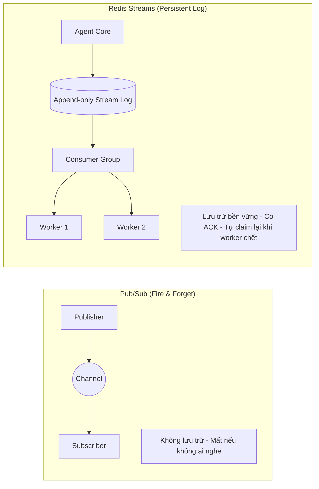
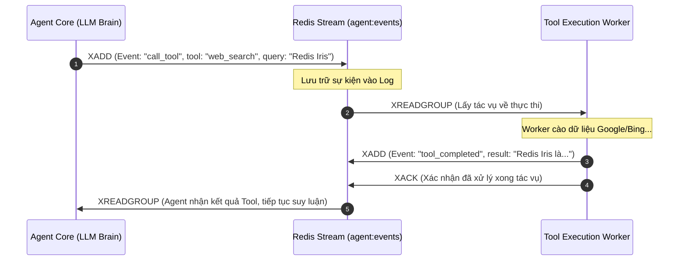

<!--
name: 3-streams-for-agent-loop.md
description: Comprehensive guide to Redis Streams for building reliable Event-driven AI Agent loops, asynchronous tool execution, and consumer groups with ACK.
-->

# 1.3 — Redis Streams cho Agent Event Loop & Async Tool Queue

Trong các ứng dụng thực tế, một AI Agent không chỉ hoạt động theo kiểu "hỏi 1 câu - đáp 1 câu" đơn giản. Khi làm việc với **Multi-step Reasoning (ReAct Loop)** hoặc **Async Tool Execution** (như cào web, chạy code, truy vấn database lớn), quá trình xử lý có thể mất từ vài giây đến vài phút.

Nếu bạn chạy tất cả một cách đồng bộ (Synchronous) trong một HTTP request duy nhất:
- Request sẽ bị timeout.
- Nếu server/worker bị crash giữa chừng, toàn bộ tiến trình suy nghĩ của Agent và kết quả của Tool sẽ **bị mất vĩnh viễn**.

**Redis Streams** chính là giải pháp hàng đầu để xây dựng **Event-Driven Agent Loop** bền bỉ, tin cậy và có khả năng phục hồi lỗi.

---

## 1. Redis Streams là gì? Tại sao vượt trội hơn List và Pub/Sub?

Nhiều người thường phân vân giữa **List (LPUSH/RPOP)**, **Pub/Sub** và **Streams**. Bảng so sánh dưới đây làm rõ lý do Streams là lựa chọn số 1 cho Agent Task Queue:



| Tiêu chí | Redis List (`LPUSH / BRPOP`) | Redis Pub/Sub | **Redis Streams** (`XADD / XREADGROUP`) |
| :--- | :--- | :--- | :--- |
| **Lưu trữ lịch sử** | Có (dưới dạng mảng) | ❌ Không (Fire & Forget) | **✅ Có (Append-only Log có timestamp ID)** |
| **Chia tải nhiều Worker** | Có (1 worker pop 1 item) | ❌ Không (Tất cả subscriber cùng nhận) | **✅ Có (Consumer Groups)** |
| **Xác nhận hoàn thành (ACK)**| ❌ Mặc định không có *(phải tự chế)* | ❌ Không | **✅ Có (`XACK` + Pending Entries List - PEL)** |
| **Xử lý khi Worker bị Crash**| ❌ Dễ mất việc *(trừ khi dùng `LMOVE`)* | ❌ Mất tin nhắn | **✅ Tự động claim lại tác vụ lỗi (`XAUTOCLAIM`)** |
| **Đọc lại lịch sử sự kiện** | Phải pop ra là mất | ❌ Không thể replay | **✅ Replay từ bất kỳ mốc thời gian nào** |

> [!NOTE]
> **Góc nhìn nâng cao về Redis List (`RPOPLPUSH` / `LMOVE`)**:
> Một số hệ thống hàng đợi cũ cố gắng xây dựng cơ chế "Reliable Queue" bằng lệnh `RPOPLPUSH` hoặc `LMOVE` (chuyển phần tử từ queue chính sang một processing list tạm). Tuy nhiên, cách làm này rất cồng kềnh: bạn phải tự viết logic dọn dẹp, không có định danh worker, không có thời gian timeout từng tin nhắn (idle time), và không hỗ trợ nhiều nhóm consumer cùng đọc song song. **Redis Streams sinh ra chính là để thay thế toàn bộ các giải pháp chắp vá đó.**

---

## 2. Kiến trúc Event-driven Agent Loop

Vòng lặp ReAct (Reason + Act) của Agent được chia thành các sự kiện (Events) gửi vào một Redis Stream chung:



---

## 3. Các lệnh Redis Streams cốt lõi & Cơ chế bảo vệ Production

### 1. `XADD`: Đẩy một sự kiện vào Stream (Kèm giới hạn `MAXLEN ~` chống OOM)
Redis Stream là một **Append-Only Log**. Nếu chỉ gọi `XADD` đơn thuần, log sự kiện sẽ phình to vô hạn theo thời gian và ăn cạn RAM của hệ thống!

Vì vậy, trong production **bắt buộc phải kèm cờ giới hạn kích thước**:
```redis
# Thêm sự kiện mới và giới hạn Stream chỉ giữ lại khoảng 10.000 phần tử gần nhất
XADD agent:events MAXLEN ~ 10000 * session_id "sess_101" event "tool_call" tool "calculator" expr "45 * 12"
```
* **Dấu `*`**: Yêu cầu Redis tự động tạo ID duy nhất dạng `<timestamp_ms>-<sequence>` (ví dụ: `1725960000000-0`).
* **Ý nghĩa của dấu `~` (Approximate Trimming - Cực quan trọng về hiệu năng)**:
  * Nếu dùng `MAXLEN 10000` (không có dấu `~`): Redis buộc phải cắt tỉa chính xác từng entry một. Điều này làm phân mảnh cấu trúc Radix Tree (Macro-nodes) nội tại của Redis, gây tốn CPU đột biến (CPU Spike) cho mỗi lệnh chèn.
  * Nếu dùng `MAXLEN ~ 10000`: Redis cho phép cắt tỉa nguyên cả một node dữ liệu (Macro-node gồm vài chục đến hàng trăm entry). Hiệu năng đạt mức tối đa gần như $\mathcal{O}(1)$ mà dung lượng bộ nhớ vẫn luôn được khống chế ổn định xấp xỉ 10.000 entry.
* Ngoài ra, bạn có thể chủ động cắt tỉa định kỳ qua lệnh riêng biệt: `XTRIM agent:events MAXLEN ~ 10000`.

### 2. `XGROUP CREATE`: Khởi tạo Consumer Group cho các Worker
```redis
# Tạo nhóm 'tool_workers' đọc từ đầu stream ('0')
XGROUP CREATE agent:events tool_workers 0 MKSTREAM
```

### 3. `XREADGROUP`: Worker nhận tác vụ về xử lý
```redis
# Worker 'worker_A' đọc 1 tin nhắn mới (kí hiệu '>') từ nhóm 'tool_workers'
XREADGROUP GROUP tool_workers worker_A COUNT 1 BLOCK 2000 STREAMS agent:events >
```
* `>`: Chỉ nhận các tin nhắn **mới toanh** chưa từng được giao cho worker nào.
* `BLOCK 2000`: Nếu stream đang rỗng, worker sẽ chờ tối đa 2000ms (2 giây) trước khi timeout.

### 4. `XACK`: Xác nhận đã xử lý xong
Sau khi worker tính toán xong, phải gửi ACK để Redis xóa tin nhắn khỏi danh sách chờ (Pending Entries List - PEL):
```redis
XACK agent:events tool_workers 1725960000000-0
```

### 5. Cứu hộ tác vụ (`XAUTOCLAIM`) & Xử lý "Poison Message" bằng Dead-Letter Queue (DLQ)
Nếu một worker nhận task nhưng đột ngột mất điện/crash trước khi kịp `XACK`:
```redis
# Kiểm tra các task bị treo quá 60 giây (60000ms) và tự chuyển sang cho worker_B xử lý tiếp:
XAUTOCLAIM agent:events tool_workers worker_B 60000 0-0 COUNT 1
```

> [!CAUTION]
> **Hiểm họa "Poison Message" (Tin nhắn độc làm sập vòng lặp)**:
> Giả sử một task chứa input lỗi cú pháp hoặc payload gây crash tool (ví dụ chia cho 0, lỗi parsing thư viện C/C++).
> 1. `Worker_1` nhận task $\to$ Bị crash ngay lập tức trước khi kịp `XACK`.
> 2. 60 giây sau, `Worker_2` chạy `XAUTOCLAIM` nhận lại task đó $\to$ `Worker_2` lại crash tiếp.
> 3. Vòng lặp lặp đi lặp lại vô hạn khiến toàn bộ cụm Worker bị tê liệt!
> 
> 👉 **Giải pháp chuẩn: Dead-Letter Queue (DLQ)**
> Khi đọc thông tin từ `XPENDING` hoặc `XAUTOCLAIM`, Redis luôn trả về trường **`delivery counter`** (số lần message đã được giao cho worker):
> * Nếu `delivery_count < 3`: Tiến hành xử lý / retry bình thường.
> * Nếu `delivery_count >= 3`: Đây chính là **Poison Message**! Hệ thống KHÔNG retry nữa mà:
>   1. Ghi tin nhắn này vào stream riêng: `XADD agent:events:dead_letter * ... original_msg ...`
>   2. Bắn cảnh báo cho đội ngũ kỹ thuật.
>   3. Gửi lệnh `XACK` trên stream chính để gỡ task độc hại khỏi PEL, bảo vệ Worker sống sót.

### 6. Bẫy "At-Least-Once Delivery" & Thiết kế Idempotency (Chống chạy Tool 2 lần)
Redis Streams đảm bảo cơ chế phân phối là **At-Least-Once** (chắc chắn đến ít nhất một lần), **KHÔNG PHẢI Exactly-Once**.

```
[Agent bắn task] ──► [Worker nhận task] ──► [Tool trừ tiền $100 thành công]
                                                         │
                                               💥 Worker crash trước khi kịp gửi XACK!
                                                         │
                                        [Worker 2 claim lại task] ──► [Trừ tiền lần 2?!]
```

Nếu worker thực thi Tool thành công nhưng gặp sự cố mạng hoặc crash ngay trước dòng lệnh `XACK`, tin nhắn vẫn nằm trong PEL và sẽ được giao lại cho worker khác $\to$ **Tool bị gọi lặp lại (nguy cơ trừ tiền 2 lần, gửi 2 email xác nhận)**.

👉 **Giải pháp bắt buộc: Idempotency Key (Khóa bất biến)**:
Gắn một `task_id` duy nhất vào mỗi sự kiện. Trước khi Worker chạy Tool có tác dụng phụ (side-effects), hãy kiểm tra hoặc khóa trạng thái trên Redis:
```python
# Mẫu kiểm tra Idempotency bằng Redis SET NX
task_id = message_payload["task_id"]
idempotency_key = f"idempotency:tool:{task_id}"

# SET với NX=True (chỉ set nếu chưa tồn tại) và TTL 24 giờ
is_first_run = client.set(idempotency_key, "PROCESSING", nx=True, ex=86400)

if not is_first_run:
    # Task này đã hoặc đang được thực thi rồi -> Bỏ qua việc gọi tool, chỉ cần gửi ACK!
    client.xack("agent:events", "tool_workers", message_id)
    return

try:
    result = execute_sensitive_tool(...)
    client.set(idempotency_key, "COMPLETED", ex=86400)
    client.xack("agent:events", "tool_workers", message_id)
except Exception as e:
    client.delete(idempotency_key)  # Xóa để cho phép retry nếu lỗi tạm thời
    raise e
```

---

## 4. Thực hành Lab 1: Tự tay gõ 5 lệnh trên Redis Insight CLI (Hiểu bản chất PEL & ACK)

Đừng chỉ đọc lý thuyết, hãy mở tab **CLI** trên **Redis Insight** (`http://localhost:8001`) và tự tay gõ từng bước sau để thấy dữ liệu biến đổi:

### 📍 Bước 1: Tạo Consumer Group (Đội ngũ thợ xử lý Tool)
```redis
XGROUP CREATE agent:stream:tools my_workers 0 MKSTREAM
```
*Tạo một nhóm thợ tên là `my_workers` lắng nghe hàng đợi `agent:stream:tools` từ mốc đầu tiên (`0`).*

---

### 📍 Bước 2: Đóng vai Agent — Bắn 1 tác vụ tính toán vào Stream
```redis
XADD agent:stream:tools * session_id "chat_01" tool "calculator" expr "50 * 200 + 99"
```
*Redis trả về Message ID (ví dụ: `1725960123456-0`). Mở tab **Database** trên Redis Insight, bấm vào key `agent:stream:tools` — bạn sẽ thấy ngay dòng sự kiện này xuất hiện!*

---

### 📍 Bước 3: Đóng vai Worker 1 — Lấy tác vụ về làm
```redis
XREADGROUP GROUP my_workers worker_A COUNT 1 BLOCK 0 STREAMS agent:stream:tools >
```
*Worker có tên `worker_A` đã nhận tác vụ này về.*

---

### 📍 Bước 4: Kiểm tra trạng thái treo (PEL - Pending Entries List)
Bây giờ `worker_A` đang cầm task nhưng **chưa báo cáo xong**. Hãy gõ lệnh kiểm tra:
```redis
XPENDING agent:stream:tools my_workers
```
*Redis sẽ báo: Có **1 entry đang pending**, người cầm việc là **worker_A**, kèm thời gian đã trôi qua. Nếu `worker_A` bị crash, Redis vẫn ghi nhớ task này để worker khác claim lại!*

---

### 📍 Bước 5: Worker báo cáo hoàn tất (XACK)
Sau khi tính toán xong, worker gửi xác nhận hoàn thành:
```redis
XACK agent:stream:tools my_workers 1725960123456-0
```
*(Thay ID bằng ID thực tế bạn nhận được).*

Gõ lại lệnh kiểm tra PEL:
```redis
XPENDING agent:stream:tools my_workers
```
*Kết quả trả về: `0 pending`. Task đã được hoàn tất trọn vẹn và an toàn!*

---

## 5. Thực hành Lab 2: Mở 2 Terminal song song (Mô phỏng Production thực chiến)

Trong thực tế, Agent Core và Tool Worker là **2 tiến trình chạy độc lập ở 2 nơi khác nhau**. Chúng ta đã chuẩn bị sẵn 2 file script để bạn tự tay trải nghiệm luồng dữ liệu chạy trực tiếp:

1. **Terminal 1 — Khởi động Worker (Treo màn hình chờ việc)**:
   ```powershell
   py .\1-redis-foundations-and-memory\code-examples\3_worker_service.py
   ```
   *Bạn sẽ thấy Worker bật lên, in ra trạng thái "Đang chờ tác vụ..." và đứng chờ lệnh.*

2. **Terminal 2 — Mở trình điều khiển Agent (Nhập lệnh từ bàn phím)**:
   Mở thêm một cửa sổ PowerShell thứ hai (đặt 2 cửa sổ cạnh nhau) và chạy:
   ```powershell
   py .\1-redis-foundations-and-memory\code-examples\3_agent_interactive_sender.py
   ```
   *Gõ một phép tính bất kỳ (ví dụ: `125 * 8 + 450`) và nhấn Enter.*

👉 **Quan sát điều kỳ diệu**: 
* Ngay khi bạn bấm Enter ở Terminal 2, Terminal 1 của Worker sẽ lập tức chộp lấy tin nhắn, in ra thông tin phép tính, thực thi, in kết quả và gửi `XACK`!
* Mở tab **Streams** trên Redis Insight để thấy Message ID và toàn bộ dữ liệu lịch sử được lưu lại nguyên vẹn.

---

*← Trước: [1.2 - RedisJSON làm Agent State Store](./2-redis-json-state-store.md) | Tiếp theo: [1.4 - Memory Eviction, TTL Strategy & Persistence](./4-memory-eviction-and-ttl-strategy.md) →*
