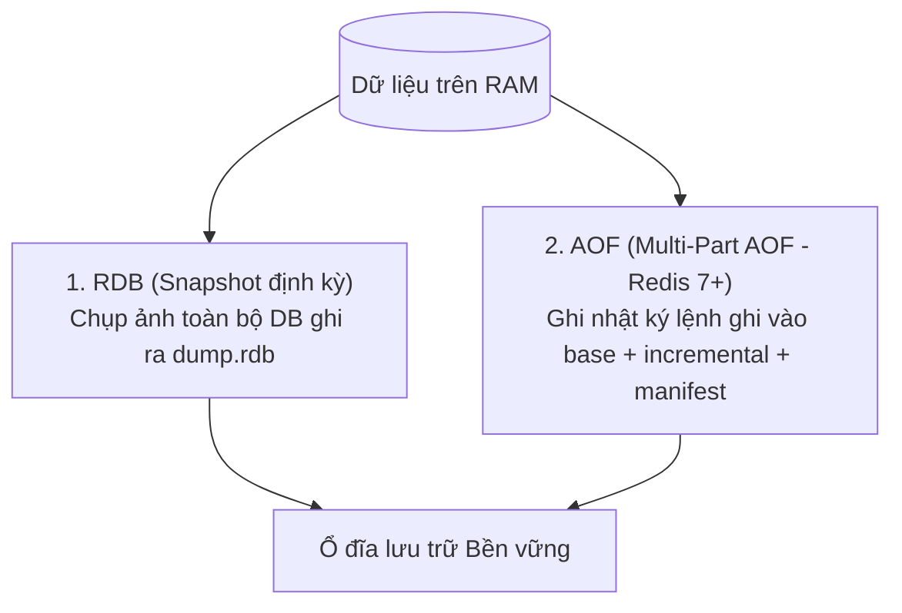

<!--
name: 4-memory-eviction-and-ttl-strategy.md
description: In-depth guide to Redis memory eviction policies, tiered TTL strategies for short/long-term agent memory, and persistence (RDB vs AOF) to prevent amnesia.
-->

# 1.4 — Quản lý bộ nhớ, Chiến lược TTL & Lưu trữ bền vững (Persistence) chống mất trí nhớ

Khi đưa AI Agent vào chạy thực tế $24/7$, hệ thống sẽ liên tục ghi nhận hàng ngàn phiên hội thoại, vector embeddings và log sự kiện. Vì **Redis là In-Memory Database (lưu toàn bộ trên RAM)**, nếu bạn không có chiến lược quản lý bộ nhớ và lưu trữ bền vững:
1. **RAM bị tràn (OOM - Out of Memory)**: Server crash hoặc Redis tự động xóa bừa dữ liệu quan trọng.
2. **Agent bị "mất trí nhớ" đột ngột**: Container hoặc server khởi động lại $\to$ toàn bộ lịch sử trò chuyện và trạng thái đang xử lý biến mất sạch sẽ.

Bài học này giúp bạn giải quyết triệt để 2 vấn đề sống còn trên.

---

## 1. Chiến lược TTL đa tầng (Tiered TTL Strategy) cho Agent

Không phải dữ liệu nào của Agent cũng cần tồn tại mãi mãi. Hãy phân loại TTL theo 3 tầng:

| Tầng bộ nhớ | Mục đích | Cấu trúc Redis | Chiến lược TTL khuyến nghị |
| :--- | :--- | :--- | :--- |
| **Working Memory (Bộ nhớ phiên)** | Tin nhắn chat tạm thời, sliding buffer, scratchpad suy luận. | List / Hash / RedisJSON | **1 giờ - 24 giờ** (`EXPIRE session:123 86400`). Gia hạn (refresh TTL) mỗi khi user chat thêm tin mới. |
| **Episodic Memory (Bộ nhớ sự kiện)** | Tóm tắt các phiên trò chuyện trước đây của người dùng. | RedisJSON / RediSearch | **7 ngày - 30 ngày**. |
| **Semantic / Long-term Memory** | Hồ sơ sở thích người dùng, kiến thức RAG, tài liệu vector. | RedisJSON + Vector Index | **Vĩnh viễn (Không set TTL)**. Cần được bảo vệ không bao giờ bị xóa tự động. |

```python
# Mẫu gia hạn TTL cho Working Memory mỗi lượt chat
pipe = client.pipeline()
pipe.json().arrappend(f"agent:session:{session_id}", "$.messages", new_message)
pipe.expire(f"agent:session:{session_id}", 3600 * 4)  # Gia hạn thêm 4 giờ
pipe.execute()
```

---

## 2. Cấu hình Eviction Policy & Ước tính bộ nhớ cho Agent

Trong file cấu hình `redis.conf` hoặc lệnh cấu hình động:
```redis
CONFIG SET maxmemory 4gb
CONFIG SET maxmemory-policy <policy_name>
```

### 2.1. Các chính sách Eviction quan trọng cho AI Agent:
* 🔴 **`allkeys-lru` / `allkeys-lfu` (Rất nguy hiểm cho Agent)**: Tự động xóa các key trên **toàn bộ database**, kể cả các key tri thức vĩnh viễn hoặc vector index! **Tuyệt đối không dùng cho hệ thống Agent có lưu Long-term memory**.
* 🟢 **`volatile-lfu` (Khuyên dùng tối ưu nhất cho AI Memory)**: Chỉ xóa những key **có cài đặt TTL**, và ưu tiên giữ lại các key **được truy vấn thường xuyên nhất** (Least Frequently Used). Rất hữu ích vì các prompt template hay profile của active user sẽ được bảo vệ tốt hơn so với LRU (chỉ căn cứ vào mốc thời gian vừa truy cập).
* 🟢 **`volatile-lru` (Tốt nếu không dùng LFU)**: Chỉ xóa những key có TTL mà lâu nhất chưa được đụng đến (Least Recently Used).
* 🟡 **`noeviction` (Dành cho hệ thống tài chính / bắt buộc zero-data-loss)**: Khi đầy RAM, Redis từ chối mọi lệnh ghi mới (`OOM command not allowed`) nhưng không bao giờ tự ý xóa bất kỳ dữ liệu nào.

### 2.2. ⚠️ Bẫy OOM của `volatile-lfu` khi hết sạch key có TTL
* Khi bạn chọn `volatile-lfu`, Redis **chỉ evict các key có cài TTL**.
* Nếu lượng **Semantic Memory (key vĩnh viễn không đặt TTL)** và **Vector Index** phình to chiếm gần hết `maxmemory`, trong khi toàn bộ key có TTL đã bị xóa sạch:
  👉 Redis sẽ tự động rơi vào trạng thái hành xử giống hệt **`noeviction`** — nghĩa là ném ngay lỗi:
  ```text
  (error) OOM command not allowed when used memory > 'maxmemory'
  ```
  đối với mọi lệnh ghi mới (`SET`, `JSON.SET`, `HSET`, `XADD`).
* **Giải pháp bắt buộc**: Luôn thiết lập hệ thống giám sát (Monitoring qua Prometheus / Grafana / Datadog) và kích hoạt cảnh báo (Alert) ngay khi dung lượng RAM vượt ngưỡng **75% - 80%**.

### 2.3. Tác động của Vector Index (HNSW / FLAT) đến dung lượng RAM & Thời gian Reboot
Bộ nhớ của AI Agent không chỉ là các chuỗi văn bản hay JSON thô:
* **HNSW (Hierarchical Navigable Small World)**: Thuật toán tìm kiếm vector phổ biến nhất hiện nay trên RediSearch. Để đạt tốc độ tìm kiếm siêu nhanh $\mathcal{O}(\log N)$, HNSW phải dựng một **cấu trúc đồ thị đa tầng (multi-layer proximity graph)** trong RAM.
* **Overhead thực tế**: Cấu trúc đồ thị HNSW ngốn thêm khoảng **20% – 50% RAM** ngoài dung lượng vector embedding thô.
* **Quy tắc ước tính `maxmemory`**: Các chỉ mục vector index là cấu trúc phụ trợ gắn liền với key vĩnh viễn (không bao giờ bị evict bởi `volatile-*`). Khi tính toán dung lượng cho hệ thống Agent, bạn cần áp dụng công thức:

$$\text{RAM yêu cầu} \approx \text{Working Memory (có TTL)} + \text{Document JSON} + (\text{Raw Vectors} \times 1.3 \to 1.5) + \text{Buffer an toàn (25\%)}$$

* ⚠️ **Thời gian tái tạo Index khi Restart (Cold-Start Rebuild Time)**:
  * Khi server khởi động lại và load dữ liệu từ RDB/AOF, Redis chỉ nạp dữ liệu key thô. RediSearch sau đó **phải dựng lại toàn bộ đồ thị HNSW từ đầu trong RAM** (Re-indexing in background).
  * Với quy mô lớn (vài trăm ngàn đến hàng triệu vector), việc dựng lại đồ thị này có thể ngốn tối đa CPU và mất từ **vài chục giây đến vài phút**.
  * Trong khoảng thời gian này, các truy vấn vector search của Agent có thể bị chậm hoặc trả về thiếu kết quả (`percent_indexed < 1.0`). Bạn cần kiểm tra trạng thái bằng lệnh `FT.INFO <index_name>` và cấu hình thời gian chờ khởi động (readiness probe `initialDelaySeconds` trong Kubernetes) phù hợp để tránh rớt Uptime SLA.

---

## 3. Persistence: RDB vs AOF trên Redis hiện đại (Redis 7+)

Để dữ liệu trên RAM không bị bốc hơi khi server khởi động lại, Redis cung cấp 2 cơ chế:



### 3.1. RDB (Redis Database Backup)
* **Cơ chế**: Định kỳ tạo một bản snapshot nhị phân lưu ra file `dump.rdb` (ví dụ: mỗi 60 giây nếu có ít nhất 1 thay đổi).
* **Ưu điểm**: File backup cực kỳ nhỏ gọn, tốc độ nạp dữ liệu khi khởi động lại server đạt mức tối đa.
* **Nhược điểm**: Có thể mất vài phút dữ liệu gần nhất nếu server sập đột ngột giữa 2 lần snapshot.

### 3.2. AOF trên Redis hiện đại (Multi-Part AOF & RDB Preamble)
* **Multi-Part AOF (Chuẩn từ Redis 7+)**: Không còn sử dụng một file `.aof` đơn lẻ khổng lồ dễ gây thắt cổ chai I/O khi rewrite. Redis 7+ chia AOF thành 3 phần:
  1. `base file`: Bản snapshot trạng thái tại thời điểm rewrite gần nhất.
  2. `incremental files`: Các lệnh ghi mới phát sinh trong quá trình chạy.
  3. `manifest file`: File manifest theo dõi trạng thái và thứ tự của các file trên.
* **Thứ tự ưu tiên khi khởi động (Recovery Priority)**: Khi cả RDB và AOF cùng được bật, Redis **luôn luôn ưu tiên nạp từ file AOF** vì AOF đảm bảo tính toàn vẹn dữ liệu cao hơn nhiều so với RDB snapshot.
* **Hybrid Persistence (`aof-use-rdb-preamble yes`)**: 
  * Mặc định được bật (`yes`) từ Redis 5/6/7 trở đi.
  * Cơ chế này biến phần đầu của `base file` thành snapshot định dạng nhị phân RDB, và chỉ ghi các thay đổi tiếp theo dưới dạng text log AOF.
  * **Lợi ích**: Khi khởi động lại, Redis nạp lại dữ liệu với tốc độ của RDB (cực nhanh), nhưng vẫn giữ trọn vẹn từng giây lịch sử thao tác của AOF!

### 3.3. Chuẩn hóa cú pháp cấu hình trong Docker / Docker Compose

Tùy vào base image bạn triển khai trong production, hãy lựa chọn cú pháp phù hợp:

#### Cách 1: Truyền trực tiếp qua `command` (Chuẩn khuyến nghị cho Image chính thức `redis:alpine` hoặc `redis:7-bookworm`)
Image chính thức của Redis yêu cầu truyền trực tiếp các cờ lệnh qua chỉ thị `command`:
```yaml
services:
  redis:
    image: redis:7-alpine
    container_name: redis-agent-prod
    ports:
      - "6379:6379"
    volumes:
      - redis_data:/data
    command: >
      redis-server
      --requirepass secret123
      --save 60 1
      --appendonly yes
      --appendfsync everysec
      --aof-use-rdb-preamble yes
      --maxmemory 4gb
      --maxmemory-policy volatile-lfu
    restart: always

volumes:
  redis_data:
```

#### Cách 2: Sử dụng biến môi trường `REDIS_ARGS` (Dành riêng cho image `redis/redis-stack`)
Nếu bạn dùng image `redis/redis-stack` (đã tích hợp sẵn RediSearch, RedisJSON và Redis Insight):
```yaml
services:
  redis-stack:
    image: redis/redis-stack:latest
    container_name: redis-stack-ai
    ports:
      - "6379:6379"
      - "8001:8001"
    environment:
      - REDIS_ARGS=--requirepass secret123 --save 60 1 --appendonly yes --appendfsync everysec --aof-use-rdb-preamble yes --maxmemory 4gb --maxmemory-policy volatile-lfu
    volumes:
      - redis_stack_data:/data
    restart: always

volumes:
  redis_stack_data:
```
> *(Lưu ý: Entrypoint script của image `redis-stack` tự động đọc biến `REDIS_ARGS` để chuyển vào `redis-server`. Nếu dùng image `redis` thông thường thì bắt buộc dùng **Cách 1**).*

---

> ⚠️ **LƯU Ý QUAN TRỌNG KHI VẬN HÀNH (PRODUCTION CAVEATS):**
> 1. **Bẫy OOM của volatile-lfu:** Nếu toàn bộ key có TTL đã bị xóa hết mà Semantic Memory & Vector Index vẫn tiếp tục tăng chạm ngưỡng `maxmemory`, Redis sẽ lập tức ném lỗi `OOM command not allowed` (hành xử như `noeviction`). Luôn thiết lập cảnh báo khi RAM vượt quá 75% - 80%.
> 2. **Overhead của Vector Index:** Thuật toán HNSW tiêu tốn thêm 20% - 50% RAM để lưu trữ cấu trúc đồ thị vector so với kích thước vector thô. Khi tính toán `maxmemory`, bắt buộc phải tính thêm phần dung lượng đồ thị này.
> 3. **Hybrid Persistence (RDB Preamble):** Đảm bảo giữ cờ mặc định `aof-use-rdb-preamble yes` để khi kết hợp RDB + AOF, Redis khởi động lại nhanh như RDB nhưng vẫn bảo toàn dữ liệu từng giây của AOF.
> 4. **Khởi động lại luôn ưu tiên AOF:** Khi có cả hai file `dump.rdb` và thư mục `appendonlydir/`, Redis sẽ nạp AOF làm chân lý (ground truth) để tránh mất mát dữ liệu mới nhất.
> 5. **Độ trễ Cold-Start khi Rebuild Vector Index:** Sau khi reboot, RediSearch phải dựng lại toàn bộ đồ thị HNSW trong RAM. Với hàng triệu vector, quá trình này mất vài phút. Bắt buộc kiểm tra `FT.INFO` và tinh chỉnh Kubernetes readiness probe (`initialDelaySeconds`) để không ảnh hưởng đến Uptime SLA.

---

## 4. Thực hành Lab: Tận mắt thấy TTL đếm ngược và tự hủy

Hãy chạy file code mẫu [4_memory_ttl_persistence.py](./code-examples/4_memory_ttl_persistence.py).

File này sẽ chạy từng bước (dừng lại chờ bạn bấm Enter) để bạn:
1. Nhìn thấy đồng hồ đếm ngược từng giây của key trên console và trên Redis Insight.
2. Thấy key tự động bốc hơi khỏi RAM khi hết giờ.
3. Thử nghiệm cơ chế gia hạn TTL khi user chat tiếp.
4. Kiểm tra snapshot đĩa bằng lệnh `BGSAVE`.

Chạy code bằng lệnh:
```powershell
py .\1-redis-foundations-and-memory\code-examples\4_memory_ttl_persistence.py
```

---

*← Trước: [1.3 - Redis Streams cho Agent Loop & Task Queue](./3-streams-for-agent-loop.md) | Tiếp theo: [1.5 - Distributed Locks & Connection Pooling](./5-distributed-locks-and-pooling.md) →*
