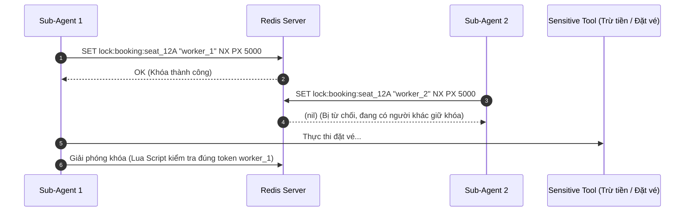
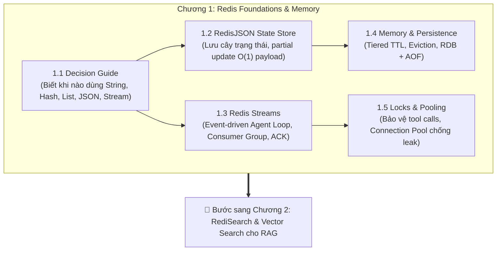

<!--
name: 5-distributed-locks-and-pooling.md
description: Production-grade distributed locking for tool execution, connection pooling to prevent socket leaks, and Chapter 1 wrap-up.
-->

# 1.5 — Distributed Locks cho Tools & Connection Pooling trong Production

Khi đưa AI Agent từ môi trường chạy thử nghiệm (local test) lên môi trường sản xuất (production) phục vụ nhiều người dùng cùng lúc, bạn sẽ đối mặt với 2 rủi ro hệ thống lớn nhất:
1. **Tranh chấp tài nguyên khi gọi Tool (Resource Contention)**: Hai sub-agents hoặc hai tool workers cùng lúc thao tác trên một tài nguyên dùng chung (ví dụ: cùng trừ tiền một ví tài khoản, cùng gửi email cho một khách hàng, cùng ghi đè một file dữ liệu).
2. **Cạn kiệt cổng kết nối (Socket / Connection Leak)**: Agent liên tục gọi Redis trong vòng lặp ReAct, nếu khởi tạo kết nối mới bừa bãi sẽ làm cạn kiệt TCP socket của hệ điều hành, khiến server bị nghẽn hoàn toàn.

Bài học này sẽ trang bị cho bạn 2 "vũ khí" phòng thủ tối quan trọng.

---

## 1. Distributed Lock: Bảo vệ Tool Calls khỏi Race Condition

Khi Agent cần gọi một công cụ có tác dụng phụ (side-effect), ta phải dùng **Distributed Lock (Khóa phân tán)** để đảm bảo tại một thời điểm chỉ có duy nhất 1 tiến trình được phép thực thi.



### Cách triển khai chuẩn mực bằng lệnh Redis:
```redis
# 1. Chiếm khóa (Chỉ set nếu chưa có - NX, tự động hết hạn sau 10 giây - PX 10000)
SET lock:resource_id "random_token_abc123" NX PX 10000

# 2. Giải phóng khóa an toàn bằng Lua Script (Chỉ xóa nếu token khớp, tránh xóa nhầm của người khác)
EVAL "if redis.call('get', KEYS[1]) == ARGV[1] then return redis.call('del', KEYS[1]) else return 0 end" 1 lock:resource_id "random_token_abc123"
```

> [!TIP]
> Trong Python, thư viện `redis-py` đã tích hợp sẵn cơ chế này thông qua context manager:
> ```python
> with client.lock("lock:booking:seat_12A", timeout=10):
>     # Vùng thực thi an toàn cho Tool Call
>     execute_sensitive_tool()
> ```

> [!WARNING]
> **Cạm bẫy khi Tool chạy quá lâu (Lock Timeout vs Long-running Tools):**
> Nếu Tool là tác vụ nặng (như web scraper cào dữ liệu hoặc LLM reasoning mất 15 giây) trong khi TTL của khóa chỉ đặt là 10 giây:
> * Khóa sẽ tự động hết hạn và giải phóng **khi Tool vẫn chưa chạy xong**.
> * Một Sub-Agent khác sẽ nhảy vào chiếm khóa $\to$ **Race condition lại xuất hiện!**
> 
> 👉 **Giải pháp Production**:
> 1. **Cơ chế Heartbeat / Lock Renewal (Gia hạn khóa)**: Khởi chạy một thread chạy ngầm định kỳ gia hạn TTL (tương tự cơ chế Watchdog của Redisson trong Java) cho đến khi Tool hoàn tất.
> 2. **Multi-node Cluster & Tranh luận kỹ thuật quanh thuật toán Redlock**:
>    * Nếu Redis chạy cụm gồm 5 Master node độc lập, Redis đề xuất thuật toán **Redlock** (yêu cầu chiếm khóa thành công trên quá bán 3/5 node).
>    * ⚠️ **Cảnh báo kỹ thuật (Martin Kleppmann vs antirez Debate)**: Redlock là một trong những thuật toán gây tranh cãi nổi tiếng nhất trong giới khoa học máy tính phân tán. Chuyên gia hệ thống phân tán Martin Kleppmann đã chỉ ra rằng: Redlock dựa vào giả định sai lầm về đồng hồ thời gian (synchronous physical clock). Nếu xuất hiện **Clock Drift (lệch đồng hồ)** hoặc **GC Pause / Network Delay** kéo dài, một node có thể cho rằng nó vẫn đang giữ khóa dù khóa đã hết hạn ở các node khác $\to$ dẫn đến vi phạm tính an toàn (Safety Violation).
>    * **Lời khuyên thực chiến**: Đối với các tác vụ thông thường của Agent (ngăn chặn double tool call, web search, scraping), Redis Distributed Lock là quá đủ và chạy rất tốt. Nhưng đối với các hệ thống tài chính / kế toán yêu cầu tính toàn vẹn 100% không khoan nhượng, **không bao giờ coi Redlock là chiếc đũa thần duy nhất** — bắt buộc phải kết hợp thêm **Fencing Tokens** (số thứ tự tăng dần mà cơ sở dữ liệu đích kiểm tra trước khi ghi) hoặc kiểm tra khóa ở tầng Database bằng ACID Transactions.

---

## 2. Connection Pooling: Ngăn chặn Connection Leak trong Agent Loop

Agent thường chạy vòng lặp suy luận (Reasoning Loop) hàng chục lần mỗi phút.
* ❌ **Sai lầm chết người**: Mỗi lần Agent muốn lưu tin nhắn lại gọi `r = redis.Redis(...)`. Mỗi lần như vậy hệ điều hành phải thực hiện bắt tay 3 bước (TCP 3-way handshake). Sau vài giờ, hàng ngàn kết nối ở trạng thái `TIME_WAIT` làm cạn kiệt socket và sập ứng dụng.
* ✅ **Giải pháp chuẩn**: Dùng **ConnectionPool** chia sẻ chung một nhóm kết nối cố định.

### 2.1. Cấu hình Connection Pool đồng bộ (Sync) cho Background Workers
```python
import os
import redis

# Khởi tạo Connection Pool duy nhất cho toàn bộ hệ thống Worker đồng bộ
sync_pool = redis.ConnectionPool(
    host="localhost",
    port=6379,
    password=os.getenv("REDIS_PASSWORD", "secret123"),
    db=0,
    max_connections=50,       # Giới hạn tối đa 50 kết nối đồng thời
    socket_timeout=5.0,       # Timeout 5s nếu Redis không phản hồi
    socket_connect_timeout=3.0,
    retry_on_timeout=True
)

def get_redis_client() -> redis.Redis:
    """Mọi Worker đồng bộ mượn kết nối từ Pool dùng chung."""
    return redis.Redis(connection_pool=sync_pool, decode_responses=True)
```

### 2.2. ⚡ Cấu hình Connection Pool BẤT ĐỒNG BỘ (Async) cho LangGraph, AutoGen & FastAPI
Hầu hết các framework Agent và API server hiện đại đều vận hành trên nền tảng **`asyncio`**.

> [!CAUTION]
> **Lỗi phổ biến nhất khi tích hợp Agent vào Production**:
> Dùng client đồng bộ (`redis.Redis`) bên trong vòng lặp `async def` của LangGraph/FastAPI. Client đồng bộ sẽ **chặn đứng (block) toàn bộ Event Loop** của Python, khiến cả server bị đơ và không thể xử lý bất kỳ request của người dùng nào khác trong lúc chờ Redis!

👉 **Bắt buộc dùng `redis.asyncio`**:
```python
import os
import redis.asyncio as aioredis

# Khởi tạo Async Connection Pool
async_pool = aioredis.ConnectionPool(
    host="localhost",
    port=6379,
    password=os.getenv("REDIS_PASSWORD", "secret123"),
    db=0,
    max_connections=50,
    socket_timeout=5.0,
    socket_connect_timeout=3.0,
    decode_responses=True
)

def get_async_redis_client() -> aioredis.Redis:
    """Dành riêng cho LangGraph Node, Async Agent Loop và FastAPI Endpoints."""
    return aioredis.Redis(connection_pool=async_pool)

# Mẫu sử dụng trong Async Agent Node
async def process_agent_step(session_id: str, message: dict):
    client = get_async_redis_client()
    # Các lệnh gọi Redis không hề block Event Loop của server
    await client.xadd("agent:events", {"sess": session_id, "data": str(message)})
```

---

## 3. Thực hành Lab: Thử nghiệm Race Condition & Distributed Lock

Hãy chạy file code mẫu [5_distributed_lock_and_pool.py](./code-examples/5_distributed_lock_and_pool.py).

File này sẽ chạy từng bước (dừng lại chờ bạn bấm Enter) để bạn:
1. Mượn kết nối từ Connection Pool để kiểm tra tái sử dụng socket.
2. Tự tay gửi lệnh chiếm khóa `SET ... NX PX 10000` và mở Redis Insight xem khóa xuất hiện với đồng hồ đếm ngược.
3. Thấy Sub-Agent 2 bị từ chối thẳng thừng khi cố tình tranh chấp tài nguyên.
4. Thử nghiệm giải phóng khóa an toàn bằng Lua script và Python Context Manager.

Chạy code bằng lệnh:
```powershell
py .\1-redis-foundations-and-memory\code-examples\5_distributed_lock_and_pool.py
```

---

## 4. Tổng kết Chương 1: Bức tranh toàn cảnh Foundations & Memory

Chúc mừng bạn đã đi trọn vẹn nền tảng vững chắc của Redis dành riêng cho AI Agent:



Bây giờ hệ thống của bạn đã có:
- Bộ nhớ ngắn hạn siêu tốc và tiết kiệm.
- Vòng lặp điều phối sự kiện bền bỉ, không sợ mất việc.
- Hệ thống phòng thủ bảo vệ tài nguyên và hạ tầng an toàn.

👉 Bạn đã sẵn sàng 100% để bước sang thế giới tìm kiếm ngữ nghĩa: **Chương 2 — RediSearch & Vector Search trong AI**!

---

*← Trước: [1.4 - Quản lý bộ nhớ, TTL & Persistence](./4-memory-eviction-and-ttl-strategy.md) | Kế tiếp: [Chương 2 — RediSearch & Vector Search](../2-redisearch-and-vector-search/1-vector-embeddings-and-indexes.md) →*
