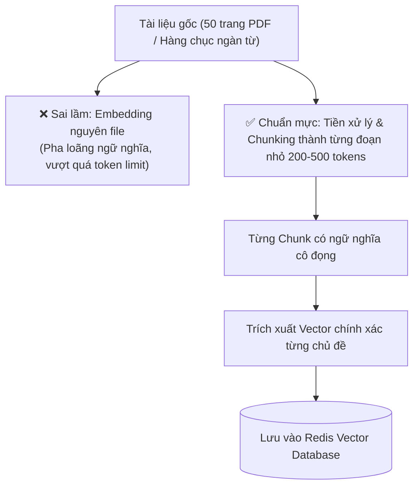

<!--
name: 0-chunking-and-preprocessing.md
description: Comprehensive guide to data preprocessing and chunking strategies (fixed-size, recursive, structural, semantic) before embedding into Redis Vector DB.
-->

# 2.0 — Chunking & Preprocessing — Tiền xử lý Dữ liệu cho Vector Search

Trong kiến trúc **Retrieval-Augmented Generation (RAG)** và **AI Agent Long-term Memory**, nhiều kỹ sư thường dành $90\%$ thời gian vào việc chọn mô hình Embedding hay tinh chỉnh HNSW, nhưng lại xem nhẹ bước đầu tiên: **Tiền xử lý văn bản (Preprocessing) & Phân mảnh tài liệu (Chunking)**.

Thực tế kiểm chứng từ production:
> *"Một thuật toán tìm kiếm vector dù có tối tân đến đâu cũng hoàn toàn vô dụng nếu dữ liệu nạp vào là những khối văn bản khổng lồ, hỗn tạp và thiếu tính liên kết ngữ nghĩa."*

Bài học này sẽ hướng dẫn bạn toàn bộ các chiến lược phân mảnh dữ liệu chuẩn mực nhất trước khi chuyển đổi thành Vector và nạp vào Redis.

---

## 1. Tại sao Chunking là bước bắt buộc trước khi Embedding?

### 1.1. Giới hạn Context Window của Embedding Model
Các mô hình Embedding đều có giới hạn độ dài đầu vào tối đa (Token Limit):
* `all-MiniLM-L6-v2`: Giới hạn **256 tokens** (khoảng 150 – 200 từ).
* `text-embedding-3-small` / `text-embedding-ada-002`: Giới hạn **8191 tokens**.

Nếu bạn nhét cả một cuốn sách hoặc tài liệu PDF dài 50 trang vào mô hình:
* Văn bản sẽ bị cắt đứt gãy thô bạo (Truncation) $\to$ Toàn bộ thông tin ở nửa sau bị biến mất hoàn toàn.
* **Hiện tượng Pha loãng Ngữ nghĩa (Semantic Dilution)**: Khi nén 8000 từ vào một vector 1536 chiều, vector đó trở thành một "nồi lẩu thập cẩm". Khi user hỏi một chi tiết nhỏ cụ thể, điểm tương đồng Cosine của tài liệu dài sẽ rất thấp và bị rớt khỏi top kết quả tìm kiếm!



---

## 2. Các chiến lược Chunking cốt lõi

### 2.1. Fixed-Size Chunking + Sliding Window Overlap (Cơ bản)
* **Cơ chế**: Cắt văn bản thành các khối có số ký tự hoặc số token cố định (ví dụ 500 ký tự), đồng thời duy trì một lượng **gối đầu (Overlap)** giữa 2 chunk liên tiếp (thường từ $10\% - 20\%$, ví dụ 50 ký tự).
* **Tại sao cần Overlap?** 
  * Tránh trường hợp một câu quan trọng bị "chém đôi" ngay giữa ranh giới cắt, khiến cả 2 chunk đều mất ngữ cảnh.

```
Chunk 1: [........................................(Vùng Overlap 50 chars)]
Chunk 2:                                          [(Vùng Overlap).....................................]
```

### 2.2. Recursive Character Text Splitting (Phân tách đệ quy — Tiêu chuẩn vàng)
* **Cơ chế**: Thay vì cắt bừa bãi theo số ký tự, thuật toán ưu tiên ngắt theo thứ tự tự nhiên của văn bản:
  1. Ngắt theo đoạn văn (`\n\n`).
  2. Nếu đoạn văn vẫn quá dài, ngắt theo dòng đơn (`\n`).
  3. Nếu dòng vẫn quá dài, ngắt theo dấu câu (`. `, `? `, `! `).
  4. Cuối cùng mới ngắt theo khoảng trắng từ (` `).
* **Ưu điểm**: Đảm bảo các câu và đoạn văn hoàn chỉnh về mặt ngữ nghĩa được giữ trọn vẹn trong cùng một chunk.

### 2.3. Document-Aware / Structural Chunking (Phân mảnh theo cấu trúc)
Dành cho tài liệu có định dạng cấu trúc:
* **Markdown**: Phân tách dựa theo các tiêu đề `#`, `##`, `###`. Toàn bộ nội dung dưới một heading cấp 2 sẽ là 1 chunk.
* **Mã nguồn (Code)**: Phân tách theo ranh giới hàm (`def`, `class`), đảm bảo logic code không bị xé vụn.
* **Bảng biểu (Tables)**: Giữ nguyên toàn bộ bảng hoặc chuyển đổi từng hàng thành câu văn tự nhiên trước khi embedding.

### 2.4. Semantic Chunking (Phân mảnh theo ranh giới biến đổi ngữ nghĩa)
* **Cơ chế**:
  1. Tách văn bản thành từng câu đơn lẻ.
  2. Tạo embedding tạm thời cho từng câu.
  3. Tính Cosine Distance giữa câu thứ $i$ và câu thứ $i+1$.
  4. Nếu khoảng cách Cosine vượt qua một ngưỡng (Threshold) định trước $\to$ Người viết vừa chuyển sang chủ đề khác $\to$ **Ngắt chunk tại vị trí đó!**
* **Ưu điểm**: Tạo ra các chunk có tính đồng nhất về mặt chủ đề hoàn hảo nhất.

---

## 3. Metadata Enrichment: Bổ sung "Hộ chiếu" cho từng Chunk

Khi lưu chunk vào Redis, **không bao giờ chỉ lưu nội dung thuần túy (`content`) và `vector`**. Hãy luôn đính kèm **Metadata phong phú** để phục vụ việc lọc dữ liệu (Filtering) sau này:

```json
{
  "chunk_id": "doc_kb_101_chunk_003",
  "parent_doc_id": "doc_kb_101",
  "title": "Chính sách nghỉ phép năm 2026",
  "content": "Nhân viên có 15 ngày nghỉ phép có lương mỗi năm...",
  "category": "hr_policy",
  "access_level": "internal",
  "created_at": 1725960000,
  "chunk_index": 3,
  "total_chunks": 8,
  "embedding": [0.023, -0.158, 0.891, "..."]
}
```

* Nhờ có `category`, `access_level`, bạn có thể thực hiện **Hybrid Search** trên RediSearch: *"Chỉ tìm kiếm vector trong các chunk có `access_level == 'internal'` và `category == 'hr_policy'`"*.

---

## 4. Thực hành Code mẫu Python: Chuẩn hóa Pipeline Chunking

Dưới đây là đoạn code thực chiến minh họa cách tiền xử lý văn bản, chia chunk có overlap và chuẩn bị payload hoàn chỉnh để nạp vào Redis:

```python
import re
from typing import List, Dict, Any

def clean_text(text: str) -> str:
    """Loại bỏ ký tự rác, chuẩn hóa khoảng trắng và dấu xuống dòng thừa."""
    text = re.sub(r'\r\n', '\n', text)
    text = re.sub(r'\n{3,}', '\n\n', text)
    text = re.sub(r'[ \t]+', ' ', text)
    return text.strip()

def recursive_chunk_text(
    text: str, 
    chunk_size: int = 500, 
    chunk_overlap: int = 50
) -> List[str]:
    """
    Chia nhỏ văn bản đệ quy theo đoạn văn, câu và từ kèm vùng gối đầu overlap.
    """
    text = clean_text(text)
    if len(text) <= chunk_size:
        return [text]

    chunks = []
    start = 0
    while start < len(text):
        end = start + chunk_size
        
        # Nếu chưa đến cuối văn bản, tìm điểm ngắt tự nhiên gần nhất (dấu chấm hoặc xuống dòng)
        if end < len(text):
            break_point = text.rfind('\n\n', start, end)
            if break_point == -1:
                break_point = text.rfind('. ', start, end)
            if break_point == -1:
                break_point = text.rfind(' ', start, end)
            if break_point != -1 and break_point > start:
                end = break_point + 1

        chunk = text[start:end].strip()
        if chunk:
            chunks.append(chunk)
        
        # Dịch chuyển start bước tiếp theo có tính đến overlap
        start = end - chunk_overlap if end < len(text) else len(text)

    return chunks

# Demo thử nghiệm
raw_document = """
Chính sách an toàn bảo mật thông tin năm 2026.
Tất cả các tài khoản truy cập vào hệ thống máy chủ Redis và AI Agent bắt buộc phải sử dụng xác thực đa yếu tố (2FA). 

Mật khẩu quản trị phải có độ dài tối thiểu 16 ký tự, bao gồm chữ hoa, chữ thường, chữ số và ký tự đặc biệt.
Định kỳ 90 ngày, hệ thống sẽ yêu cầu người dùng thay đổi mật khẩu một lần.

Trong trường hợp phát hiện truy cập bất thường từ IP lạ, Redis Sentinel sẽ tự động kích hoạt chế độ cách ly và gửi thông báo khẩn cấp tới kênh Slack của đội ngũ Security Ops.
"""

chunks = recursive_chunk_text(raw_document, chunk_size=200, chunk_overlap=30)
for idx, c in enumerate(chunks):
    print(f"--- CHUNK {idx + 1} ({len(c)} chars) ---")
    print(c)
```

---

## 5. Bảng tổng kết: Chọn chiến lược Chunking cho từng loại dữ liệu Agent

| Loại dữ liệu đầu vào | Kích thước Chunk đề xuất | Mức độ Overlap | Chiến lược tối ưu |
| :--- | :--- | :--- | :--- |
| **FAQ / Q&A ngắn** | Toàn bộ 1 câu hỏi + câu trả lời | $0\%$ (Không cần overlap) | **Atomic Q&A Chunking** |
| **Tài liệu PDF / Quy chế / Hướng dẫn** | 300 – 600 tokens | $15\% – 20\%$ | **Recursive Character Splitting** |
| **Markdown / GitHub Docs** | Theo từng Heading `#`, `##` | $10\%$ | **Markdown Structural Chunking** |
| **Mã nguồn (Python, JS, SQL)** | Theo từng Function / Class | $0\% – 10\%$ | **AST-based / Language-aware Chunking** |
| **Lịch sử chat hội thoại dài** | 3 – 5 lượt chat (Turns) gần nhất | 1 lượt chat (Turn) | **Sliding Window Chat Chunking** |

---

*← Quay lại: [1.5 - Distributed Locks & Connection Pooling](../1-redis-foundations-and-memory/5-distributed-locks-and-pooling.md) | Tiếp theo: [2.1 - Embeddings & HNSW Indexing](./1-embeddings-and-hnsw-indexing.md) →*
