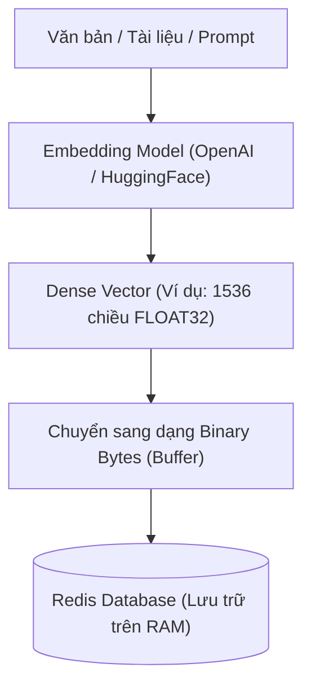
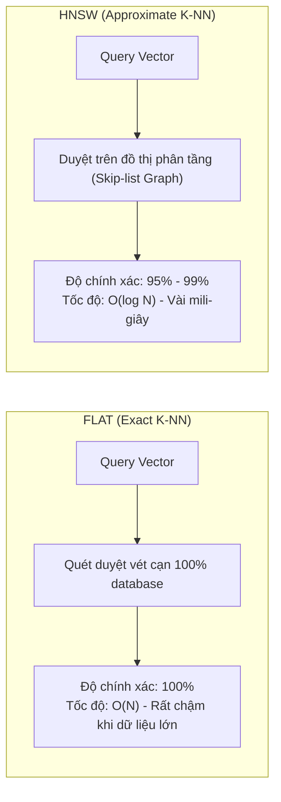
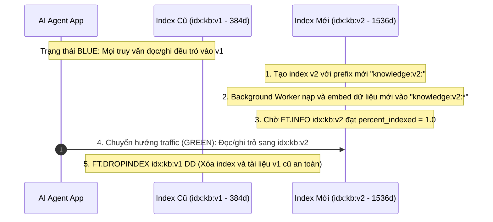

<!--
name: 1-embeddings-and-hnsw-indexing.md
description: Comprehensive guide to Vector Embeddings, RediSearch Vector Indexing, FLAT vs HNSW algorithmic deep-dive, hyperparameter tuning (M, efConstruction, efRuntime), and Python integration.
-->

# 2.1 — Embeddings & HNSW Indexing — Xây dựng Vector Database trên Redis

Trong Chương 1, chúng ta đã biến Redis thành bộ nhớ làm việc siêu tốc (**Working Memory** qua RedisJSON) và trạm điều phối sự kiện tin cậy (**Event Loop** qua Streams). 

Tuy nhiên, mọi AI Agent thực chiến đều cần một tầng bộ nhớ thứ hai: **Long-term / Semantic Memory (Bộ nhớ dài hạn & Tri thức ngữ nghĩa)**.
* Khi người dùng hỏi: *"Tháng trước tôi đã cấu hình chính sách bảo mật như thế nào?"*
* Hoặc Agent cần tra cứu tài liệu nghiệp vụ: *"Tìm kiếm tài liệu API thanh toán cho đơn hàng quốc tế"*.

Nếu chỉ dùng tìm kiếm từ khóa truyền thống (Keyword / Lexical Search như SQL `LIKE '%bảo mật%'`), Agent sẽ **bỏ lỡ hoàn toàn các câu có cùng ý nghĩa nhưng khác chữ** (ví dụ: *"chính sách an ninh"*, *"security rule"*).

**Vector Embedding kết hợp RediSearch** chính là chìa khóa mở ra khả năng tìm kiếm ngữ nghĩa (Semantic Search) với độ trễ chỉ tính bằng mili-giây.

---

## 1. Vector Embedding là gì? "DNA" của Bộ nhớ AI Agent

### 1.1. Từ Ngôn ngữ tự nhiên sang Không gian Vector
Một mô hình Embedding (như `text-embedding-3-small` của OpenAI, hoặc `all-MiniLM-L6-v2` mã nguồn mở) nhận đầu vào là một đoạn văn bản và chuyển đổi nó thành một **mảng các số thực** (Vector) cố định số chiều (Dimension - $D$).

```
"Chính sách bảo mật" ──► Embedding Model ──► [ 0.024, -0.158, 0.891, ... ]  (1536 chiều)
"Security rule"       ──► Embedding Model ──► [ 0.026, -0.151, 0.885, ... ]  (Rất gần nhau trong không gian!)
"Công thức nấu phở"   ──► Embedding Model ──► [-0.781,  0.412, -0.052, ... ] (Cách rất xa)
```



### 1.2. Cách Redis lưu trữ Vector: Định dạng nhị phân thô (Raw Float Bytes)
Redis không lưu vector dưới dạng mảng JSON chuỗi `"[0.12, 0.45, ...]"` vì cách này cực kỳ tốn RAM và làm chậm việc tính toán khoảng cách.

Thay vào đó, Redis yêu cầu vector phải được nạp dưới dạng **chuỗi byte nhị phân (Binary Blob)** của các số thực float:
* **FLOAT32 (Mặc định phổ biến nhất)**: Mỗi số thực chiếm 4 bytes.
  * Vector 384 chiều (`all-MiniLM-L6-v2`): $384 \times 4 = 1,536 \text{ bytes} \approx 1.5 \text{ KB}$.
  * Vector 1536 chiều (`text-embedding-3-small`): $1536 \times 4 = 6,144 \text{ bytes} \approx 6 \text{ KB}$.
* **FLOAT64**: Độ chính xác kép, chiếm 8 bytes mỗi chiều (ít khi cần cho NLP).

Trong Python, bạn chuyển đổi mảng vector sang định dạng Redis bằng NumPy:
```python
import numpy as np

vector = [0.024, -0.158, 0.891]
# Bắt buộc ép kiểu về float32 và trích xuất raw bytes
byte_buffer = np.array(vector, dtype=np.float32).tobytes()
```

---

## 2. RediSearch: `ON HASH` vs `ON JSON`

Redis hỗ trợ đánh chỉ mục Vector trên 2 cấu trúc dữ liệu chính:

| Tiêu chí | `ON HASH` | `ON JSON` (Khuyên dùng cho AI Agent) |
| :--- | :--- | :--- |
| **Cấu trúc lưu trữ** | Redis Hash phẳng (`HSET key field value`) | Cây tài liệu RedisJSON (`JSON.SET key $ ...`) |
| **Độ linh hoạt dữ liệu** | Kém: Chỉ lưu được key-value 1 cấp, khó lồng danh sách/object con. | **Tuyệt vời**: Lưu trọn vẹn cả payload metadata phức tạp (tags, chat history, user profile). |
| **Cú pháp đánh Index** | Trỏ trực tiếp vào tên field: `embedding VECTOR ...` | Trỏ qua JSONPath: `$.embedding AS embedding VECTOR ...` |
| **Hiệu năng & Tối ưu** | Nhỉnh hơn một chút về RAM thuần do Hash rất nhẹ. | Tối ưu hơn cho luồng Agent vì không cần tách nhỏ document ra nhiều key. |

---

## 3. So sánh thuật toán Indexing: FLAT vs HNSW

Khi tạo Vector Index, Redis cung cấp 2 thuật toán tìm kiếm láng giềng gần nhất (K-Nearest Neighbors - KNN):



### 3.1. FLAT (Brute-force / Exact Search)
* **Nguyên lý**: Khi có query vector, Redis so sánh khoảng cách lần lượt với **tất cả vector** có trong database.
* **Ưu điểm**:
  * Độ chính xác tuyệt đối **100% Recall** (không bao giờ bỏ sót vector gần nhất).
  * Không tốn thêm RAM phụ trợ để dựng đồ thị.
  * Build index tức thì, không tốn thời gian tính toán trước.
* **Nhược điểm**:
  * Độ phức tạp tính toán là $\mathcal{O}(N)$. Khi có 1 triệu vector, mỗi câu query phải thực hiện 1 triệu phép nhân vô hướng $\to$ độ trễ tăng vọt (hàng trăm ms đến vài giây), nghẽn CPU server.
* **Khi nào nên dùng FLAT?**
  * Dataset nhỏ (dưới $10.000$ vectors).
  * Dùng làm bộ chuẩn (Ground Truth) để benchmark độ chính xác của HNSW.

### 3.2. HNSW (Hierarchical Navigable Small World)
* **Nguyên lý**: Lấy cảm hứng từ hiện tượng "sáu bậc cách biệt" (Six Degrees of Separation) và cấu trúc Skip-List. HNSW xây dựng một **mạng đồ thị đa tầng**:
  * Tầng trên cùng: Thưa thớt, các liên kết nhảy vọt dài giúp định hướng nhanh đến vùng không gian cần tìm.
  * Càng xuống tầng dưới: Mật độ liên kết dày đặc dần để định vị chính xác điểm lân cận.
* **Ưu điểm**:
  * Tốc độ tìm kiếm thần tốc: Độ phức tạp chỉ là $\mathcal{O}(\log N)$. Với hàng triệu vector, thời gian tìm kiếm chỉ mất **1 – 5 mili-giây**.
* **Nhược điểm**:
  * Tốn thêm **20% – 50% RAM** để lưu trữ các cạnh của đồ thị.
  * Tốn thời gian build index khi chèn dữ liệu mới.
* **Khi nào nên dùng HNSW?**
  * Lựa chọn mặc định cho mọi hệ thống Production của AI Agent và RAG Pipeline quy mô lớn ($> 10.000$ vectors).

---

## 4. Giải phẫu các siêu tham số HNSW (`M`, `efConstruction`, `efRuntime`)

Để làm chủ HNSW trên Redis, bạn cần hiểu rõ 3 tham số quyết định sự cân bằng giữa **Tốc độ (Speed)**, **Độ chính xác (Recall)** và **Dung lượng RAM (Memory)**:

```
                  ┌───────────────────────────────┐
                  │    Độ chính xác (Recall)     │
                  └──────────────┬────────────────┘
                                 ▲
                                / \
                               /   \
                              /     \
                             /       \
  ┌─────────────────────────┐         ┌─────────────────────────┐
  │  Tốc độ truy vấn (QPS)  │◄───────►│  Tiết kiệm RAM & Build  │
  └─────────────────────────┘         └─────────────────────────┘
```

| Tham số | Giá trị mặc định | Khoảng kiến nghị | Ý nghĩa kỹ thuật & Trade-off |
| :--- | :--- | :--- | :--- |
| **`M`** | `16` | `16 – 64` | **Số lượng liên kết tối đa của mỗi node trên mỗi tầng đồ thị**.<br/>* $M$ càng cao: Đồ thị kết nối càng chặt chẽ $\to$ Recall cao hơn trên dữ liệu phức tạp (như audio/hình ảnh/embedding chiều cao), nhưng **ngốn thêm rất nhiều RAM** và làm chậm tốc độ ghi. |
| **`efConstruction`** | `200` | `100 – 400` | **Kích thước hàng đợi ứng viên khi XÂY DỰNG index**.<br/>* Giá trị càng cao: Đồ thị được tối ưu cấu trúc tốt hơn $\to$ Tìm kiếm sau này chính xác hơn, nhưng thời gian nạp dữ liệu ban đầu lâu hơn. |
| **`efRuntime`** | `10` | `10 – 200` | **Kích thước hàng đợi ứng viên khi TRUY VẤN (Search-time)**.<br/>* Có thể điều chỉnh động theo từng truy vấn mà không cần tạo lại index! Tăng `efRuntime` giúp tăng Recall khi cần tra cứu tài liệu cực kỳ chính xác. |

### Lựa chọn Khoảng cách (`DISTANCE_METRIC`)
Redis hỗ trợ 3 phép đo khoảng cách toán học:
1. **`COSINE` (Phổ biến nhất cho NLP/LLM)**: Đo góc giữa 2 vector, bỏ qua độ dài. Giá trị trả về từ $0$ (giống hệt nhau) đến $2$ (đối lập hoàn toàn). Khoảng cách càng nhỏ càng tương đồng.
2. **`L2` (Euclidean Distance)**: Đo khoảng cách đường thẳng thông thường. Thích hợp cho nhận diện khuôn mặt hoặc hình ảnh.
3. **`IP` (Inner Product / Tích vô hướng)**: Cực kỳ nhanh về mặt tính toán CPU. **Nếu vector của bạn đã được chuẩn hóa L2 (L2-Normalized - độ dài bằng 1)**, thì `IP` tương đương với `COSINE` nhưng tốc độ tính toán nhanh hơn đáng kể!

---

## 5. Cú pháp lệnh RediSearch: `FT.CREATE` & `FT.INFO`

### 5.1. Cú pháp `FT.CREATE` cho RedisJSON
Dưới đây là câu lệnh chuẩn mực để tạo một Vector Index trên tài liệu RedisJSON:

```redis
FT.CREATE idx:agent_knowledge ON JSON
  PREFIX 1 "knowledge:doc:"
  SCHEMA
    $.title AS title TEXT WEIGHT 2.0
    $.category AS category TAG
    $.embedding AS vector VECTOR HNSW 6
      TYPE FLOAT32
      DIM 1536
      DISTANCE_METRIC COSINE
      M 16
      efConstruction 200
```

**Giải thích từng dòng lệnh**:
* `FT.CREATE idx:agent_knowledge ON JSON`: Tạo chỉ mục tên `idx:agent_knowledge` đánh trên tài liệu dạng JSON.
* `PREFIX 1 "knowledge:doc:"`: Chỉ tự động index các key có tiền tố bắt đầu bằng `knowledge:doc:` (ví dụ: `knowledge:doc:001`, `knowledge:doc:002`).
* `SCHEMA`: Định nghĩa cấu trúc các trường:
  * `$.title AS title TEXT`: Trường văn bản để tìm kiếm từ khóa kết hợp (Hybrid Search).
  * `$.category AS category TAG`: Trường tag để lọc chính xác (Filter: ví dụ chỉ tìm trong category `"security"`).
  * `$.embedding AS vector VECTOR HNSW 6`: Định nghĩa trường vector dùng thuật toán HNSW với 6 tham số đi kèm phía sau:
    * `TYPE FLOAT32`: Định dạng số thực 32-bit.
    * `DIM 1536`: Số chiều của vector (ví dụ của OpenAI `text-embedding-3-small`).
    * `DISTANCE_METRIC COSINE`: Đo độ tương đồng ngữ nghĩa bằng góc Cosine.
    * `M 16` và `efConstruction 200`: Cấu hình đồ thị HNSW cân bằng tối ưu.

---

### 5.2. `FT.INFO`: Giám sát trạng thái Index sống còn trong Production
Sau khi tạo index, bạn kiểm tra tình trạng bằng lệnh:
```redis
FT.INFO idx:agent_knowledge
```

Các trường cần đặc biệt theo dõi:
1. `num_docs`: Số lượng tài liệu đã được lập chỉ mục thành công.
2. `indexing`: Giá trị `0` (đã index xong hoàn toàn) hoặc `1` (đang trong quá trình quét index ngầm).
3. `percent_indexed`: Tỉ lệ phần trăm index đã hoàn tất (phải đạt `1.0` thì kết quả tìm kiếm mới đầy đủ).
4. `total_inverted_index_blocks`: Bộ nhớ dành riêng cho chỉ mục văn bản/tag.
5. `vector_index_size`: Dung lượng RAM mà đồ thị HNSW đang chiếm dụng.

---

## 6. Bảo trì Index (Index Maintenance): Cập nhật, Xóa & Blue-Green Reindexing

Trong môi trường Production thực tế, tri thức của Agent không bao giờ là bất biến: tài liệu cũ bị xóa, chính sách mới được cập nhật, và đôi khi bạn cần nâng cấp mô hình Embedding sang thế hệ mới.

### 6.1. Cập nhật và Xóa Vector tự động
Một điểm tuyệt vời của RediSearch khi tích hợp với `RedisJSON`:
* **Khi cập nhật tài liệu**: Khi bạn gọi lệnh `JSON.SET knowledge:doc:101 $.embedding <new_vector>` hoặc cập nhật text `$.title`, RediSearch tự động bắt sự kiện và tái cấu trúc liên kết HNSW cho vector đó ngay lập tức trong RAM.
* **Khi xóa tài liệu**: Chỉ cần gọi `JSON.DEL knowledge:doc:101`, RediSearch sẽ gỡ bỏ node tương ứng khỏi đồ thị HNSW và cập nhật `num_docs`. Bạn không cần phải gọi thêm bất kỳ lệnh dọn index thủ công nào.

### 6.2. Thách thức lớn: Thay đổi mô hình Embedding (Model Upgrade)
Giả sử hệ thống đang dùng model cũ `all-MiniLM-L6-v2` ($384$ chiều), nay muốn nâng cấp lên `text-embedding-3-small` ($1536$ chiều):
* ⚠️ **Nguyên tắc bất biến**: Bạn **KHÔNG THỂ** sửa trực tiếp tham số `DIM` hay `DISTANCE_METRIC` trên một Index đã tồn tại!
* Nếu xóa index (`FT.DROPINDEX`) để tạo lại từ đầu, toàn bộ hệ thống RAG của Agent sẽ bị ngừng hoạt động (Downtime) trong suốt thời gian embedding lại dữ liệu!

### 6.3. Giải pháp chuẩn Production: Chiến lược Zero-Downtime Blue-Green Reindexing



**Các bước thực hiện:**
1. **Bước 1 (Giữ nguyên v1)**: Index `idx:kb:v1` (prefix `knowledge:v1:`) tiếp tục phục vụ người dùng bình thường.
2. **Bước 2 (Khởi tạo v2 song song)**: Tạo `idx:kb:v2` với prefix `knowledge:v2:` và cấu hình `DIM 1536`.
3. **Bước 3 (Re-indexing chạy ngầm)**: Một background worker đọc tài liệu gốc, trích xuất embedding 1536 chiều bằng model mới và lưu vào các key `knowledge:v2:*`.
4. **Bước 4 (Kiểm tra sức khỏe)**: Chạy `FT.INFO idx:kb:v2` cho đến khi `percent_indexed == 1.0` và `indexing == 0`.
5. **Bước 5 (Cutover - Đổi hướng)**: Cập nhật biến cấu hình ứng dụng `ACTIVE_VECTOR_INDEX = "idx:kb:v2"` và `DOC_PREFIX = "knowledge:v2:"` (không downtime).
6. **Bước 6 (Dọn dẹp)**: Khi v2 đã chạy ổn định, chạy lệnh `FT.DROPINDEX idx:kb:v1 DD` để giải phóng RAM của index cũ.

---

## 7. Thực hành Lab: Tự tay tạo Index & nạp Vector bằng Python

Chúng ta sẽ sử dụng thư viện `sentence-transformers` (chạy hoàn toàn offline miễn phí, vector 384 chiều) kết hợp với `redis-py` để xây dựng một kho tri thức cho Agent.

### Cài đặt môi trường
```powershell
pip install redis numpy sentence-transformers
```

### File mã nguồn mẫu: `1_embeddings_and_hnsw.py`
Toàn bộ mã nguồn thực thi được đặt tại:
`./2-vector-search-and-rag/code-examples/1_embeddings_and_hnsw.py`

```python
"""
name: 1_embeddings_and_hnsw.py
description: Complete hands-on tutorial for creating an HNSW Vector Index on RedisJSON, embedding documents, and inspecting index health.
"""

import os
import json
import numpy as np
import redis
from redis.commands.search.field import TextField, TagField, VectorField
from redis.commands.search.indexDefinition import IndexDefinition, IndexType
from sentence_transformers import SentenceTransformer

# 1. Khởi tạo kết nối Redis
pwd = os.getenv("REDIS_PASSWORD", "secret123")
client = redis.Redis(host="localhost", port=6379, password=pwd, decode_responses=True)

# 2. Tải model Embedding miễn phí, nhẹ (384 chiều)
print("📥 Đang tải mô hình Embedding (all-MiniLM-L6-v2)...")
embedder = SentenceTransformer("all-MiniLM-L6-v2")
VECTOR_DIM = 384
INDEX_NAME = "idx:agent_docs"
DOC_PREFIX = "doc:knowledge:"

# 3. Tạo Vector Index HNSW trên RedisJSON
try:
    client.ft(INDEX_NAME).info()
    print(f"[*] Index '{INDEX_NAME}' đã tồn tại. Đang xóa để khởi tạo mới...")
    client.ft(INDEX_NAME).dropindex(delete_documents=True)
except Exception:
    pass

schema = (
    TextField("$.title", as_name="title"),
    TagField("$.category", as_name="category"),
    VectorField(
        "$.embedding",
        "HNSW",
        {
            "TYPE": "FLOAT32",
            "DIM": VECTOR_DIM,
            "DISTANCE_METRIC": "COSINE",
            "M": 16,
            "EF_CONSTRUCTION": 200,
        },
        as_name="vector"
    )
)

definition = IndexDefinition(prefix=[DOC_PREFIX], index_type=IndexType.JSON)
client.ft(INDEX_NAME).create_index(fields=schema, definition=definition)
print(f"✅ Đã tạo thành công HNSW Vector Index: '{INDEX_NAME}'!")

# 4. Chuẩn bị tập dữ liệu tri thức của Agent
sample_docs = [
    {
        "id": "1",
        "title": "Chính sách bảo mật mật khẩu và xác thực đa yếu tố (MFA)",
        "content": "Người dùng bắt buộc phải thiết lập 2FA và mật khẩu dài ít nhất 12 ký tự.",
        "category": "security"
    },
    {
        "id": "2",
        "title": "Quy trình xin hoàn tiền đơn hàng kỹ thuật số",
        "content": "Khách hàng có quyền yêu cầu hoàn lại tiền trong vòng 14 ngày kể từ khi thanh toán.",
        "category": "billing"
    },
    {
        "id": "3",
        "title": "Hướng dẫn cấu hình kết nối Redis Cluster cho ứng dụng Agent",
        "content": "Sử dụng connection pooling với timeout 5 giây để tránh cạn kiệt socket trên server.",
        "category": "infra"
    }
]

# 5. Tạo Vector và lưu trữ vào RedisJSON
print("\n🔄 Đang trích xuất Vector Embeddings và lưu vào RedisJSON...")
for doc in sample_docs:
    # Trích xuất vector embedding
    embedding = embedder.encode(doc["content"])
    raw_bytes = np.array(embedding, dtype=np.float32).tobytes()

    # Dữ liệu JSON lưu trữ
    json_doc = {
        "title": doc["title"],
        "content": doc["content"],
        "category": doc["category"],
        # Lưu raw byte dạng danh sách số thực hoặc binary trong RedisJSON
        "embedding": embedding.tolist()
    }

    doc_key = f"{DOC_PREFIX}{doc['id']}"
    client.json().set(doc_key, "$", json_doc)
    print(f"   -> Đã lưu key: {doc_key} | Danh mục: [{doc['category']}]")

# 6. Kiểm tra thông tin Index bằng FT.INFO
info = client.ft(INDEX_NAME).info()
print("\n" + "=" * 60)
print("📊 BÁO CÁO TÌNH TRẠNG INDEX (FT.INFO):")
print("=" * 60)
print(f" - Tên Index          : {info['index_name']}")
print(f" - Số lượng Docs      : {info['num_docs']}")
print(f" - Trạng thái Indexing: {'HOÀN TẤT' if info.get('indexing') == '0' or not info.get('indexing') else 'ĐANG XỬ LÝ'}")
print(f" - Tỉ lệ lập chỉ mục  : {float(info.get('percent_indexed', 1.0)) * 100}%")
print("=" * 60)
```

Chạy code thử nghiệm bằng lệnh:
```powershell
py .\2-vector-search-and-rag\code-examples\1_embeddings_and_hnsw.py
```

---

## 8. Tổng kết & Bước tiếp theo

Trong bài này, bạn đã nắm vững nền tảng kiến trúc của **Vector Database trên Redis**:
* Bản chất của Vector Embedding là các chuỗi byte nhị phân `FLOAT32`.
* Tại sao **HNSW** là tiêu chuẩn vàng cho AI Agent nhờ tốc độ tìm kiếm $\mathcal{O}(\log N)$.
* Cách tinh chỉnh bộ 3 siêu tham số `M`, `efConstruction`, và `efRuntime` để kiểm soát dung lượng RAM và Recall.
* Cách tạo Index trên tài liệu `RedisJSON`, bảo trì cập nhật/xóa vector và chiến lược Zero-Downtime Blue-Green Reindexing.
* Cách theo dõi sức khỏe index qua `FT.INFO`.

👉 Ở bài tiếp theo, chúng ta sẽ bước sang kỹ thuật truy vấn cốt lõi: **[2.2 — Vector Similarity & Hybrid Search](./2-vector-similarity-and-hybrid-search.md)** — kết hợp Vector Search cùng Full-Text & Tag Filtering để tạo ra Pipeline RAG siêu chuẩn xác!

---

*← Trước: [2.0 - Chunking & Preprocessing](./0-chunking-and-preprocessing.md) | Tiếp theo: [2.2 - Vector Similarity & Hybrid Search](./2-vector-similarity-and-hybrid-search.md) →*
