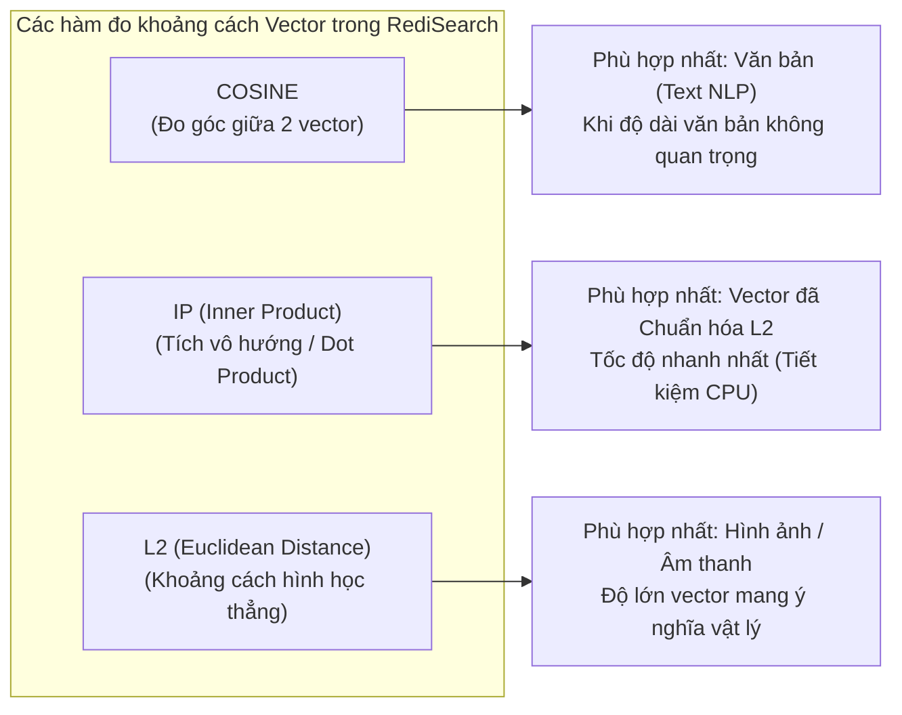
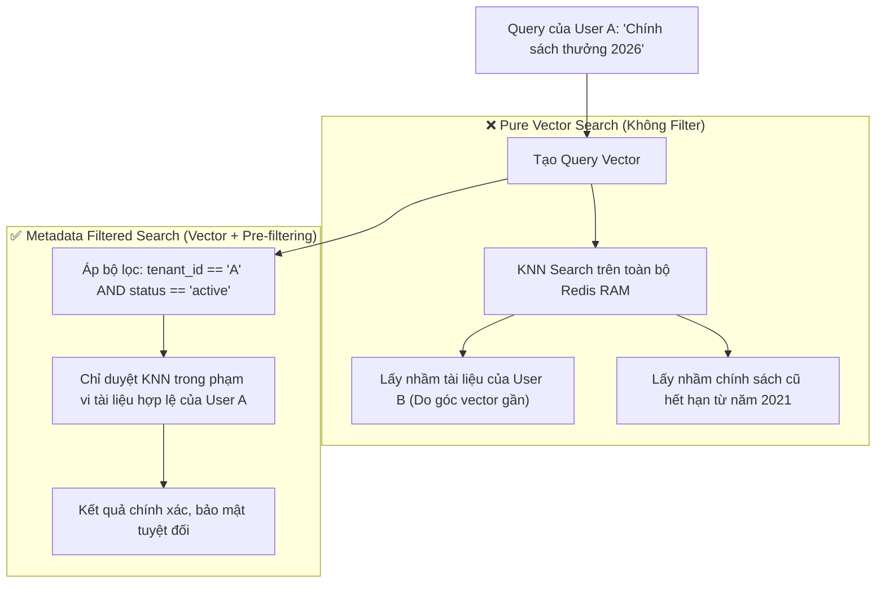
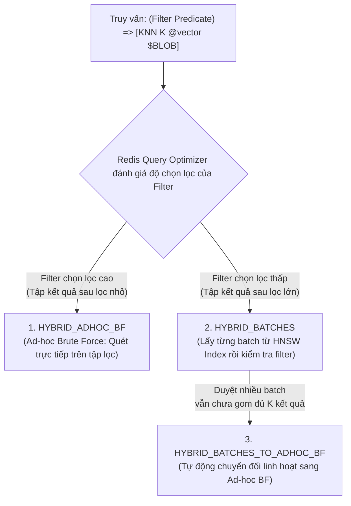
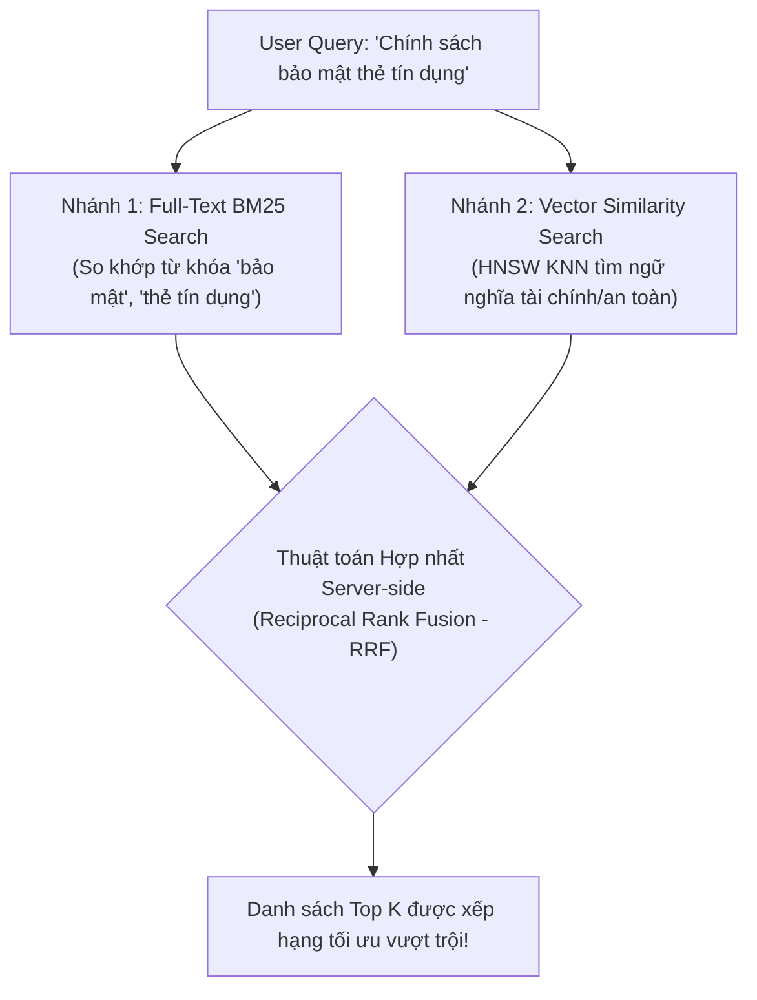
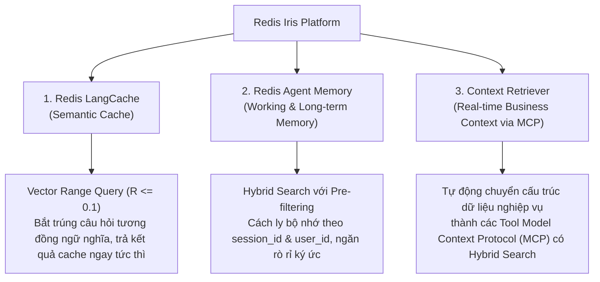

<!--
name: 2-vector-similarity-and-hybrid-search.md
description: In-depth guide to Vector Similarity Metrics (Cosine, IP, L2), FT.SEARCH KNN queries, Vector Range Search, Multi-tenant Hybrid Search, Pre-filtering mechanics (HYBRID_POLICY, ADHOC_BF, BATCHES), modern FT.HYBRID command (Redis 8.4+), and integration with Redis Iris Context Platform.
-->

# 2.2 — Vector Similarity & Hybrid Search — Tìm kiếm Ngữ nghĩa cho RAG & AI Agent Memory

Trong bài trước, chúng ta đã nắm vững cách số hóa văn bản thành Vector và lập chỉ mục bằng giải thuật đồ thị **HNSW** trên Redis. 

Tuy nhiên, trong các hệ thống AI Agent thực chiến cấp doanh nghiệp, một bài toán sống còn xuất hiện:
> *"Làm thế nào để tìm kiếm chính xác các mảnh ký ức ngữ nghĩa liên quan nhất, nhưng **tuyệt đối không được rò rỉ dữ liệu** giữa các User khác nhau, **không lấy nhầm văn bản đã hết hạn**, và **kết hợp được cả từ khóa chính xác lẫn ngữ nghĩa** mà không làm nghẽn CPU?"*

Nếu chỉ dùng **Pure Vector Search (Tìm kiếm vector thuần túy)**, hệ thống của bạn sẽ nhanh chóng gặp thảm họa vi phạm bảo mật đa người dùng (Multi-tenant data leakage) và hiện tượng "ảo giác dữ liệu cũ".

Chương này sẽ trang bị cho bạn kiến thức chuyên sâu về:
1. **3 hàm đo khoảng cách vector** (`COSINE`, `IP`, `L2`) và cách chọn chuẩn xác.
2. Cú pháp truy vấn **`FT.SEARCH` KNN & Vector Range Query**.
3. Cơ chế **Pre-filtering với 3 chế độ thực thi chính thức của Redis** (`HYBRID_ADHOC_BF`, `HYBRID_BATCHES`, `HYBRID_BATCHES_TO_ADHOC_BF`) và cách kiểm soát qua `HYBRID_POLICY` / `FT.PROFILE`.
4. Lệnh **`FT.HYBRID` hoàn toàn mới (Redis 8.4+)** kết hợp Full-Text BM25 + Vector Similarity qua thuật toán hợp nhất **Reciprocal Rank Fusion (RRF)**.
5. Cách nền tảng **Redis Iris AI Platform** khai thác tầng tìm kiếm này để quản lý ngữ cảnh cho Agent.

---

## 1. Ba hàm đo khoảng cách Vector (Distance Metrics) — Chọn sao cho chuẩn?

Khi khai báo trường `VECTOR` trong RediSearch, tham số `DISTANCE_METRIC` quyết định thuật toán mà Redis dùng để tính mức độ "gần nhau" giữa vector truy vấn ($\vec{q}$) và vector tài liệu ($\vec{d}$).

```sql
FT.CREATE idx:kb ON JSON SCHEMA $.embedding AS embedding VECTOR HNSW 6 ... DISTANCE_METRIC <COSINE | IP | L2>
```



---

### 1.1. `COSINE` (Cosine Distance)

* **Bản chất hình học**: Đo **góc** giữa hai vector trong không gian đa chiều, hoàn toàn bỏ qua độ dài (độ lớn - magnitude) của chúng.
* **Công thức toán học**:
  $$\text{Cosine Similarity}(\vec{u}, \vec{v}) = \frac{\vec{u} \cdot \vec{v}}{\|\vec{u}\|_2 \|\vec{v}\|_2} = \frac{\sum_{i=1}^{D} u_i v_i}{\sqrt{\sum_{i=1}^{D} u_i^2} \sqrt{\sum_{i=1}^{D} v_i^2}}$$
* **Khoảng cách trong Redis (Cosine Distance)**:
  $$D_{\text{Cosine}}(\vec{u}, \vec{v}) = 1 - \text{Cosine Similarity}(\vec{u}, \vec{v})$$
* **Miền giá trị**: Từ $0.0$ đến $2.0$:
  * $D = 0.0$: Hai vector cùng hướng hoàn toàn (đồng nghĩa $100\%$).
  * $D = 1.0$: Hai vector vuông góc ($90^\circ$, không có mối liên hệ ngữ nghĩa).
  * $D = 2.0$: Hai vector ngược hướng hoàn toàn ($180^\circ$).
* **Use-case**: Chuẩn mực cho tìm kiếm tài liệu văn bản khi vector chưa được chuẩn hóa độ dài.

---

### 1.2. `IP` (Inner Product / Dot Product)

* **Bản chất toán học**: Tích vô hướng giữa hai vector:
  $$\langle \vec{u}, \vec{v} \rangle = \sum_{i=1}^{D} u_i v_i$$
* **Khoảng cách trong Redis (IP Distance)**:
  $$D_{\text{IP}}(\vec{u}, \vec{v}) = 1 - \langle \vec{u}, \vec{v} \rangle$$
* **Điểm cốt lõi cực kỳ quan trọng**:
  * Nếu vector đầu vào đã được **chuẩn hóa độ dài đơn vị (Unit Normalized: $\|\vec{u}\|_2 = 1$)**, thì:
    $$\|\vec{u}\|_2 \|\vec{v}\|_2 = 1 \times 1 = 1 \implies \text{Cosine Distance} \equiv \text{IP Distance}$$
  * **Tại sao nên dùng `IP` thay vì `COSINE`?** 
    * Thuật toán `COSINE` phải thực hiện phép chia căn bậc hai ở mẫu số cho mỗi lần so sánh cạnh đồ thị HNSW.
    * `IP` chỉ thực hiện các phép nhân và cộng (FMA - Fused Multiply-Add), tận dụng tối đa tập lệnh SIMD (AVX-512 / ARM NEON) của CPU.
    * **Kết quả**: `IP` cho thông lượng truy vấn (Throughput) **nhanh hơn đáng kể** so với `COSINE` trên cùng một tập dữ liệu, do loại bỏ hoàn toàn chi phí tính toán căn bậc hai và chuẩn hóa mẫu số tại runtime!

> [!TIP]
> Các mô hình Embedding hiện đại như OpenAI `text-embedding-3-small` / `large`, Cohere Embed v3, hay BGE-M3 mặc định **đều đã xuất xưởng dưới dạng vector chuẩn hóa $L_2 = 1$**. Hãy ưu tiên chọn `DISTANCE_METRIC IP` để đạt hiệu năng tối đa trên Redis!

---

### 1.3. `L2` (Euclidean Distance bình phương)

* **Bản chất hình học**: Khoảng cách đường thẳng vật lý (đoạn nối trực tiếp) giữa 2 điểm trong không gian:
  $$D_{\text{L2}}(\vec{u}, \vec{v}) = \|\vec{u} - \vec{v}\|_2^2 = \sum_{i=1}^{D} (u_i - v_i)^2$$
* **Miền giá trị**: $[0, +\infty)$. Hai vector càng gần nhau thì $D_{\text{L2}}$ càng tiến về $0$.
* **Use-case**: Nhận diện khuôn mặt (Face recognition), phân cụm hình ảnh (Computer Vision features như ResNet/VGG), phân tích chuỗi thời gian (Audio/Sensor embeddings), nơi mà khoảng cách hình học tuyệt đối mang ý nghĩa khác biệt.

---

### 1.4. Bảng tổng kết so sánh 3 Metrics

| Tiêu chí | `COSINE` | `IP` (Inner Product) | `L2` (Euclidean) |
| :--- | :--- | :--- | :--- |
| **Công thức Redis Distance** | $1 - \frac{\vec{u} \cdot \vec{v}}{\|\vec{u}\| \|\vec{v}\|}$ | $1 - (\vec{u} \cdot \vec{v})$ | $\sum (u_i - v_i)^2$ |
| **Miền giá trị khoảng cách** | $[0.0, 2.0]$ | $(-\infty, +\infty)$ (hoặc $[0, 2]$ nếu normalized) | $[0.0, +\infty)$ |
| **Giá trị 0 mang ý nghĩa gì?** | Trùng hướng hoàn toàn | Tích vô hướng bằng 1 | Trùng tọa độ hoàn toàn |
| **Độ phức tạp tính toán** | Trung bình (Cần tính căn mẫu số) | **Siêu nhanh (Chỉ nhân & cộng vector)** | Nhanh |
| **Yêu cầu Vector chuẩn hóa?** | Không bắt buộc | **Bắt buộc chuẩn hóa $L_2 = 1$** | Không |
| **Ứng dụng khuyến nghị** | Text RAG tổng quát | **RAG Production tối ưu latency** | Vision, Audio, Clustering |

---

## 2. Kỹ thuật truy vấn `FT.SEARCH` với Vector KNN

### 2.1. Giải phẫu cú pháp truy vấn KNN (K-Nearest Neighbors)

Truy vấn tìm kiếm $K$ vector gần nhất trên RediSearch có cấu trúc chuẩn như sau:

```sql
FT.SEARCH <index_name> 
  "(*)=>[KNN <k> @<vector_field> $BLOB AS <score_field>]" 
  PARAMS 2 BLOB <binary_bytes> 
  SORTBY <score_field> ASC 
  DIALECT 2
```

Hãy mổ xẻ từng thành phần:

1. `(*)`: **Filter Query**. Dấu `*` đại diện cho wildcard (lấy toàn bộ không gian tài liệu). Chúng ta sẽ thay thế phần này bằng các biểu thức lọc nghiệp vụ trong phần Hybrid Search.
2. `=>[KNN <k> @vector_field $BLOB AS score_field]`: Toán tử KNN Vector.
   * `<k>`: Số lượng láng giềng gần nhất muốn lấy về (ví dụ `5`, `10`).
   * `@vector_field`: Tên trường vector được khai báo trong Schema (ví dụ `@embedding`).
   * `$BLOB`: Tên biến tham số chứa vector truy vấn.
   * `AS score_field`: Đổi tên điểm khoảng cách trả về (thường đặt là `AS score` hoặc `AS vector_distance`).
3. `PARAMS 2 BLOB <binary_bytes>`:
   * RediSearch sử dụng cơ chế Parameterized Query để nạp dữ liệu nhị phân.
   * `2`: Số lượng phần tử trong cặp `[tên_biến, giá_trị]`.
   * `<binary_bytes>`: **Bắt buộc** là mảng byte nhị phân của số thực float (dù index lưu trên JSON hay HASH, khi truyền vector query vào hàm tìm kiếm của RediSearch thì tham số này vẫn phải đóng gói dưới dạng `np.array(vec, dtype=np.float32).tobytes()`).
4. `SORTBY <score_field> ASC`:
   * Vì RediSearch trả về **Khoảng cách (Distance)** chứ không phải độ tương đồng. Điểm càng nhỏ nghĩa là 2 vector càng gần nhau $\to$ **Luôn sắp xếp tăng dần (`ASC`)**.
5. `DIALECT 2` (hoặc `DIALECT 4`):
   * Bắt buộc phải bật `DIALECT 2` trở lên để kích hoạt cú pháp Vector Search hiện đại và bộ phân tích cú pháp chuẩn.

---

### 2.2. Vector Range Query: Tìm kiếm theo Bán kính Ngưỡng

Một nhược điểm lớn của truy vấn KNN thuần túy ($K=5$):
* Nếu user đặt một câu hỏi hoàn toàn vô nghĩa (ví dụ: *"asdjaksjd123"*), mô hình Embedding vẫn sinh ra một vector.
* Thuật toán KNN **vẫn bị ép buộc phải trả về đủ 5 tài liệu**, dù khoảng cách của chúng rất xa ($D > 0.8$ — hoàn toàn không liên quan)!
* Hậu quả: LLM nhận phải thông tin rác và sinh ra ảo giác (Hallucination).

**Giải pháp**: Sử dụng **Vector Range Query** (Chỉ lấy tài liệu nếu khoảng cách nằm trong bán kính $R$ cho phép):

```sql
FT.SEARCH idx:kb 
  "@embedding:[VECTOR_RANGE $radius $BLOB] => {$yield_distance_as: score}" 
  PARAMS 4 radius 0.25 BLOB <binary_bytes> 
  SORTBY score ASC 
  DIALECT 2
```

* `$radius 0.25`: Chỉ giữ lại các tài liệu có $D_{\text{Cosine}} \le 0.25$ (tương đương Cosine Similarity $\ge 75\%$). Nếu không có tài liệu nào đạt chuẩn, Redis sẽ trả về $0$ kết quả!

---

## 3. Metadata Filtering: Trái tim của Hệ thống AI Agent Thực chiến

### 3.1. Thảm họa khi thiếu Metadata Filtering

Hãy tưởng tượng một hệ thống SaaS Agent phục vụ 10,000 công ty cùng lưu ký ức vào một Redis Cluster duy nhất:
* Nếu chỉ tìm kiếm bằng Vector, khi nhân viên Công ty A hỏi: *"Doanh thu quý 3 là bao nhiêu?"*, vector này có thể có khoảng cách cực kỳ gần với tài liệu báo cáo của Công ty B!
* Kết quả: **Rò rỉ dữ liệu xuyên người dùng (Cross-tenant Data Breach)** — lỗi bảo mật mức độ nghiêm trọng nhất (P0).



---

### 3.2. Cú pháp kết hợp Multi-Field Filters trong RediSearch

Trong `FT.SEARCH`, phần nằm trước dấu `=>` chính là biểu thức lọc nghiệp vụ (Filter Expression). Bạn có thể kết hợp toán tử logic `AND` (khoảng trắng), `OR` (`|`), `NOT` (`-`), lọc khoảng số (`NUMERIC`), và lọc danh mục (`TAG`):

#### 1. Lọc theo Phân quyền và Người dùng (TAG Filter):
```sql
(@tenant_id:{tenant_99} @user_id:{user_007})=>[KNN 5 @embedding $BLOB AS score]
```

#### 2. Lọc theo Khoảng thời gian (NUMERIC Filter):
Chỉ lấy các ký ức được tạo trong 30 ngày gần nhất (Timestamp $\ge 1725100000$):
```sql
(@created_at:[1725100000 +inf])=>[KNN 5 @embedding $BLOB AS score]
```

#### 3. Lọc kết hợp Phức tạp:
Tìm kiếm các tài liệu thuộc danh mục `hr_policy` hoặc `security_rule`, có trạng thái `active`, tạo sau mốc thời gian chỉ định, và thuộc quyền truy cập của công ty `acme_corp`:

```sql
(
  @tenant_id:{acme_corp} 
  @category:{hr_policy | security_rule} 
  @status:{active} 
  @created_at:[1704067200 +inf]
)=>[KNN 5 @embedding $BLOB AS score]
```

---

## 4. Bản chất thuật toán Pre-filtering: 3 Chế độ Thực thi Chính thức của Redis

Một câu hỏi cốt lõi mà các kỹ sư hạ tầng luôn đặt ra:
> *"Khi ta kết hợp bộ lọc metadata với Vector Search, RediSearch thực thi giải thuật lọc như thế nào để không làm đứt gãy đồ thị HNSW?"*

Trong tài liệu kỹ thuật chính thức của Redis, cơ chế lọc kết hợp (Hybrid Filtering) được vận hành thông qua **3 chế độ thực thi (Execution Modes)** rõ ràng:



### Chi tiết 3 Chế độ Thực thi:

1. **`HYBRID_ADHOC_BF` (Ad-hoc Brute Force)**:
   * **Cơ chế**: Redis sử dụng Inverted Index của RediSearch để lấy toàn bộ danh sách các document thỏa mãn biểu thức lọc trước. Sau đó, nó tính toán khoảng cách vector trực tiếp (Brute Force Distance Calculation) trên riêng tập tài liệu này để chọn ra Top $K$.
   * **Khi nào tối ưu?**: Khi bộ lọc **có độ chọn lọc cao (Highly Selective)** — ví dụ bộ lọc `@user_id:{alice}` chỉ trả về 50 tài liệu trong tổng số 10 triệu bản ghi. Quét thẳng 50 tài liệu nhanh hơn gấp nhiều lần việc lang thang duyệt đồ thị HNSW 10 triệu đỉnh!
   * **Ưu điểm lớn nhất**: Loại bỏ hoàn toàn nguy cơ "đứt gãy đồ thị" (Graph Disconnection Problem).

2. **`HYBRID_BATCHES`**:
   * **Cơ chế**: Redis truy vấn đồ thị HNSW để lấy ra các vector gần nhất theo từng **lô (batch)** nhỏ. Với mỗi lô, Redis kiểm tra xem các vector đó có thỏa mãn điều kiện filter hay không. Quá trình này lặp lại cho đến khi thu thập đủ $K$ kết quả đạt yêu cầu.
   * **Khi nào tối ưu?**: Khi bộ lọc **có độ chọn lọc thấp (Broad Filter)** — ví dụ bộ lọc `@status:{active}` thỏa mãn tới $95\%$ dữ liệu. Lúc này, hầu như mọi vector gần nhất tìm được trên HNSW đều vượt qua filter ngay trong batch đầu tiên, giúp tốc độ đạt mức tối đa.

3. **`HYBRID_BATCHES_TO_ADHOC_BF` (Cơ chế thích ứng thông minh mặc định)**:
   * **Cơ chế**: Redis bắt đầu bằng chiến lược `HYBRID_BATCHES`. Tuy nhiên, nếu sau một số lượng batch nhất định mà vẫn chưa thu đủ $K$ kết quả (do filter khó hơn dự tính), hệ thống sẽ **tự động chuyển đổi sang `HYBRID_ADHOC_BF`** ở giữa chừng!
   * **Lợi ích**: Ngăn ngừa thảm họa CPU starvation khi thuật toán duyệt batch liên tục mà không tìm thấy kết quả phù hợp.

---

### 4.1. Điều khiển Chế độ Lọc bằng tham số `HYBRID_POLICY`

Theo mặc định, RediSearch tự động ước lượng kích thước tập dữ liệu để chọn chế độ tối ưu. Tuy nhiên, bạn có thể **chủ động ép chế độ thực thi** bằng tham số runtime `HYBRID_POLICY`:

```sql
-- Ép buộc dùng Ad-hoc Brute Force khi biết chắc user chỉ có ít dữ liệu:
FT.SEARCH idx:kb "(@user_id:{user_alice})=>[KNN 5 @embedding $BLOB HYBRID_POLICY ADHOC_BF]" PARAMS 2 BLOB <bytes> DIALECT 2

-- Ép buộc dùng Batches khi filter rất rộng:
FT.SEARCH idx:kb "(@language:{vi})=>[KNN 5 @embedding $BLOB HYBRID_POLICY BATCHES]" PARAMS 2 BLOB <bytes> DIALECT 2
```

### 4.2. Debugging Hiệu năng với `FT.PROFILE`

Để kiểm tra xem Redis đang thực sự chạy chế độ nào trên tập dữ liệu thực tế của bạn, hãy sử dụng lệnh `FT.PROFILE`:

```sql
FT.PROFILE idx:kb SEARCH QUERY "(@user_id:{user_alice})=>[KNN 5 @embedding $BLOB]" PARAMS 2 BLOB <bytes> DIALECT 2
```

Trong kết quả trả về ở mục **`Vector index` / `Iterators profile`**, bạn sẽ nhìn thấy chính xác:
* Mode được chọn: `HYBRID_ADHOC_BF` hay `HYBRID_BATCHES`.
* Số lượng batch đã duyệt (`batches_count`).
* Thời gian tính toán khoảng cách vector thực tế (`compute_time`).

---

## 5. `FT.HYBRID` — Kỷ nguyên Mới của Hybrid Search (Redis 8.4+)

Trong các phiên bản trước đây, cộng đồng gọi việc dùng `FT.SEARCH` với biểu thức lọc metadata là "Hybrid Search". Nhưng về bản chất, đó chỉ là **Filtered Vector Search** (Tìm kiếm vector có điều kiện lọc).

**True Hybrid Search (Tìm kiếm Lai Thực thụ)** đòi hỏi khả năng:
$$\text{Kết hợp đồng thời: } \underbrace{\text{Full-Text Lexical Search (BM25)}}_{\text{Chính xác từ khóa, thuật ngữ chuyên ngành}} + \underbrace{\text{Dense Vector Search (HNSW)}}_{\text{Bắt trúng ý nghĩa tương đương}} \longrightarrow \underbrace{\text{Hợp nhất Bảng xếp hạng (Score Fusion)}}_{\text{Đưa ra Top K xuất sắc nhất}}$$

Từ phiên bản **Redis 8.4.0**, Redis chính thức giới thiệu lệnh bản địa hoàn toàn mới: **`FT.HYBRID`**.



---

### 5.1. Cú pháp Lệnh `FT.HYBRID`

```text
FT.HYBRID <index> 
  SEARCH <text_query> 
  VSIM <vector_field> $<vector_param> [KNN <k> [EF_RUNTIME <ef>]] 
  [FILTER <filter_expression>] 
  [COMBINE RRF <count> [CONSTANT <c>] [WINDOW <w>]] 
  [COMBINE LINEAR <count> [ALPHA <alpha>] [BETA <beta>]] 
  PARAMS 2 <vector_param> <binary_bytes>
```

### Các thành phần chính:
* `SEARCH <text_query>`: Truy vấn văn bản truyền thống (sử dụng thuật toán tính điểm BM25).
* `VSIM @embedding $vec KNN 10`: Truy vấn tìm kiếm độ tương đồng vector lấy Top 10 láng giềng.
* `FILTER <expr>`: Bộ lọc metadata bổ sung (ví dụ `FILTER "@status:{active}"`).
* `COMBINE`: Phương thức hợp nhất bảng điểm:
  1. **`COMBINE RRF` (Reciprocal Rank Fusion — Tiêu chuẩn khuyến nghị)**:
     * Công thức toán học:
       $$\text{RRF\_Score}(d) = \frac{1}{k + \text{Rank}_{\text{Text}}(d)} + \frac{1}{k + \text{Rank}_{\text{Vector}}(d)}$$
     * Tham số `CONSTANT <c>` (mặc định $60$): Giúp làm mượt bảng xếp hạng, không bị thiên lệch bởi thứ hạng cực đoan.
     * **Ưu điểm**: Không cần chuẩn hóa thang điểm (vì BM25 tính điểm từ $0 \to +\infty$ còn Cosine tính từ $0 \to 2$, việc cộng điểm trực tiếp sẽ bị sai lệch hoàn toàn). RRF chỉ quan tâm tới **vị trí xếp hạng (Rank)** của tài liệu trong từng danh sách!
  2. **`COMBINE LINEAR` (Kết hợp Tuyến tính có Trọng số)**:
     * Công thức: $\text{Score} = \alpha \cdot \text{Score}_{\text{Text}} + \beta \cdot \text{Score}_{\text{Vector}}$.
     * Dành cho các hệ thống đã tinh chỉnh (fine-tuned) trọng số $\alpha, \beta$ qua benchmark.

---

### 5.2. Ví dụ Lệnh `FT.HYBRID` Thực tế

```sql
FT.HYBRID idx:kb 
  SEARCH "bảo mật thẻ tín dụng" 
  VSIM @embedding $q_vec KNN 10 
  FILTER "@status:{active}" 
  COMBINE RRF 5 CONSTANT 60 
  PARAMS 2 q_vec "\x12\xa9\xf5\x6c..."
```

> [!NOTE]
> **Khi nào dùng lệnh nào?**
> * Dùng **`FT.SEARCH` + Filter**: Khi bạn chỉ tìm kiếm theo ngữ nghĩa vector, nhưng cần cô lập theo quyền truy cập (`@user_id`), danh mục (`@category`), thời gian (`@created_at`).
> * Dùng **`FT.HYBRID`**: Khi bạn cần sự phối hợp sức mạnh của cả 2 thế giới — vừa không muốn bỏ sót từ khóa chuyên ngành (mã số lỗi, tên hàm code, mã sản phẩm SKU), vừa muốn hiểu ngữ nghĩa câu hỏi tổng thể của người dùng.

---

## 6. Tương thích với Nền tảng Redis Iris AI Platform

Trong hệ sinh thái chuyên biệt cho AI Agent vừa được Redis công bố — **Redis Iris**, cơ chế Hybrid Search chính là "động cơ ngầm" kích hoạt các năng lực sau:



1. **Redis Agent Memory**:
   * Tự động quản lý 2 tầng bộ nhớ: **Working Memory** (lưu ngữ cảnh phiên chat hiện tại trên RedisJSON) và **Episodic Long-term Memory** (vector hóa các sự kiện quan trọng).
   * Khi Agent cần hồi tưởng quá khứ, Iris thực thi câu truy vấn Hybrid Search với bộ lọc cứng `@user_id` và `@session_id` với policy `HYBRID_ADHOC_BF` để đảm bảo không bao giờ "nhớ nhầm ký ức của người khác" và tốc độ hồi đáp dưới $5\text{ms}$.
2. **Redis LangCache (Semantic Caching)**:
   * Sử dụng **Vector Range Query** với khoảng cách Cosine cực nhỏ ($R \le 0.10$). Khi người dùng hỏi một câu có cùng ý nghĩa với câu hỏi 5 phút trước, hệ thống trả về câu trả lời đã lưu trong cache mà không cần tốn tiền gọi API OpenAI/Claude.
3. **Redis Context Retriever**:
   * Tự động đồng bộ dữ liệu từ PostgreSQL/MySQL sang Redis qua Change Data Capture (CDC), sau đó mở ra giao diện tìm kiếm kết hợp (Text + Vector) chuẩn giao thức **Model Context Protocol (MCP)** để các Agent có thể tự do tra cứu.

---

## 7. Thực hành Code mẫu Python: Multi-Tenant Memory Search

Dưới đây là kịch bản thực tế hoàn chỉnh: Xây dựng hệ thống lưu trữ và tìm kiếm ký ức cho AI Agent đa người dùng bằng thư viện `redis-py` (hỗ trợ RediSearch).

### 7.1. Cài đặt thư viện cần thiết

```bash
pip install redis numpy sentence-transformers
```

### 7.2. Source Code hoàn chỉnh

```python
"""
name: test_hybrid_search.py
description: Complete runnable example demonstrating RediSearch HNSW indexing, 
             pure vector search vs multi-tenant hybrid search, and vector range query.
"""

import json
import time
import numpy as np
import redis
from redis.commands.search.field import (
    TextField,
    TagField,
    NumericField,
    VectorField
)
from redis.commands.search.indexDefinition import IndexDefinition, IndexType
from redis.commands.search.query import Query

# 1. Kết nối tới Redis Stack
client = redis.Redis(host="localhost", port=6379, decode_responses=False)

INDEX_NAME = "idx:agent_memory"
DOC_PREFIX = "mem:"
VECTOR_DIM = 4  # Dùng 4 chiều để demo trực quan (Trong production: 384 hoặc 1536)

def recreate_index():
    """Tạo mới Index hỗ trợ cả Metadata Fields và Vector Field."""
    try:
        client.ft(INDEX_NAME).dropindex(delete_documents=True)
        print(f"[*] Dropped existing index: {INDEX_NAME}")
    except Exception:
        pass

    schema = (
        TagField("$.user_id", as_name="user_id"),
        TagField("$.category", as_name="category"),
        NumericField("$.created_at", as_name="created_at"),
        TextField("$.content", as_name="content"),
        VectorField(
            "$.embedding",
            "HNSW",
            {
                "TYPE": "FLOAT32",
                "DIM": VECTOR_DIM,
                "DISTANCE_METRIC": "COSINE",
                "M": 16,
                "EF_CONSTRUCTION": 200,
            },
            as_name="embedding"
        )
    )

    definition = IndexDefinition(prefix=[DOC_PREFIX], index_type=IndexType.JSON)
    client.ft(INDEX_NAME).create_index(fields=schema, definition=definition)
    print(f"[+] Index '{INDEX_NAME}' created successfully with HNSW COSINE!")

def seed_sample_memories():
    """
    Nạp dữ liệu ký ức của 2 User khác nhau:
    - User A (user_alice): Lưu thông tin thẻ tín dụng & chính sách nghỉ phép.
    - User B (user_bob): Lưu ghi chú mật khẩu server & lịch công tác.
    """
    memories = [
        {
            "id": "1",
            "user_id": "user_alice",
            "category": "finance",
            "created_at": int(time.time()) - 1000,
            "content": "Thẻ tín dụng Visa doanh nghiệp kết thúc bằng số 8899, hạn mức 50 triệu.",
            # Vector giả lập ngữ nghĩa về 'thanh toán / thẻ tín dụng'
            "embedding": [0.85, 0.10, 0.05, 0.02]
        },
        {
            "id": "2",
            "user_id": "user_alice",
            "category": "hr",
            "created_at": int(time.time()) - 500,
            "content": "Alice đã đăng ký nghỉ phép từ ngày 15 đến 18 tháng sau.",
            "embedding": [0.05, 0.90, 0.12, 0.01]
        },
        {
            "id": "3",
            "user_id": "user_bob",
            "category": "devops",
            "created_at": int(time.time()) - 300,
            "content": "Mật khẩu root của cụm Redis Cluster Staging là 'SecretAdmin2026!'.",
            "embedding": [0.10, 0.15, 0.88, 0.05]
        },
        {
            "id": "4",
            "user_id": "user_bob",
            "category": "finance",
            "created_at": int(time.time()) - 100,
            "content": "Bob thanh toán hóa đơn thẻ tín dụng cá nhân 12 triệu tại ngân hàng.",
            # Vector của Bob cũng nói về 'thẻ tín dụng', có góc rất gần với doc 1 của Alice!
            "embedding": [0.82, 0.12, 0.08, 0.01]
        }
    ]

    for item in memories:
        key = f"{DOC_PREFIX}{item['id']}"
        client.json().set(key, "$", item)
    print(f"[+] Seeded {len(memories)} memory records into RedisJSON.")

def run_pure_vector_search(query_vector: list, top_k: int = 2):
    """
    Tìm kiếm Vector thuần túy (Không có bộ lọc).
    Minh họa nguy cơ lộ lọt dữ liệu giữa các User!
    """
    print("\n" + "="*60)
    print("DEMO 1: PURE VECTOR SEARCH (Nguy cơ lộ lọt dữ liệu)")
    print("="*60)

    # Đóng gói vector query thành dạng binary bytes
    query_bytes = np.array(query_vector, dtype=np.float32).tobytes()

    # Cú pháp KNN wildcard (*)
    query_str = f"(*)=>[KNN {top_k} @embedding $BLOB AS score]"
    q = (
        Query(query_str)
        .sort_by("score", asc=True)
        .return_fields("user_id", "category", "content", "score")
        .dialect(2)
    )

    results = client.ft(INDEX_NAME).search(q, query_params={"BLOB": query_bytes})
    print(f"Query: Tìm kiếm thông tin liên quan tới 'thẻ tín dụng'...")
    print(f"Tổng kết quả tìm thấy: {results.total}")
    for doc in results.docs:
        print(f"  -> [User: {doc.user_id}] | Category: {doc.category} | Distance: {float(doc.score):.4f}")
        print(f"     Nội dung: {doc.content}")

def run_hybrid_search(target_user_id: str, query_vector: list, top_k: int = 2):
    """
    Hybrid Search: Kết hợp Pre-filtering cô lập theo User ID.
    Ngăn chặn tuyệt đối việc User này đọc ký ức của User kia.
    """
    print("\n" + "="*60)
    print(f"DEMO 2: HYBRID SEARCH (Bảo mật - Chỉ tìm trong phạm vi '{target_user_id}')")
    print("="*60)

    query_bytes = np.array(query_vector, dtype=np.float32).tobytes()

    # Pre-filter: Bắt buộc trường user_id phải khớp chính xác, áp dụng HYBRID_POLICY ADHOC_BF
    query_str = f"(@user_id:{{{target_user_id}}})=>[KNN {top_k} @embedding $BLOB HYBRID_POLICY ADHOC_BF AS score]"
    q = (
        Query(query_str)
        .sort_by("score", asc=True)
        .return_fields("user_id", "category", "content", "score")
        .dialect(2)
    )

    results = client.ft(INDEX_NAME).search(q, query_params={"BLOB": query_bytes})
    print(f"Kết quả tìm kiếm cho riêng {target_user_id}:")
    for doc in results.docs:
        print(f"  -> [User: {doc.user_id}] | Category: {doc.category} | Distance: {float(doc.score):.4f}")
        print(f"     Nội dung: {doc.content}")

def run_vector_range_search(target_user_id: str, query_vector: list, max_distance: float = 0.20):
    """
    Vector Range Search: Chỉ lấy các ký ức đạt chất lượng tương đồng cao (Distance <= max_distance).
    Loại bỏ tài liệu không liên quan.
    """
    print("\n" + "="*60)
    print(f"DEMO 3: VECTOR RANGE SEARCH (Bán kính khoảng cách <= {max_distance})")
    print("="*60)

    query_bytes = np.array(query_vector, dtype=np.float32).tobytes()

    # Cú pháp Vector Range kết hợp bộ lọc TAG
    query_str = f"(@user_id:{{{target_user_id}}} @embedding:[VECTOR_RANGE $radius $BLOB] => {{$yield_distance_as: score}})"
    q = (
        Query(query_str)
        .sort_by("score", asc=True)
        .return_fields("user_id", "content", "score")
        .dialect(2)
    )

    params = {
        "radius": max_distance,
        "BLOB": query_bytes
    }

    results = client.ft(INDEX_NAME).search(q, query_params=params)
    print(f"Tìm thấy {results.total} ký ức thỏa mãn ngưỡng bán kính <= {max_distance}:")
    for doc in results.docs:
        print(f"  -> Content: {doc.content} | Distance: {float(doc.score):.4f}")

if __name__ == "__main__":
    recreate_index()
    seed_sample_memories()

    # Vector câu hỏi: "Thẻ ngân hàng và tài chính"
    test_query_vector = [0.84, 0.11, 0.06, 0.02]

    # 1. Pure vector search: Lấy nhầm dữ liệu của cả Alice và Bob
    run_pure_vector_search(test_query_vector, top_k=2)

    # 2. Hybrid search: Khi Alice hỏi, chỉ trả về đúng tài liệu của Alice
    run_hybrid_search(target_user_id="user_alice", query_vector=test_query_vector, top_k=2)

    # 3. Range search: Lọc theo ngưỡng tin cậy
    run_vector_range_search(target_user_id="user_alice", query_vector=test_query_vector, max_distance=0.05)
```

---

## 8. Tiếp cận Hiện đại: Sử dụng Redis VL (`redisvl`)

Bên cạnh thư viện gốc `redis-py`, đội ngũ Redis AI phát triển thư viện cấp cao chuyên dụng mang tên **Redis Vector Library (`redisvl`)**. 

Thư viện này cung cấp cú pháp hướng đối tượng cực kỳ trong sáng cho cả Vector Query có Filter lẫn lệnh `FT.HYBRID` mới:

### 8.1. Vector Query kết hợp Filter qua `redisvl`

```python
from redisvl.index import SearchIndex
from redisvl.query import VectorQuery
from redisvl.query.filter import Tag, Num

# 1. Khởi tạo Index từ file cấu hình YAML hoặc dict
index = SearchIndex.from_yaml("memory_schema.yaml")
index.connect("redis://localhost:6379")

# 2. Tạo biểu thức lọc Hybrid chuẩn Pythonic
filter_expression = (Tag("user_id") == "user_alice") & (Num("created_at") >= 1704067200)

# 3. Tạo Vector Query tích hợp Filter và Policy
query = VectorQuery(
    vector=[0.024, -0.158, 0.891, 0.045],
    vector_field_name="embedding",
    num_results=5,
    return_fields=["content", "category"],
    filter_expression=filter_expression
)

# 4. Thực thi truy vấn
results = index.query(query)
for doc in results:
    print(f"Doc: {doc['content']} | Distance: {doc['vector_distance']}")
```

### 8.2. Hybrid Query (Text + Vector RRF Fusion) trên `redisvl`

Trên các phiên bản mới của `redisvl` hỗ trợ `FT.HYBRID`, bạn có thể thực hiện tìm kiếm lai với Reciprocal Rank Fusion một cách gọn gàng:

```python
from redisvl.query import HybridQuery
from redisvl.query.filter import Tag

hybrid_query = HybridQuery(
    text="quy định bảo mật tài khoản",
    text_field_name="content",
    vector=[0.024, -0.158, 0.891, 0.045],
    vector_field_name="embedding",
    num_results=5,
    filter_expression=(Tag("status") == "active"),
    # Fusion method: RRF (Reciprocal Rank Fusion)
    fusion_algorithm="rrf"
)

results = index.query(hybrid_query)
```

---

## 9. Production Checklist & Best Practices

1. **Luôn bật `DIALECT 2` hoặc `DIALECT 4`**: Nếu quên chỉ định dialect, câu lệnh `FT.SEARCH` sẽ báo lỗi cú pháp hoặc fallback về dialect 1 không hỗ trợ toán tử vector.
2. **Hiểu rõ `HYBRID_POLICY`**: Mặc định Redis tự động cân bằng (`HYBRID_BATCHES_TO_ADHOC_BF`). Nhưng trong các use-case Multi-tenant có dữ liệu phân mảnh nhỏ theo từng user/tenant, hãy cân nhắc chỉ định `HYBRID_POLICY ADHOC_BF` để tiết kiệm chu kỳ CPU duyệt đồ thị.
3. **Chuyển sang `FT.HYBRID` khi cần cả Từ khóa và Ngữ nghĩa**: Nếu ứng dụng của bạn tìm kiếm tài liệu có nhiều thuật ngữ chuyên môn, mã code, hoặc tên riêng, hãy nâng cấp lên Redis 8.4+ để tận dụng `FT.HYBRID` với thuật toán RRF server-side thay vì tự viết logic ghép điểm ở client.
4. **Luôn gán nhãn `TAG` cho các trường định danh**: Các trường như `tenant_id`, `user_id`, `org_id`, `status` phải dùng kiểu `TagField` thay vì `TextField` để đảm bảo so khớp chính xác tuyệt đối (exact match).
5. **Sắp xếp `SORTBY score ASC`**: Khoảng cách nhỏ hơn nghĩa là độ tương đồng cao hơn. Sắp xếp `DESC` sẽ trả về những tài liệu ít liên quan nhất!
6. **Luôn nạp Query Vector dưới dạng `FLOAT32` binary buffer**: Kể cả khi dữ liệu trong Redis lưu dạng JSON, giá trị tham số `$BLOB` truyền vào `PARAMS` vẫn bắt buộc phải là bytes (`np.array(vec, dtype=np.float32).tobytes()`).

---

*← Bài trước: [2.1 - Embeddings & HNSW Indexing](./1-embeddings-and-hnsw-indexing.md) | Bài tiếp theo: [2.3 - RAG Pipeline & Reranking](./3-rag-pipeline-and-reranking.md) →*
