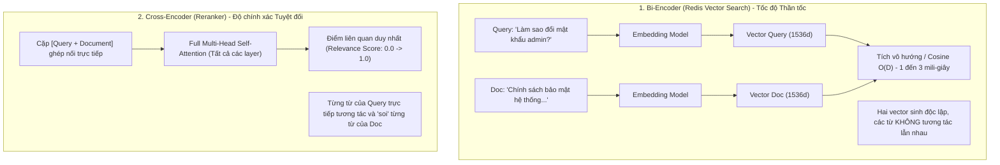
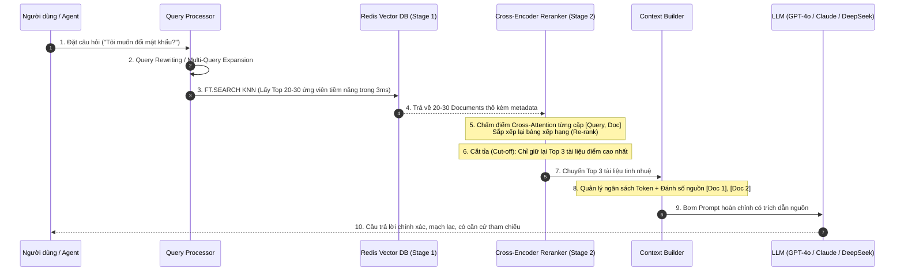
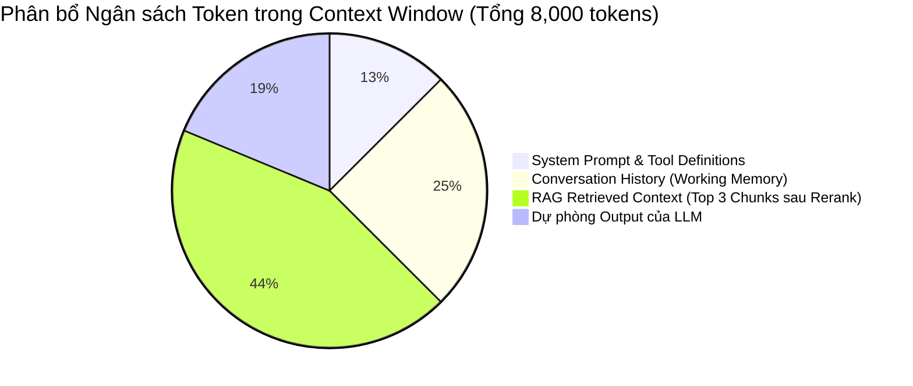

<!--
name: 3-rag-pipeline-and-reranking.md
description: Masterclass on building production-grade RAG pipelines, Bi-Encoder vs Cross-Encoder architectures, Two-Stage Retrieval with Reranking, Multi-Query Expansion & HyDE, Context Window Budgeting, Citations, and full Python implementation with Redis Vector Search and Cross-Encoder.
-->

# 2.3 — RAG Pipeline & Reranking — Ráp nối Hệ thống RAG Thực chiến

Trong các bài học trước, chúng ta đã nắm vững các thành phần độc lập:
* **2.0**: Cắt nhỏ và làm sạch tài liệu (**Chunking & Preprocessing**).
* **2.1**: Biến đổi văn bản thành vector và lập chỉ mục đồ thị (**Embeddings & HNSW Indexing**).
* **2.2**: Tìm kiếm tương đồng kết hợp bộ lọc quyền hạn (**Vector Similarity & Hybrid Search**).

Tuy nhiên, nếu bạn chỉ ráp nối các thành phần theo tư duy ngây thơ (Naive RAG):
$$\text{User Query} \longrightarrow \text{Redis Vector Search (Top 5)} \longrightarrow \text{Nhồi vào Prompt} \longrightarrow \text{Gọi LLM}$$

...hệ thống của bạn sẽ lập tức bộc lộ **3 vấn đề nan giải trong môi trường Production**:
1. **Hiện tượng "Nhìn gà hóa cuốc" (Semantic False Positives)**: Khoảng cách Cosine chỉ đo độ tương đồng về chủ đề rộng. Nó thường xuyên nhặt phải các câu có chứa từ ngữ tương tự nhưng mang ngữ nghĩa trái ngược, câu phủ định, hoặc thiếu sót các ràng buộc logic khắt khe.
2. **Hội chứng "Lost in the Middle"**: Các nghiên cứu từ Đại học Stanford chỉ ra rằng các mô hình LLM lớn (kể cả GPT-4 hay Claude) ghi nhớ và xử lý thông tin tốt nhất ở **phần đầu** và **phần cuối** của Context Window. Nếu bạn nhồi một danh sách 10 – 15 chunk thô vào giữa prompt, LLM sẽ bị "bão hòa chú ý" và bỏ sót thông tin quan trọng nhất.
3. **Lãng phí Token & Suy giảm Latency**: Mỗi chunk thừa thãi không chỉ làm tăng chi phí token API của OpenAI/Anthropic theo cấp số nhân, mà còn làm tăng thời gian sinh token đầu tiên (Time-To-First-Token - TTFT).

Bài học này sẽ hướng dẫn bạn kỹ thuật **Two-Stage Retrieval (Thu hồi 2 giai đoạn)** kết hợp **Cross-Encoder Reranker**, tối ưu hóa truy vấn nâng cao (**Query Transformation**), và quản lý **Ngân sách Context Window** — tiêu chuẩn vàng của mọi hệ thống RAG cấp doanh nghiệp hiện nay.

---

## 1. Bản chất kiến trúc: Bi-Encoder (Redis) vs Cross-Encoder (Reranker)

Để hiểu vì sao cần Reranking, ta phải phân biệt sâu sắc 2 họ kiến trúc Transformer:



### So sánh chi tiết hai kiến trúc:

| Tiêu chí | Bi-Encoder (Redis Vector Search) | Cross-Encoder (Reranker) |
| :--- | :--- | :--- |
| **Cơ chế hoạt động** | Mã hóa Query và Document độc lập thành 2 vector cố định rồi tính Cosine/IP. | Ghép đôi `[Query, Document]` đưa qua transformer để các từ tự do chú ý (Self-Attention) chéo lẫn nhau. |
| **Tốc độ xử lý** | **Siêu nhanh (1 – 5 ms)** trên hàng triệu tài liệu nhờ đồ thị HNSW trên Redis RAM. | **Chậm hơn (30 – 100 ms)** vì phải chạy suy luận transformer cho từng cặp `[Query, Doc]`. |
| **Độ chính xác ngữ nghĩa** | Tốt ở mức tìm kiếm diện rộng (**High Recall**). | **Cực kỳ xuất sắc (**High Precision**)**, bắt trọn sắc thái phủ định, thứ tự từ ngữ và logic sâu. |
| **Khả năng Scale** | Lưu sẵn vector vào Redis, chỉ tính dot-product ở query time. | Không thể tính trước (vì phụ thuộc vào câu hỏi cụ thể của người dùng ở runtime). |
| **Vai trò trong RAG** | **Giai đoạn 1 (Đãi cát tìm vàng)**: Lọc từ 1,000,000 tài liệu xuống còn Top 20 – 30 ứng viên thô. | **Giai đoạn 2 (Giũa ngọc)**: Soi kỹ 20 – 30 ứng viên thô để chọn ra Top 3 – 5 đoạn văn đắt giá nhất. |

---

## 2. Kiến trúc Two-Stage Retrieval (Thu hồi 2 giai đoạn)

Quy trình chuẩn hóa của một RAG Pipeline chuyên nghiệp được vận hành như sau:



### Tại sao sự kết hợp này là "Cặp đôi hoàn hảo"?
1. Nếu chỉ dùng **Bi-Encoder**: Nhanh nhưng độ chính xác không đủ cao, dễ đưa tài liệu rác vào context.
2. Nếu chỉ dùng **Cross-Encoder**: Để tìm 1 câu hỏi trên 100,000 documents, bạn phải chạy model transformer 100,000 lần $\to$ Mất hàng chục phút, sập server!
3. **Kết hợp**: Redis gánh $99.99\%$ khối lượng nặng nhọc để thu hẹp không gian tìm kiếm xuống $20$ tài liệu trong $2\text{ms}$. Sau đó Cross-Encoder chỉ cần chạy inference $20$ lần trong $40\text{ms}$. Tổng thời gian toàn bộ pipeline: **dưới $50\text{ms}$** với độ chính xác đạt mức tối đa!

---

## 3. Các kỹ thuật Tối ưu hóa Truy vấn (Query Transformation)

Trong thực tế, câu hỏi người dùng nhập vào hiếm khi ở dạng "hoàn hảo" cho việc tìm kiếm vector. Các kỹ thuật tiền xử lý truy vấn sau đây sẽ giúp tăng vọt độ chuẩn xác của Stage 1:

### 3.1. Query Rewriting (Viết lại câu hỏi theo ngữ cảnh hội thoại)
Trong một phiên chat dài, người dùng thường hỏi cụt ngủn:
* *Turn 1*: "Chính sách nghỉ phép thai sản quy định thế nào?"
* *Turn 2*: "Thế còn trường hợp sinh đôi thì sao?"

Nếu bạn mang nguyên câu *"Thế còn trường hợp sinh đôi thì sao?"* đi search vector, Redis sẽ tìm ra các tài liệu về... sinh học hoặc y tế!
* **Giải pháp**: Cho một LLM nhỏ (như `gpt-4o-mini`) đọc lịch sử chat và viết lại truy vấn độc lập:
  $$\text{"Thế còn trường hợp sinh đôi thì sao?"} \xrightarrow{\text{Rewrite}} \text{"Chính sách nghỉ phép thai sản cho trường hợp sinh đôi năm 2026"}$$

### 3.2. Multi-Query Expansion (Phát sinh đa truy vấn)
Mỗi người dùng có một thói quen dùng từ khác nhau. Kỹ thuật Multi-Query sử dụng LLM để sinh ra 3 biến thể câu hỏi diễn đạt cùng một ý:
1. *"Cách reset password admin Redis"*
2. *"Quy trình khôi phục mật khẩu tài khoản quản trị"*
3. *"Quên mật khẩu root Redis server xử lý thế nào"*

Pipeline sẽ gửi cả 3 câu hỏi này vào Redis song song, sau đó hợp nhất các tập kết quả bằng thuật toán **Reciprocal Rank Fusion (RRF)** trước khi đưa sang Reranker.

### 3.3. Parent-Child / Hierarchical Chunking
* **Vấn đề**: Khi chunking văn bản, chunk nhỏ ($150-200$ tokens) rất tốt cho vector search vì ý nghĩa ngữ nghĩa cô đọng. Nhưng khi đưa cho LLM trả lời, chunk nhỏ lại thiếu ngữ cảnh bao quát.
* **Giải pháp**:
  * Chia tài liệu thành các **Parent Documents** lớn ($1000$ tokens).
  * Trong mỗi Parent Document, cắt nhỏ thành các **Child Chunks** ($200$ tokens).
  * Chỉ tạo vector cho các Child Chunks và lưu vào Redis kèm metadata `parent_id`.
  * Khi tìm kiếm: Vector match trúng Child Chunk $\to$ Hệ thống tự động lấy **toàn bộ Parent Document** tương ứng từ RedisJSON để nạp vào prompt cho LLM!

---

## 4. Chiến lược Ngân sách Token (Context Window Budgeting)

Đừng bao giờ nhồi nhét tài liệu vào Context Window một cách không kiểm soát. Một context prompt chuẩn mực cấp Production cần phân bổ ngân sách token rõ ràng theo công thức:

$$\text{Tổng Context Window} = \text{System Prompt} + \text{Conversation History} + \text{Retrieved Context (RAG)} + \text{Output Reservation}$$



### Bảng phân bổ ngân sách khuyến nghị theo từng quy mô:

| Thành phần | Model 8K Context | Model 32K Context | Model 128K Context |
| :--- | :--- | :--- | :--- |
| **System Prompt & Identity** | $800\text{ tokens}$ | $1,500\text{ tokens}$ | $3,000\text{ tokens}$ |
| **Lịch sử hội thoại gần nhất** | $1,500\text{ tokens}$ (3-4 turns) | $6,000\text{ tokens}$ (10 turns) | $20,000\text{ tokens}$ (30 turns) |
| **RAG Retrieved Context** | $4,000\text{ tokens}$ (3-5 chunks) | $18,000\text{ tokens}$ (15-20 chunks) | $60,000\text{ tokens}$ |
| **Output Token Reservation** | $1,700\text{ tokens}$ | $6,500\text{ tokens}$ | $45,000\text{ tokens}$ |

> [!WARNING]
> Kể cả khi mô hình hỗ trợ context window khổng lồ ($128\text{K}$ hoặc $1\text{M}$ tokens), việc nhồi hàng trăm chunk tài liệu vẫn là một **sai lầm nghiêm trọng**. Chi phí gọi API sẽ tăng vọt, tốc độ trả lời bị kéo dài thêm hàng giây, và khả năng LLM bị phân tâm bởi các thông tin nhiễu là rất lớn!

---

## 5. Định dạng Context chuẩn để LLM trích dẫn nguồn (Citations)

Để loại bỏ hoàn toàn ảo giác (Hallucination) và tạo sự minh bạch tuyệt đối cho người dùng, Context nạp vào LLM cần được cấu trúc hóa kèm nhãn trích dẫn:

```markdown
Bạn là một AI Trợ lý hỗ trợ kỹ thuật chuyên nghiệp. 
Hãy trả lời câu hỏi của người dùng DỰA HOÀN TOÀN vào các tài liệu tham khảo được cung cấp dưới đây.

QUY TẮC BẮT BUỘC:
1. Tuyệt đối KHÔNG tự suy diễn hoặc dùng kiến thức bên ngoài nếu không có trong tài liệu.
2. Nếu tài liệu không chứa đủ thông tin để trả lời, hãy thành thật đáp: "Xin lỗi, tài liệu nội bộ hiện tại không có thông tin về vấn đề này."
3. Mọi khẳng định đưa ra PHẢI kèm mã trích dẫn nguồn ở cuối câu, ví dụ: [Doc 1] hoặc [Doc 2, Doc 3].

--- TÀI LIỆU THAM KHẢO ---
[Doc 1] Tiêu đề: Chính sách an toàn thông tin năm 2026
Nội dung: Mọi tài khoản truy cập vào hệ thống máy chủ Redis và AI Agent bắt buộc phải kích hoạt xác thực đa yếu tố (2FA).

[Doc 2] Tiêu đề: Quy định quản trị mật khẩu
Nội dung: Mật khẩu quản trị viên phải có độ dài tối thiểu 16 ký tự, bao gồm chữ hoa, chữ thường, số và ký tự đặc biệt. Định kỳ 90 ngày phải đổi mật khẩu một lần.
---------------------------

Câu hỏi của người dùng: Tôi cần cấu hình mật khẩu quản trị như thế nào và có cần bật 2FA không?
Câu trả lời của bạn:
```

---

## 6. Thực hành Lab: Xây dựng RAG Pipeline hoàn chỉnh với Redis & Reranking

Dưới đây là đoạn mã Python hoàn chỉnh, chạy được từ đầu đến cuối:
1. Khởi tạo Index trên Redis với RediSearch.
2. Nạp dữ liệu tri thức mẫu kèm vector embedding thực sự (dùng `sentence-transformers`).
3. Thực thi **Stage 1: Redis KNN Vector Search** để lấy Top 5 ứng viên thô.
4. Thực thi **Stage 2: Cross-Encoder Reranker** để chấm điểm tương tác sâu và lấy Top 2 tài liệu chuẩn xác nhất.
5. Tạo Prompt hoàn chỉnh có trích dẫn nguồn.

### 6.1. Cài đặt các thư viện cần thiết

```bash
pip install redis numpy sentence-transformers
```

### 6.2. Mã nguồn Python thực chiến

```python
"""
name: complete_rag_pipeline.py
description: End-to-end production RAG pipeline combining Redis HNSW Vector Search (Stage 1) 
             with Cross-Encoder Reranking (Stage 2) and Citation Prompt formatting.
"""

import json
import time
import numpy as np
import redis
from typing import List, Dict, Any
from sentence_transformers import SentenceTransformer, CrossEncoder
from redis.commands.search.field import TextField, TagField, VectorField
from redis.commands.search.indexDefinition import IndexDefinition, IndexType
from redis.commands.search.query import Query

# 1. Kết nối Redis Stack
client = redis.Redis(host="localhost", port=6379, decode_responses=False)

INDEX_NAME = "idx:rag_knowledge"
DOC_PREFIX = "doc:kb:"
EMBED_MODEL_NAME = "all-MiniLM-L6-v2"
RERANK_MODEL_NAME = "cross-encoder/ms-marco-MiniLM-L-6-v2"
VECTOR_DIM = 384  # Chiều của all-MiniLM-L6-v2

print(f"[*] Đang tải mô hình Bi-Encoder Embedding ({EMBED_MODEL_NAME})...")
bi_encoder = SentenceTransformer(EMBED_MODEL_NAME)

print(f"[*] Đang tải mô hình Cross-Encoder Reranker ({RERANK_MODEL_NAME})...")
cross_encoder = CrossEncoder(RERANK_MODEL_NAME)

def setup_knowledge_base():
    """Tạo Index và nạp kho tri thức doanh nghiệp mẫu vào Redis."""
    try:
        client.ft(INDEX_NAME).dropindex(delete_documents=True)
        print(f"[*] Đã xóa Index cũ: {INDEX_NAME}")
    except Exception:
        pass

    schema = (
        TagField("$.category", as_name="category"),
        TextField("$.title", as_name="title"),
        TextField("$.content", as_name="content"),
        VectorField(
            "$.embedding",
            "HNSW",
            {
                "TYPE": "FLOAT32",
                "DIM": VECTOR_DIM,
                "DISTANCE_METRIC": "COSINE",
                "M": 16,
                "EF_CONSTRUCTION": 200,
            },
            as_name="embedding"
        )
    )

    definition = IndexDefinition(prefix=[DOC_PREFIX], index_type=IndexType.JSON)
    client.ft(INDEX_NAME).create_index(fields=schema, definition=definition)
    print(f"[+] Tạo thành công Index: {INDEX_NAME}")

    # Kho tri thức doanh nghiệp mẫu
    kb_data = [
        {
            "id": "101",
            "category": "security",
            "title": "Chính sách xác thực 2FA",
            "content": "Mọi tài khoản truy cập vào hệ thống máy chủ Redis, cơ sở dữ liệu và AI Agent bắt buộc phải bật xác thực 2 bước (2FA) qua ứng dụng Google Authenticator."
        },
        {
            "id": "102",
            "category": "security",
            "title": "Quy định độ dài mật khẩu",
            "content": "Mật khẩu tài khoản quản trị viên bắt buộc phải dài tối thiểu 16 ký tự, bao gồm chữ hoa, chữ thường, chữ số và ký hiệu đặc biệt. Phải đổi định kỳ 90 ngày."
        },
        {
            "id": "103",
            "category": "hr",
            "title": "Chính sách nghỉ mát hàng năm",
            "content": "Công ty tổ chức chuyến du lịch nghỉ mát thường niên cho toàn thể cán bộ nhân viên vào tháng 7 hàng năm tại Đà Nẵng hoặc Nha Trang."
        },
        {
            "id": "104",
            "category": "devops",
            "title": "Quy trình triển khai Redis Cluster",
            "content": "Cụm Redis Cluster trên môi trường Production phải cấu hình tối thiểu 3 Master nodes và 3 Replica nodes phân bổ trên 3 Availability Zones khác nhau."
        },
        {
            "id": "105",
            "category": "security",
            "title": "Chính sách an toàn mạng văn phòng",
            "content": "Không được sử dụng thiết bị mạng cá nhân cắm trực tiếp vào switch văn phòng. Mọi kết nối từ xa phải đi qua cổng VPN WireGuard nội bộ."
        }
    ]

    print(f"[*] Đang mã hóa vector và nạp {len(kb_data)} tài liệu vào Redis...")
    for item in kb_data:
        # Tạo vector thực sự bằng SentenceTransformer
        vector = bi_encoder.encode(item["content"], normalize_embeddings=True).tolist()
        payload = {
            "category": item["category"],
            "title": item["title"],
            "content": item["content"],
            "embedding": vector
        }
        client.json().set(f"{DOC_PREFIX}{item['id']}", "$", payload)

    print(f"[+] Nạp dữ liệu hoàn tất!")

# =====================================================================
# GIAI ĐOẠN 1: THU HỒI DIỆN RỘNG BẰNG REDIS VECTOR SEARCH (STAGE 1)
# =====================================================================
def stage1_redis_vector_search(query: str, top_k: int = 5) -> List[Dict[str, Any]]:
    """
    Sử dụng Redis Vector Search với HNSW để thu hồi nhanh Top K ứng viên thô.
    """
    t0 = time.time()
    # 1. Mã hóa câu hỏi của người dùng thành vector
    query_vector = bi_encoder.encode(query, normalize_embeddings=True)
    query_bytes = np.array(query_vector, dtype=np.float32).tobytes()

    # 2. Xây dựng câu truy vấn KNN RediSearch
    query_str = f"(*)=>[KNN {top_k} @embedding $BLOB AS score]"
    q = (
        Query(query_str)
        .sort_by("score", asc=True)
        .return_fields("title", "content", "category", "score")
        .dialect(2)
    )

    # 3. Thực thi tìm kiếm trên Redis RAM
    results = client.ft(INDEX_NAME).search(q, query_params={"BLOB": query_bytes})
    latency_ms = (time.time() - t0) * 1000

    candidates = []
    for doc in results.docs:
        candidates.append({
            "id": doc.id,
            "title": doc.title,
            "content": doc.content,
            "category": doc.category,
            "vector_distance": float(doc.score)
        })

    print(f"\n🔍 [STAGE 1] Redis Vector Search tìm thấy {len(candidates)} ứng viên ({latency_ms:.2f} ms):")
    for idx, c in enumerate(candidates, 1):
        print(f"   {idx}. [{c['title']}] - Cosine Distance: {c['vector_distance']:.4f}")

    return candidates

# =====================================================================
# GIAI ĐOẠN 2: CHẤM ĐIỂM CHÍNH XÁC BẰNG CROSS-ENCODER RERANKER (STAGE 2)
# =====================================================================
def stage2_cross_encoder_rerank(
    query: str, 
    candidates: List[Dict[str, Any]], 
    top_n: int = 2
) -> List[Dict[str, Any]]:
    """
    Sử dụng Cross-Encoder để soi từng cặp [Query, Document] và xếp hạng lại.
    """
    t0 = time.time()
    # Chuẩn bị danh sách các cặp [câu_hỏi, nội_dung_tài_liệu]
    pairs = [[query, doc["content"]] for doc in candidates]
    
    # Dự đoán điểm liên quan bằng Cross-Encoder
    scores = cross_encoder.predict(pairs)
    latency_ms = (time.time() - t0) * 1000

    for idx, score in enumerate(scores):
        candidates[idx]["rerank_score"] = float(score)

    # Sắp xếp lại theo thứ tự giảm dần của điểm Rerank (điểm càng cao càng chuẩn)
    reranked = sorted(candidates, key=lambda x: x["rerank_score"], reverse=True)
    selected = reranked[:top_n]

    print(f"\n⚖️  [STAGE 2] Cross-Encoder Reranking hoàn tất ({latency_ms:.2f} ms):")
    for idx, doc in enumerate(selected, 1):
        print(f"   ⭐ Top {idx}: [{doc['title']}] - Rerank Score: {doc['rerank_score']:.4f}")

    return selected

# =====================================================================
# GIAI ĐOẠN 3: ĐÓNG GÓI CONTEXT KÈM TRÍCH DẪN NGUỒN (CITATIONS)
# =====================================================================
def build_rag_prompt(query: str, context_docs: List[Dict[str, Any]]) -> str:
    """Xây dựng Prompt chuẩn mực có đánh số thứ tự tài liệu để chống ảo giác."""
    context_blocks = []
    for idx, doc in enumerate(context_docs, 1):
        block = f"[Doc {idx}] Tiêu đề: {doc['title']}\nNội dung: {doc['content']}"
        context_blocks.append(block)

    formatted_context = "\n\n".join(context_blocks)

    prompt = f"""Bạn là một AI Trợ lý hỗ trợ kỹ thuật chuyên nghiệp. Hãy trả lời câu hỏi dựa hoàn toàn vào tài liệu dưới đây. Luôn trích dẫn nguồn theo dạng [Doc X].

--- TÀI LIỆU THAM KHẢO ---
{formatted_context}
---------------------------

Câu hỏi của người dùng: {query}
Câu trả lời của bạn:"""
    return prompt

# =====================================================================
# CHẠY THỬ TOÀN BỘ PIPELINE
# =====================================================================
if __name__ == "__main__":
    setup_knowledge_base()

    user_query = "Tôi cần đặt mật khẩu hệ thống dài bao nhiêu ký tự và có bắt buộc bật xác thực 2 bước không?"
    print(f"\n💬 Người dùng hỏi: \"{user_query}\"")

    # Bước 1: Redis thu hồi nhanh 5 ứng viên thô
    raw_candidates = stage1_redis_vector_search(user_query, top_k=5)

    # Bước 2: Reranker lọc lấy 2 ứng viên xuất sắc nhất
    top_docs = stage2_cross_encoder_rerank(user_query, raw_candidates, top_n=2)

    # Bước 3: Dựng Prompt hoàn chỉnh sẵn sàng gửi sang OpenAI / Claude
    prompt = build_rag_prompt(user_query, top_docs)

    print("\n" + "=" * 70)
    print("🚀 PROMPT HOÀN CHỈNH ĐƯỢC TỐI ƯU HÓA ĐỂ GỬI SANG LLM:")
    print("=" * 70)
    print(prompt)
```

---

## 7. Lựa chọn Reranker phổ biến trong Production

| Giải pháp Reranker | Kiểu triển khai | Latency trung bình | Chi phí bản quyền | Đánh giá thực chiến |
| :--- | :--- | :--- | :--- | :--- |
| **`bge-reranker-base / large`** | Tự host (GPU / vCPU) | 30 – 80 ms | Mã nguồn mở (Apache 2.0) | **Lựa chọn mã nguồn mở số 1 hiện nay**. Hỗ trợ đa ngôn ngữ xuất sắc (tiếng Anh, tiếng Việt, tiếng Trung). |
| **`ms-marco-MiniLM-L-6-v2`** | Tự host (Chạy tốt trên CPU) | 10 – 25 ms | Mã nguồn mở (Apache 2.0) | Cực kỳ nhẹ và nhanh, phù hợp cho các server không có GPU rời, xử lý tiếng Anh rất tốt. |
| **`Cohere Rerank v3.5`** | Cloud Managed API | 80 – 150 ms | Trả phí theo lượt gọi ($/1K searches) | **Chất lượng đầu bảng ngành**, hiểu sâu context tài liệu phức tạp, tích hợp đơn giản qua SDK. |
| **`Jina Reranker v2`** | Cloud API hoặc Tự host | 40 – 90 ms | Freemium / Open-weights | Hỗ trợ context dài (tới 1024 tokens mỗi doc), hiệu năng rất cạnh tranh. |
| **LLM-as-a-Reranker (RankGPT)** | Gọi LLM (`gpt-4o-mini`) | 400 – 1200 ms | Trả phí Token LLM | Độ thông minh cực cao nhưng latency quá lớn, không khả thi cho real-time chatbot. |

---

## 8. Production Checklist & Best Practices

1. **Luôn dùng Two-Stage Retrieval**: Đừng bao giờ nhồi trực tiếp kết quả thô của Vector Search vào prompt nếu chưa đi qua bộ lọc hoặc Reranker.
2. **Cân đối tỷ lệ `Stage 1 : Stage 2`**: Tỷ lệ vàng thông thường là lấy **Top 20 – 30** từ Redis Vector Search, sau đó dùng Reranker cắt lấy **Top 3 – 5** tài liệu có điểm liên quan cao nhất.
3. **Đặt ngưỡng cắt tỉa (Cut-off Threshold)**: Nếu tài liệu đứng đầu sau khi Rerank có điểm số thấp hơn ngưỡng tin cậy (ví dụ `score < 0.20`), hãy kích hoạt cơ chế fallback: thông báo cho người dùng biết hệ thống không tìm thấy thông tin thay vì để LLM đoán mò.
4. **Viết lại truy vấn (Query Rewriting)**: Với Agent có tính năng chat nhiều lượt, luôn sử dụng một mô hình LLM nhỏ để phân giải đại từ ("nó", "chính sách đó", "trường hợp này") thành một câu hỏi độc lập hoàn chỉnh trước khi tạo vector embedding.
5. **Đánh số trích dẫn nguồn tường minh**: Định dạng `[Doc 1]`, `[Doc 2]` giúp người dùng kiểm chứng được câu trả lời và tạo thói quen tốt cho Agent trong việc không bịa đặt dữ liệu.

---

*← Bài trước: [2.2 - Vector Similarity & Hybrid Search](./2-vector-similarity-and-hybrid-search.md) | Bài tiếp theo: [2.4 - RAG Benchmarking & Evaluation](./4-rag-benchmarking-and-evaluation.md) →*
