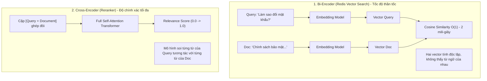
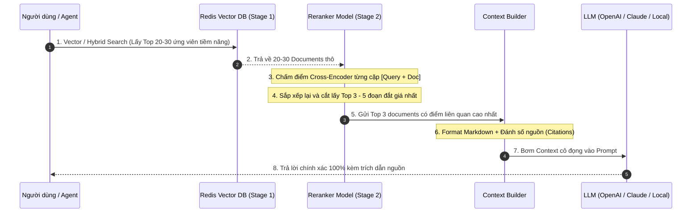

<!--
name: 3-rag-pipeline-and-reranking.md
description: Masterclass on building production-grade RAG pipelines, Bi-Encoder vs Cross-Encoder architectures, Two-Stage Retrieval with Reranking, context window budgeting, and citation generation.
-->

# 2.3 — RAG Pipeline & Reranking — Ráp nối Hệ thống RAG Thực chiến

Trong các bài trước, bạn đã học cách cắt nhỏ tài liệu (**Chunking**), tạo vector (**Embeddings**), lưu trữ vào đồ thị **HNSW**, và tìm kiếm tương đồng (**Vector Search**).

Tuy nhiên, nếu chỉ dừng lại ở bước:
$$\text{Query} \longrightarrow \text{Redis Vector Search (Top 5)} \longrightarrow \text{Nhồi vào Prompt} \longrightarrow \text{LLM}$$

...hệ thống RAG của bạn sẽ lập tức gặp các vấn đề nghiêm trọng trong production:
1. **Vector Search "nhìn gà hóa cuốc" (False Positives)**: Vector Cosine chỉ đo độ tương đồng về chủ đề chung chung, không hiểu được câu hỏi phủ định, logic đảo ngược, hay các chi tiết kỹ thuật sắc thái cao.
2. **Hội chứng "Lost in the Middle"**: Nghiên cứu từ Stanford chỉ ra rằng LLM ghi nhớ thông tin tốt nhất ở **đầu** và **cuối** Context Window. Nếu bạn nhồi một đống 10 – 15 chunk thô vào giữa prompt, LLM sẽ bị "ngợp" và bỏ sót thông tin quan trọng nhất.
3. **Lãng phí Token & Tăng Latency**: Mỗi token rác nhồi vào prompt đều tốn tiền API và làm chậm thời gian sinh token đầu tiên (Time-to-First-Token - TTFT).

Bài học này sẽ hướng dẫn bạn kỹ thuật **Two-Stage Retrieval (Thu hồi 2 giai đoạn)** kết hợp **Reranker** — tiêu chuẩn vàng của mọi hệ thống RAG cấp doanh nghiệp hiện nay.

---

## 1. Bản chất kiến trúc: Bi-Encoder (Redis) vs Cross-Encoder (Reranker)

Để hiểu vì sao cần Reranking, ta phải phân biệt 2 họ mô hình:



| Tiêu chí | Bi-Encoder (Redis Vector Search) | Cross-Encoder (Reranker) |
| :--- | :--- | :--- |
| **Cơ chế hoạt động** | Mã hóa Query và Document thành 2 vector riêng biệt rồi tính tích vô hướng / Cosine. | Ghép đôi `[Query, Document]` đưa qua transformer để các từ tự do chú ý (Self-Attention) lẫn nhau. |
| **Tốc độ xử lý** | **Siêu nhanh (1 – 5 ms)** trên hàng triệu tài liệu nhờ đồ thị HNSW. | **Chậm hơn (50 – 150 ms)** vì phải chạy inference transformer cho từng cặp. |
| **Độ chính xác ngữ nghĩa** | Tốt ở mức tìm kiếm diện rộng (Broad Recall). | **Cực kỳ xuất sắc**, bắt trọn sắc thái phủ định, thứ tự từ và ngữ cảnh chi tiết. |
| **Vai trò trong RAG** | **Giai đoạn 1 (Đãi cát tìm vàng)**: Lọc từ 1 triệu doc xuống Top 30. | **Giai đoạn 2 (Giũa ngọc)**: Soi kỹ Top 30 để chọn ra Top 3 tốt nhất đưa vào LLM. |

---

## 2. Kiến trúc Two-Stage Retrieval (Thu hồi 2 giai đoạn)

Quy trình chuẩn hóa của một RAG Pipeline chuyên nghiệp:



---

## 3. Chiến lược Ngân sách Token (Context Window Budgeting)

Đừng bao giờ nhồi nhét không kiểm soát. Một context prompt chuẩn mực cần phân bổ ngân sách token rõ ràng:

$$\text{Tổng Context Window} = \text{System Prompt} + \text{Conversation History} + \text{Retrieved Context (RAG)} + \text{Output Reservation}$$

Ví dụ phân bổ cho ngân sách **8,000 tokens**:
* **System Prompt & Tool Definitions**: $1,000\text{ tokens}$ (Cố định danh tính, quy tắc trả lời).
* **Conversation History (Working Memory)**: $2,000\text{ tokens}$ (Lịch sử chat gần nhất lấy từ RedisJSON).
* **RAG Retrieved Context**: $3,500\text{ tokens}$ (Chỉ chứa 3 – 5 chunks chất lượng cao sau khi Rerank).
* **Dự phòng Output của LLM**: $1,500\text{ tokens}$ (Đảm bảo câu trả lời không bị ngắt cụt giữa chừng).

---

## 4. Định dạng Context chuẩn để LLM trích dẫn nguồn (Citations)

Để chống ảo giác (Hallucination) và tăng độ tin cậy, hãy yêu cầu LLM trích dẫn mã nguồn tham chiếu:

```markdown
Bạn là một AI Trợ lý thông thái. Hãy trả lời câu hỏi của người dùng DỰA HOÀN TOÀN vào các tài liệu tham khảo dưới đây. 
Nếu thông tin không có trong tài liệu, hãy thành thật trả lời "Tôi không tìm thấy thông tin trong tài liệu", không được tự bịa đặt.
Mỗi khi đưa ra một khẳng định, hãy trích dẫn số thứ tự tài liệu ở cuối câu, ví dụ: [Doc 1].

--- TÀI LIỆU THAM KHẢO ---
[Doc 1] Tiêu đề: Chính sách bảo mật 2026
Nội dung: Mọi tài khoản truy cập vào Redis bắt buộc phải kích hoạt xác thực 2FA.

[Doc 2] Tiêu đề: Quy định mật khẩu
Nội dung: Mật khẩu quản trị phải có độ dài tối thiểu 16 ký tự và đổi định kỳ 90 ngày.
---------------------------

Câu hỏi của người dùng: Tôi cần đặt mật khẩu như thế nào và có cần bật 2FA không?
```

---

## 5. Thực hành Lab: Xây dựng RAG Pipeline hoàn chỉnh với Redis & Reranking

Dưới đây là mã nguồn Python mẫu hoàn chỉnh, mô phỏng toàn bộ luồng từ lúc truy vấn Redis đến khi Rerank và tạo Prompt:

```python
"""
name: rag_pipeline_with_reranking.py
description: End-to-end production RAG pipeline using Redis Vector Search (Stage 1) and Cross-Encoder Reranking (Stage 2).
"""

import os
import json
import numpy as np
import redis
from typing import List, Dict, Any

# 1. Kết nối Redis
pwd = os.getenv("REDIS_PASSWORD", "secret123")
client = redis.Redis(host="localhost", port=6379, password=pwd, decode_responses=True)

# 2. Giả lập Stage 1: Bi-Encoder Vector Search trên Redis
def stage1_redis_vector_search(query: str, top_k: int = 10) -> List[Dict[str, Any]]:
    """
    Tìm kiếm diện rộng trên Redis Vector Index, lấy về top_k ứng viên thô.
    """
    print(f"\n🔍 [STAGE 1] Redis Vector Search: Quét tìm {top_k} ứng viên thô cho câu hỏi: '{query}'...")
    
    # Ở đây ta truy vấn các key knowledge:doc:* đã tạo ở Bài 2.1
    # Để demo chạy độc lập, ta đọc danh sách tài liệu từ Redis
    keys = client.keys("knowledge:doc:*")
    candidate_docs = []
    for k in keys:
        doc = client.json().get(k)
        if doc:
            candidate_docs.append({
                "id": k,
                "title": doc.get("title", ""),
                "content": doc.get("content", ""),
                "category": doc.get("category", "")
            })
    return candidate_docs[:top_k]

# 3. Giả lập Stage 2: Cross-Encoder Reranker
def stage2_cross_encoder_rerank(
    query: str, 
    candidates: List[Dict[str, Any]], 
    top_n: int = 3
) -> List[Dict[str, Any]]:
    """
    Chấm điểm lại từng ứng viên bằng Cross-Encoder và chọn ra top_n tài liệu xuất sắc nhất.
    (Hỗ trợ thư viện sentence_transformers.CrossEncoder nếu có, hoặc heuristic scoring làm fallback)
    """
    print(f"\n⚖️  [STAGE 2] Cross-Encoder Reranking: Soi kỹ {len(candidates)} ứng viên để chọn ra Top {top_n}...")
    
    try:
        from sentence_transformers import CrossEncoder
        reranker = CrossEncoder("cross-encoder/ms-marco-MiniLM-L-6-v2")
        pairs = [[query, doc["content"]] for doc in candidates]
        scores = reranker.predict(pairs)
        for idx, score in enumerate(scores):
            candidates[idx]["rerank_score"] = float(score)
    except ImportError:
        # Fallback scoring đơn giản nếu chưa cài model nặng
        print("💡 [INFO] Đang dùng Fallback Reranking Scorer...")
        query_words = set(query.lower().split())
        for doc in candidates:
            content_words = doc["content"].lower()
            overlap = sum(1 for w in query_words if w in content_words)
            doc["rerank_score"] = overlap / (len(query_words) + 1e-5)

    # Sắp xếp giảm dần theo điểm số Rerank
    ranked_docs = sorted(candidates, key=lambda x: x["rerank_score"], reverse=True)
    return ranked_docs[:top_n]

# 4. Stage 3: Context Builder & Prompt Assembly
def build_rag_prompt(query: str, context_docs: List[Dict[str, Any]]) -> str:
    """Đóng gói ngữ cảnh cô đọng kèm đánh số trích dẫn nguồn."""
    context_str = ""
    for idx, doc in enumerate(context_docs, 1):
        context_str += f"[Doc {idx}] {doc['title']}\nNội dung: {doc['content']}\n\n"

    prompt = f"""Bạn là AI Trợ lý hỗ trợ khách hàng. Hãy trả lời câu hỏi dựa trên tài liệu bên dưới. Luôn trích dẫn nguồn [Doc X].

--- TÀI LIỆU THAM KHẢO ---
{context_str.strip()}
---------------------------

Câu hỏi: {query}
Câu trả lời của bạn:"""
    return prompt

# --- CHẠY THỬ PIPELINE TOÀN DIỆN ---
if __name__ == "__main__":
    user_query = "Chính sách bảo mật yêu cầu xác thực như thế nào?"
    
    # Bước 1: Thu hồi thô từ Redis
    raw_candidates = stage1_redis_vector_search(user_query, top_k=5)
    
    # Bước 2: Rerank chọn Top 2 tốt nhất
    best_docs = stage2_cross_encoder_rerank(user_query, raw_candidates, top_n=2)
    
    # Bước 3: Dựng Prompt hoàn chỉnh
    final_prompt = build_rag_prompt(user_query, best_docs)
    
    print("\n" + "=" * 60)
    print("🚀 PROMPT HOÀN CHỈNH SẴN SÀNG GỬI CHO LLM:")
    print("=" * 60)
    print(final_prompt)
```

---

## 6. Lựa chọn Reranker phổ biến trong Production

| Giải pháp Reranker | Triển khai | Latency | Chi phí | Đánh giá thực chiến |
| :--- | :--- | :--- | :--- | :--- |
| **`bge-reranker-base / large`** | Tự host (GPU / CPU) | 30 – 80 ms | Miễn phí bản quyền | **Lựa chọn mã nguồn mở số 1 hiện nay**. Hỗ trợ đa ngôn ngữ rất tốt kể cả tiếng Việt. |
| **`ms-marco-MiniLM-L-6-v2`** | Tự host (Chạy tốt trên CPU) | 10 – 30 ms | Miễn phí bản quyền | Siêu nhẹ, rất thích hợp chạy trên server CPU không có card GPU rời. |
| **Cohere Rerank API (v3)** | Managed Cloud API | 100 – 200 ms | Trả phí theo lượt gọi | **Chất lượng đầu bảng**, không cần bảo trì hạ tầng GPU, tích hợp chỉ bằng 1 dòng code. |
| **LLM-as-a-Reranker (RankGPT)**| Gọi LLM (GPT-4o mini) | 500 – 1500 ms| Tốn token LLM | Cực kỳ thông minh nhưng quá chậm và đắt, chỉ dùng cho các bài toán phân tích học thuật chuyên sâu. |

---

## 7. Tổng kết & Bước tiếp theo

Bạn vừa hoàn thành mảnh ghép quan trọng nhất để biến Redis từ một cơ sở dữ liệu vector đơn thuần thành một **Hệ thống RAG hoàn chỉnh cấp Production**:
* Nắm vững kiến trúc **Two-Stage Retrieval**: Dùng Redis làm bộ lọc diện rộng siêu tốc (Stage 1), và dùng Cross-Encoder làm bộ lọc tinh nhuệ (Stage 2).
* Giải quyết triệt để vấn đề False Positives và hội chứng "Lost in the Middle".
* Biết cách quản lý ngân sách Token và format Prompt kèm trích dẫn nguồn chuẩn xác.

👉 Ở bài tiếp theo: **[2.4 — RAG Benchmarking & Evaluation](./4-rag-benchmarking-and-evaluation.md)** — chúng ta sẽ học cách đo lường độ chính xác của Pipeline bằng các chỉ số khoa học (`Recall@K`, `MRR`, `NDCG`) thay vì dựa vào "cảm tính"!

---

*← Trước: [2.2 - Vector Similarity & Hybrid Search](./2-vector-similarity-and-hybrid-search.md) | Tiếp theo: [2.4 - RAG Benchmarking & Evaluation](./4-rag-benchmarking-and-evaluation.md) →*
