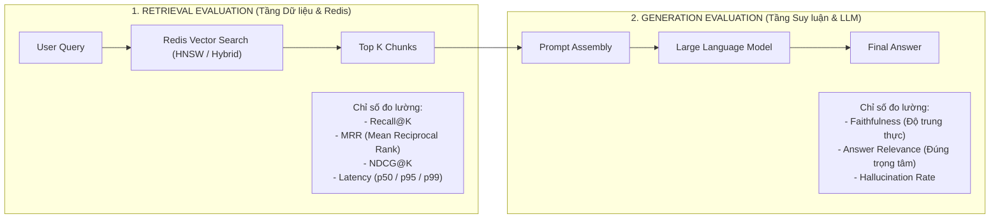
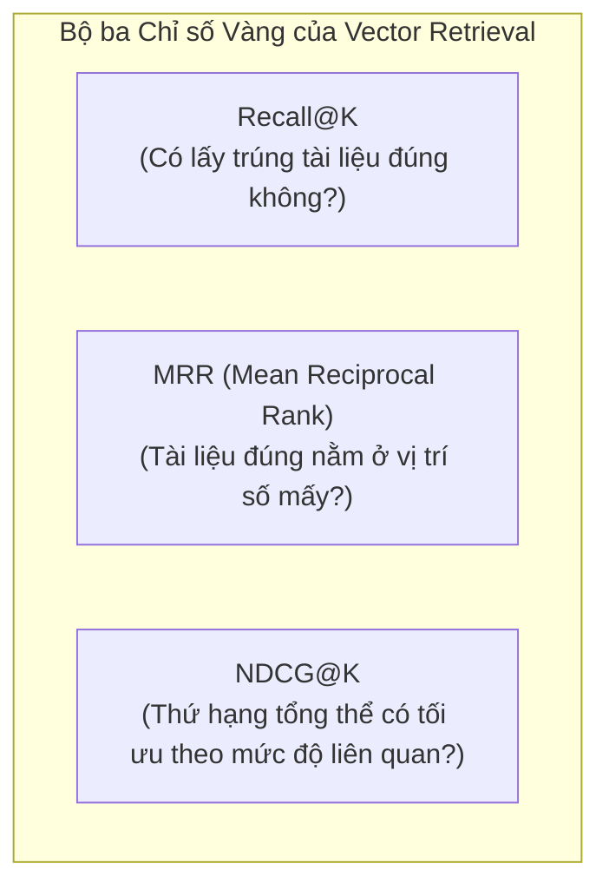
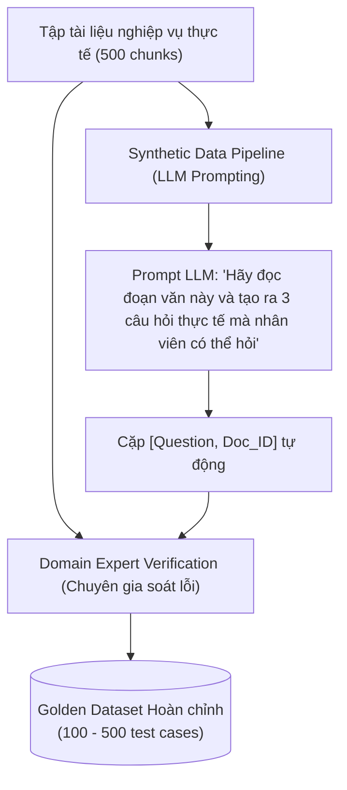
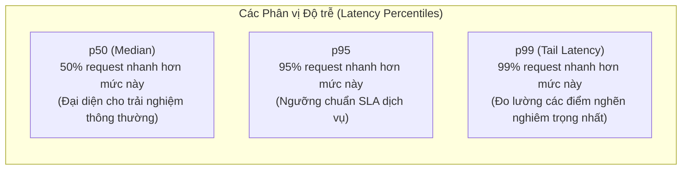
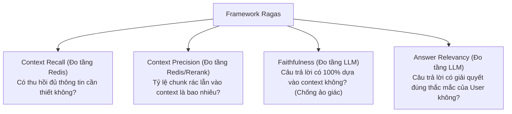
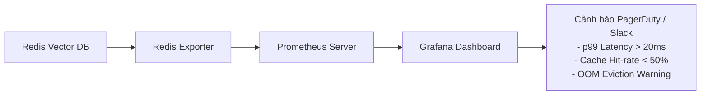

<!--
name: 4-rag-benchmarking-and-evaluation.md
description: Masterclass on RAG Benchmarking & Evaluation, measuring Recall@K, MRR, NDCG, latency percentiles (p50/p95/p99), HNSW parameter tuning trade-offs, Ragas framework integration, and automated Python evaluation pipelines.
-->

# 2.4 — RAG Benchmarking & Evaluation — Đo lường Chất lượng Retrieval & Hiệu năng Vector DB

Trong phát triển phần mềm truyền thống, chúng ta có Unit Test, Integration Test với kết quả đúng/sai (Pass/Fail) rõ ràng dựa trên giá trị trả về xác định.

Nhưng trong thế giới **AI Agent & RAG**, hầu hết các đội ngũ kỹ thuật đều mắc phải một cái bẫy kinh điển:
> **"Vibe-based Evaluation" (Đánh giá bằng cảm tính)**:
> Thử nghiệm 3 – 5 câu hỏi ngẫu nhiên trong môi trường phát triển, thấy LLM trả lời "nghe có vẻ hay và hợp lý", sau đó vội vã đưa lên Production. 
> Khi tải tăng cao và người dùng hỏi hàng ngàn câu hỏi đa dạng, hệ thống bắt đầu sụp đổ: $30\% - 40\%$ câu trả lời bị ảo giác, người dùng phàn nàn vì Agent trả lời lạc đề, và độ trễ truy vấn tăng vọt không kiểm soát!

Quy tắc bất biến của kỹ thuật hạ tầng AI:
> *"Bạn không thể tối ưu hóa những gì bạn không thể đo lường."*

Bài học này sẽ hướng dẫn bạn phương pháp luận khoa học và các công cụ thực chiến để:
1. Phân tách rõ ràng giữa **Retrieval Evaluation** (đo chất lượng Redis Vector Search) và **Generation Evaluation** (đo độ trung thực của LLM).
2. Nắm vững các chỉ số vàng: **`Recall@K`**, **`MRR`**, **`NDCG`**, và **Latency Percentiles ($p50, p95, p99$)**.
3. Xây dựng **Golden Dataset** tự động bằng kỹ thuật Synthetic Data Generation.
4. Tích hợp framework **Ragas** vào quy trình kiểm thử tự động (CI/CD).
5. Chạy một Python Benchmark Lab thực tế để đo đường cong đánh đổi giữa `Recall` và `Latency` khi tinh chỉnh tham số HNSW.

---

## 1. Phân tầng Đánh giá: Retrieval vs Generation

Một hệ thống RAG bao gồm 2 trạm kiểm soát chất lượng hoàn toàn độc lập:



### Tại sao phải phân tách rạch ròi 2 tầng này?
* **Trường hợp 1**: Redis trả về đúng tài liệu chứa câu trả lời, nhưng LLM đọc không hiểu hoặc bị "Lost in the Middle" và trả lời sai $\to$ **Lỗi tại Tầng Generation** (Cần đổi prompt hoặc nâng cấp model LLM).
* **Trường hợp 2**: LLM rất thông minh nhưng Redis tìm sai tài liệu (do chunking kém hoặc HNSW chưa tối ưu), LLM buộc phải đoán mò hoặc từ chối trả lời $\to$ **Lỗi tại Tầng Retrieval** (Cần tinh chỉnh embedding, chunking, hoặc HNSW).

Nếu không đo lường riêng biệt tầng Retrieval, bạn sẽ liên tục đổi Prompt và đổi LLM đắt tiền trong vô vọng trong khi gốc rễ của vấn đề lại nằm ở cơ sở dữ liệu!

---

## 2. Các chỉ số Đánh giá Retrieval Cốt lõi (Retrieval Metrics Deep-Dive)

Để đánh giá chất lượng tìm kiếm của Redis Vector Database, ngành công nghiệp sử dụng 3 chỉ số toán học chuẩn:



---

### 2.1. `Recall@K` — Tỷ lệ bao phủ tài liệu đúng

* **Ý nghĩa**: Trong $K$ tài liệu đầu tiên mà Redis trả về, có bao nhiêu phần trăm tài liệu thực sự liên quan (Ground Truth) được tìm thấy?
* **Công thức**:
  $$\text{Recall@K} = \frac{|\text{Retrieved}_K \cap \text{Relevant}|}{|\text{Relevant}|}$$
* **Ví dụ thực tế**:
  * Một câu hỏi nghiệp vụ có đúng **2 văn bản chuẩn** chứa câu trả lời.
  * Bạn gọi `FT.SEARCH ... KNN 5` (tức $K=5$). Redis trả về 5 tài liệu, trong đó có chứa 1 trong 2 văn bản chuẩn.
  * $\text{Recall@5} = \frac{1}{2} = 0.5$ ($50\%$).
* **Tiêu chuẩn Production**:
  * $\text{Recall@20}$ (cho Stage 1 trước khi Rerank) phải đạt $\ge 90\% - 95\%$. Nếu Stage 1 bỏ sót tài liệu đúng, Reranker ở Stage 2 hoàn toàn không có cơ hội sửa sai!

---

### 2.2. `MRR` (Mean Reciprocal Rank) — Đo độ nhạy thứ tự xuất hiện

* **Ý nghĩa**: Đánh giá vị trí của **tài liệu đúng đầu tiên** xuất hiện trong danh sách kết quả. Nếu tài liệu đúng luôn nằm ở vị trí số 1, điểm sẽ là $1.0$. Nếu trôi xuống các vị trí sau, điểm số sẽ giảm theo nghịch đảo vị trí ($1/\text{rank}$).
* **Công thức**:
  $$\text{MRR} = \frac{1}{|Q|} \sum_{i=1}^{|Q|} \frac{1}{\text{Rank}_i}$$
  *(Trong đó $|Q|$ là tổng số câu hỏi test, $\text{Rank}_i$ là thứ tự của tài liệu đúng đầu tiên tìm thấy).*

| Vị trí tìm thấy doc đúng đầu tiên | Reciprocal Rank ($1/\text{Rank}$) | Đánh giá |
| :---: | :---: | :--- |
| **Top 1** | $1/1 = 1.00$ | Hoàn hảo! Context quan trọng nhất nằm ngay đầu prompt. |
| **Top 2** | $1/2 = 0.50$ | Tốt. |
| **Top 3** | $1/3 = 0.33$ | Chấp nhận được. |
| **Top 5** | $1/5 = 0.20$ | Bắt đầu nguy hiểm, dễ rơi vào vùng "Lost in the Middle". |
| **Không tìm thấy** | $0.00$ | Thất bại hoàn toàn. |

---

### 2.3. `NDCG@K` (Normalized Discounted Cumulative Gain)

* **Ý nghĩa**: Trong trường hợp dữ liệu có nhiều mức độ liên quan (ví dụ: *Cực kỳ liên quan (3 điểm)*, *Hơi liên quan (1 điểm)*, *Không liên quan (0 điểm)*), `NDCG@K` tính toán xem các tài liệu điểm cao nhất có được ưu tiên đưa lên đầu hay không.
* Được sử dụng phổ biến trong các hệ thống Search / Recommendation lớn để đo lường toàn diện bảng xếp hạng.

---

### 2.4. Bảng tóm tắt Bộ chỉ số Retrieval

| Chỉ số | Mục tiêu đo lường | Công thức cốt lõi | Ngưỡng kỳ vọng Production |
| :--- | :--- | :--- | :--- |
| **`Recall@5`** | Tỷ lệ trúng tài liệu đúng trong Top 5 | $\frac{\text{Hits}}{|\text{Ground Truth}|}$ | $\ge 80\%$ |
| **`Recall@20`** | Độ phủ tối đa cho Stage 1 trước Reranking | $\frac{\text{Hits}}{|\text{Ground Truth}|}$ | $\ge 92\% - 95\%$ |
| **`MRR`** | Mức độ ưu tiên đưa doc đúng lên đỉnh | $\text{Trung bình}(1/\text{Rank})$ | $\ge 0.70$ |
| **`Latency p95`** | Độ trễ truy vấn cho $95\%$ yêu cầu | Phân vị thứ 95 | $\le 10\text{ ms}$ (trên Redis RAM) |

---

## 3. Phương pháp Xây dựng "Golden Dataset" (Bộ Dữ liệu Chuẩn)

Để đo được `Recall@K` và `MRR`, bạn bắt buộc phải có một **Golden Dataset** (bộ dữ liệu kiểm chuẩn đã biết trước đáp án). 

Mỗi bản ghi kiểm thử (Test Case) có cấu trúc chuẩn như sau:

```json
{
  "test_id": "tc_042",
  "query": "Mật khẩu tài khoản admin Redis phải có độ dài tối thiểu bao nhiêu?",
  "ground_truth_doc_ids": ["doc:kb:102"],
  "ground_truth_answer": "Mật khẩu quản trị viên phải dài tối thiểu 16 ký tự và đổi định kỳ 90 ngày.",
  "metadata_filter": {"category": "security"}
}
```



### 3 Phương pháp tạo Golden Dataset:

1. **Khai thác từ Production Logs (Tự nhiên nhất)**:
   * Thu thập các câu hỏi thực tế của người dùng từ hệ thống chatbot hiện có.
   * Kết hợp với phản hồi đánh giá (Thumbs Up / Thumbs Down) hoặc lịch sử bấm vào nguồn tài liệu tham khảo.
2. **Gán nhãn thủ công bởi Chuyên gia nghiệp vụ (Chính xác nhất)**:
   * Cho nhân viên nghiệp vụ tự viết câu hỏi và chỉ định chính xác tài liệu chứa câu trả lời. Phương pháp này chất lượng cao nhưng tốn nhiều thời gian và chi phí.
3. **Synthetic Data Generation (Tạo tự động bằng LLM — Xu hướng hiện đại)**:
   * Sử dụng một mô hình LLM mạnh (`gpt-4o`) đọc qua từng chunk trong cơ sở tri thức của bạn.
   * Gửi prompt yêu cầu LLM đóng vai người dùng cuối: *"Hãy đặt 3 câu hỏi khác nhau (1 câu trực diện, 1 câu gián tiếp, 1 câu dùng từ đồng nghĩa) mà câu trả lời nằm trọn vẹn trong đoạn văn sau"*.
   * Gán ID của chunk đó làm `ground_truth_doc_ids`. Phương pháp này cho phép tạo ra hàng trăm test case chuẩn mực chỉ trong vài phút!

---

## 4. Đo lường Hiệu năng Hạ tầng: Latency Percentiles ($p50, p95, p99$)

Trong các hệ thống phân tán, **Average Latency (Độ trễ trung bình) là một "lời nói dối" nguy hiểm**:
* Nếu bạn chạy 1,000 truy vấn: 990 truy vấn mất $2\text{ms}$, nhưng 10 truy vấn bị nghẽn mất $2,000\text{ms}$.
* Độ trễ trung bình: $\frac{990 \times 2 + 10 \times 2000}{1000} \approx 21.9\text{ms}$ — con số nhìn có vẻ "ổn".
* Nhưng trên thực tế: $1\%$ người dùng của bạn (hoặc các Agent phụ thuộc vào multi-step tool calls) đang phải chịu đựng trải nghiệm đóng băng màn hình suốt 2 giây!



### Đường cong Đánh đổi giữa Recall và Latency trong HNSW

Trong bài 2.1, chúng ta đã biết tham số `EF_RUNTIME` quyết định số lượng láng giềng được kiểm tra tại thời điểm truy vấn:

$$\text{Tăng } \text{EF\_RUNTIME} \implies \text{Recall Tăng } (\uparrow) \quad \text{nhưng } \text{Latency cũng Tăng } (\uparrow)$$

```
Recall (%)
 100% ┼───────────────────────────╭────────── (Bão hòa: EF_RUNTIME >= 64)
      │                     ╭─────╯
  90% ┼───────────────╭─────╯  (Vùng tối ưu Production: EF_RUNTIME = 32..64)
      │         ╭─────╯
  80% ┼───╭─────╯ (EF_RUNTIME = 10: Rất nhanh nhưng hay bỏ sót)
      │   │
   0% ┼───┴──────────┴──────────┴──────────┴────►
      0   2ms        5ms        10ms       20ms    Latency p95
```

Mục tiêu của việc Benchmark là vẽ ra đường cong này để chọn điểm **"Sweet Spot"**: Nơi Recall đạt $\ge 95\%$ với mức Latency $p95$ thấp nhất.

---

## 5. Tích hợp Framework Đánh giá RAG Tự động: Ragas

[Ragas](https://github.com/explodinggradients/ragas) là framework mã nguồn mở tiêu chuẩn công nghiệp hiện nay để đánh giá toàn diện RAG Pipeline:



### Cách cài đặt và sử dụng Ragas cơ bản:

```bash
pip install ragas datasets langchain-openai
```

```python
from ragas import evaluate
from ragas.metrics import (
    context_recall, 
    context_precision, 
    faithfulness, 
    answer_relevancy  # Lưu ý: "answer_relevancy" (có 'cy' ở cuối)
)
from datasets import Dataset

# Chuẩn bị dữ liệu đánh giá
data = {
    "question": ["Mật khẩu admin Redis cần bao nhiêu ký tự?"],
    "contexts": [["Mật khẩu quản trị viên phải dài tối thiểu 16 ký tự và đổi mỗi 90 ngày."]],
    "answer": ["Mật khẩu admin Redis cần tối thiểu 16 ký tự."],
    "ground_truth": ["Độ dài tối thiểu của mật khẩu là 16 ký tự."]
}

dataset = Dataset.from_dict(data)
results = evaluate(
    dataset,
    metrics=[context_recall, context_precision, faithfulness, answer_relevancy]
)

print(results)
# Output: {'context_recall': 1.0000, 'context_precision': 1.0000, 'faithfulness': 1.0000, 'answer_relevancy': 0.9821}
```

> [!NOTE]
> Trong các phiên bản Ragas mới nhất (0.2+), hệ thống hỗ trợ thêm các class metric chuyên biệt (`from ragas.metrics import AnswerRelevancy, Faithfulness`). Các hàm độc lập trên vẫn được hỗ trợ song song cho các script đánh giá nhanh.

---

## 6. Thực hành Python Lab: Tự động hóa Benchmark Đánh giá Redis Vector DB

Dưới đây là mã nguồn Python hoàn chỉnh giúp bạn:
1. Tạo một tập dữ liệu tri thức và nạp vào Redis Vector Index.
2. Xây dựng một **Golden Dataset** mẫu gồm các câu hỏi và ID tài liệu chuẩn.
3. Chạy benchmark tự động tính toán:
   * **`Recall@1`**, **`Recall@3`**, **`Recall@5`**.
   * **`MRR`** (Mean Reciprocal Rank).
   * **Latency Percentiles**: $p50$, $p95$, $p99$.
4. So sánh thực nghiệm trực tiếp hiệu năng giữa 2 cấu hình: `EF_RUNTIME = 10` (Tốc độ) vs `EF_RUNTIME = 64` (Độ chính xác).

### 6.1. Cài đặt thư viện

```bash
pip install redis numpy sentence-transformers
```

### 6.2. Mã nguồn Benchmark Thực nghiệm

```python
"""
name: benchmark_redis_vector.py
description: Automated evaluation harness measuring Recall@K, MRR, and Latency percentiles 
             (p50, p95, p99) across different HNSW EF_RUNTIME settings on Redis.
"""

import time
import numpy as np
import redis
from typing import List, Dict, Any
from sentence_transformers import SentenceTransformer
from redis.commands.search.field import TextField, TagField, VectorField
from redis.commands.search.indexDefinition import IndexDefinition, IndexType
from redis.commands.search.query import Query

# 1. Kết nối Redis Stack
client = redis.Redis(host="localhost", port=6379, decode_responses=False)

INDEX_NAME = "idx:benchmark_rag"
DOC_PREFIX = "bench:doc:"
MODEL_NAME = "all-MiniLM-L6-v2"
VECTOR_DIM = 384

print(f"[*] Đang nạp mô hình Embedding: {MODEL_NAME}...")
model = SentenceTransformer(MODEL_NAME)

# 2. Khởi tạo Cơ sở Dữ liệu & Dữ liệu Tri thức Mẫu
KNOWLEDGE_BASE = [
    {"id": "doc_01", "content": "Chính sách an toàn thông tin bắt buộc sử dụng xác thực đa yếu tố 2FA cho mọi tài khoản hệ thống."},
    {"id": "doc_02", "content": "Mật khẩu quản trị viên bắt buộc phải dài tối thiểu 16 ký tự và định kỳ 90 ngày phải thay đổi một lần."},
    {"id": "doc_03", "content": "Cụm máy chủ Redis Cluster chạy trên môi trường Production phải có tối thiểu 3 Master nodes phân bổ trên 3 AZs."},
    {"id": "doc_04", "content": "Quy trình xin nghỉ phép thường niên yêu cầu nộp đơn trước ít nhất 3 ngày làm việc trên cổng thông tin nội bộ."},
    {"id": "doc_05", "content": "Mọi kết nối mạng từ xa truy cập vào server nội bộ đều phải đi qua VPN WireGuard có mã hóa đầu cuối."},
    {"id": "doc_06", "content": "Sao lưu dữ liệu RDB và AOF của Redis được thực hiện tự động định kỳ hàng ngày vào lúc 02:00 sáng."},
    {"id": "doc_07", "content": "Chính sách thưởng dự án hàng quý được tính dựa trên KPI hoàn thành và đánh giá năng lực 360 độ."},
    {"id": "doc_08", "content": "Hạn mức chi tiêu thẻ tín dụng doanh nghiệp dành cho cấp trưởng phòng là 50 triệu đồng mỗi tháng."},
    {"id": "doc_09", "content": "Khi phát hiện sự cố bảo mật P0, đội ngũ kỹ thuật phải kích hoạt kênh liên lạc khẩn cấp trên Slack trong vòng 5 phút."},
    {"id": "doc_10", "content": "Tài liệu kỹ thuật API và kiến trúc hệ thống được lưu trữ tập trung tại trang Notion Engineering Wiki."}
]

# 3. Golden Dataset: Cặp [Câu hỏi -> Document ID chuẩn xác]
GOLDEN_DATASET = [
    {
        "query": "Tôi cần đặt mật khẩu admin dài bao nhiêu ký tự và bao lâu phải đổi?",
        "expected_doc_ids": ["bench:doc:doc_02"]
    },
    {
        "query": "Tài khoản đăng nhập vào hệ thống có cần bật xác thực 2 bước không?",
        "expected_doc_ids": ["bench:doc:doc_01"]
    },
    {
        "query": "Cấu hình tối thiểu cho cụm Redis Cluster trên môi trường thật là gì?",
        "expected_doc_ids": ["bench:doc:doc_03"]
    },
    {
        "query": "Làm sao để truy cập vào server nội bộ từ xa khi làm việc tại nhà?",
        "expected_doc_ids": ["bench:doc:doc_05"]
    },
    {
        "query": "Dữ liệu Redis được backup tự động vào thời gian nào?",
        "expected_doc_ids": ["bench:doc:doc_06"]
    },
    {
        "query": "Quy định thời gian nộp đơn xin nghỉ phép hàng năm là bao lâu?",
        "expected_doc_ids": ["bench:doc:doc_04"]
    },
    {
        "query": "Khi xảy ra sự cố bảo mật nghiêm trọng thì liên hệ qua đâu?",
        "expected_doc_ids": ["bench:doc:doc_09"]
    }
]

def setup_index():
    """Khởi tạo Index HNSW trên Redis."""
    try:
        client.ft(INDEX_NAME).dropindex(delete_documents=True)
    except Exception:
        pass

    schema = (
        TextField("$.content", as_name="content"),
        VectorField(
            "$.embedding",
            "HNSW",
            {
                "TYPE": "FLOAT32",
                "DIM": VECTOR_DIM,
                "DISTANCE_METRIC": "COSINE",
                "M": 16,
                "EF_CONSTRUCTION": 200,
            },
            as_name="embedding"
        )
    )

    client.ft(INDEX_NAME).create_index(fields=schema, definition=IndexDefinition(prefix=[DOC_PREFIX], index_type=IndexType.JSON))
    
    # Nạp tài liệu kèm vector
    for item in KNOWLEDGE_BASE:
        vec = model.encode(item["content"], normalize_embeddings=True).tolist()
        key = f"{DOC_PREFIX}{item['id']}"
        client.json().set(key, "$", {"content": item["content"], "embedding": vec})
    
    print(f"[+] Đã khởi tạo Index và nạp {len(KNOWLEDGE_BASE)} documents thành công!")

def evaluate_retrieval(ef_runtime: int = 10, top_k_max: int = 5) -> Dict[str, Any]:
    """
    Thực hiện benchmark đánh giá Recall@K, MRR và Latency cho một cấu hình EF_RUNTIME cụ thể.
    """
    latencies = []
    hits_at_1 = 0
    hits_at_3 = 0
    hits_at_5 = 0
    reciprocal_ranks = []

    for test_case in GOLDEN_DATASET:
        query_text = test_case["query"]
        expected_ids = set(test_case["expected_doc_ids"])

        # Đo lường thời gian vector query trên Redis
        q_vec = model.encode(query_text, normalize_embeddings=True)
        q_bytes = np.array(q_vec, dtype=np.float32).tobytes()

        # Cú pháp KNN chuẩn với tham số runtime $EF_RUNTIME:
        # Lưu ý: $EF_RUNTIME bắt buộc phải nằm trong khối thuộc tính sau dấu '=>' thứ 2:
        # (*)=>[KNN <k> @embedding $BLOB AS score]=>{$EF_RUNTIME: $EF}
        query_str = f"(*)=>[KNN {top_k_max} @embedding $BLOB AS score]=>{{$EF_RUNTIME: $EF}}"
        q = (
            Query(query_str)
            .sort_by("score", asc=True)
            .return_fields("score")
            .dialect(2)
        )

        t0 = time.perf_counter()
        res = client.ft(INDEX_NAME).search(q, query_params={"BLOB": q_bytes, "EF": ef_runtime})
        t1 = time.perf_counter()
        
        latencies.append((t1 - t0) * 1000)  # Mili-giây

        retrieved_ids = [doc.id for doc in res.docs]

        # 1. Tính Recall@K
        if any(doc_id in retrieved_ids[:1] for doc_id in expected_ids):
            hits_at_1 += 1
        if any(doc_id in retrieved_ids[:3] for doc_id in expected_ids):
            hits_at_3 += 1
        if any(doc_id in retrieved_ids[:5] for doc_id in expected_ids):
            hits_at_5 += 1

        # 2. Tính Reciprocal Rank (MRR)
        rr = 0.0
        for rank_idx, doc_id in enumerate(retrieved_ids, 1):
            if doc_id in expected_ids:
                rr = 1.0 / rank_idx
                break
        reciprocal_ranks.append(rr)

    num_queries = len(GOLDEN_DATASET)
    return {
        "ef_runtime": ef_runtime,
        "recall@1": hits_at_1 / num_queries,
        "recall@3": hits_at_3 / num_queries,
        "recall@5": hits_at_5 / num_queries,
        "mrr": float(np.mean(reciprocal_ranks)),
        "p50_ms": float(np.percentile(latencies, 50)),
        "p95_ms": float(np.percentile(latencies, 95)),
        "p99_ms": float(np.percentile(latencies, 99))
    }

if __name__ == "__main__":
    setup_index()

    print("\n" + "=" * 75)
    print("🔬 BẮT ĐẦU CHẠY BENCHMARK ĐÁNH GIÁ REDIS VECTOR RETRIEVAL")
    print("=" * 75)

    # Thử nghiệm với 2 cấu hình EF_RUNTIME khác nhau
    configs = [10, 64]
    results = []

    for ef in configs:
        res = evaluate_retrieval(ef_runtime=ef, top_k_max=5)
        results.append(res)

    print("\n📊 BẢNG TỔNG HỢP KẾT QUẢ BENCHMARK:")
    print(f"{'EF_RUNTIME':<12} | {'Recall@1':<10} | {'Recall@3':<10} | {'Recall@5':<10} | {'MRR':<8} | {'p50 (ms)':<10} | {'p95 (ms)':<10}")
    print("-" * 80)
    for r in results:
        print(f"{r['ef_runtime']:<12} | {r['recall@1']*100:>7.1f}%   | {r['recall@3']*100:>7.1f}%   | {r['recall@5']*100:>7.1f}%   | {r['mrr']:>6.3f} | {r['p50_ms']:>8.2f}ms | {r['p95_ms']:>8.2f}ms")
    print("=" * 80)
```

---

## 7. Giám sát Liên tục trên Production (Observability & Monitoring)

Việc chạy benchmark định kỳ trong CI/CD là điều kiện cần. Nhưng để đảm bảo hệ thống RAG không bị suy thoái theo thời gian thực (Real-time Drift), bạn cần thiết lập Dashboard giám sát liên tục:



### 3 Metrics sống còn cần hiển thị trên Dashboard:

1. **Redis Vector Search Latency ($p50, p95, p99$)**:
   * Theo dõi thời gian thực thi của các lệnh `FT.SEARCH`. Nếu $p99$ vượt quá $20\text{ms}$, hệ thống cần được cảnh báo để kiểm tra tài nguyên RAM hoặc tăng số lượng Read Replica.
2. **LangCache Semantic Hit-Rate (Tỷ lệ trúng Cache)**:
   * Đo lường tỷ lệ các câu hỏi được phục vụ trực tiếp từ **Redis LangCache** mà không cần gọi sang mô hình LLM:
     $$\text{Cache Hit Rate} = \frac{\text{Cache Hits}}{\text{Total Agent Queries}} \times 100\%$$
   * Một hệ thống chăm sóc khách hàng tốt thường có Hit-Rate duy trì từ $40\% - 70\%$, giúp tiết kiệm hàng ngàn USD chi phí API mỗi tháng!
3. **Index Mutation & Memory Overhead**:
   * Theo dõi bộ nhớ RAM tiêu thụ bởi đồ thị HNSW qua lệnh `FT.INFO <index_name>`. Đảm bảo kích thước đồ thị vector không vượt quá $70\%$ dung lượng RAM vật lý của server.

---

## 8. Production Checklist: Đạt Chuẩn Sẵn sàng Triển khai

1. **Không bao giờ deploy RAG mà không có Golden Dataset**: Tối thiểu phải chuẩn bị từ 50 đến 100 test case thực tế trước khi đưa vào sản xuất.
2. **Luôn đo `Recall@20` cho Stage 1**: Đảm bảo tầng thu hồi của Redis đạt tỷ lệ bao phủ $\ge 90\%$. Đừng vội đổ lỗi cho Reranker hay LLM nếu tài liệu đúng ngay từ đầu đã không lọt vào Top 20!
3. **Đo lường $p95 / p99$, bỏ qua Average**: Thiết lập cảnh báo (Alert) dựa trên phân vị thứ 95 và 99 để bảo vệ trải nghiệm của toàn bộ người dùng.
4. **Tích hợp Benchmark vào CI/CD Pipeline**: Mỗi khi thay đổi chiến lược Chunking, đổi mô hình Embedding, hoặc cập nhật phiên bản Redis, hãy tự động kích hoạt script benchmark để kiểm tra xem Recall có bị tụt (Regression) hay không.

---

*← Bài trước: [2.3 - RAG Pipeline & Reranking](./3-rag-pipeline-and-reranking.md) | Bài tiếp theo: [2.5 - Vector Migration Guide](./5-vector-migration-guide.md) →*
