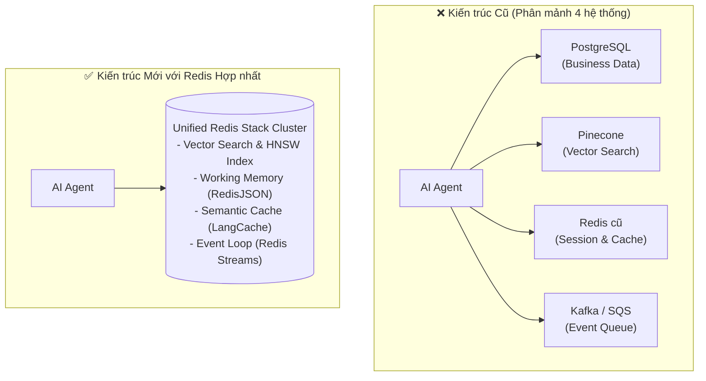
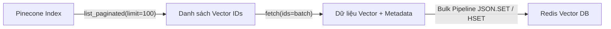
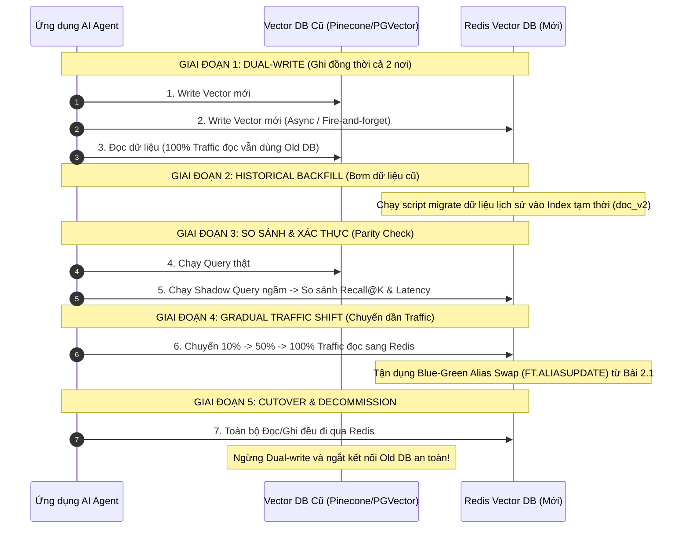

<!--
name: 5-vector-migration-guide.md
description: Production migration guide from Pinecone, Qdrant, and PGVector to Redis Vector DB, covering cost comparisons, schema mapping, batch pipeline imports, CDC with Redis Data Integration (RDI), Blue-Green zero-downtime cutover, and runnable Python migration scripts.
-->

# 2.5 — Vector Migration Guide — Import Embeddings từ Pinecone / Qdrant / PGVector

Trong giai đoạn xây dựng nguyên mẫu (PoC), các đội ngũ phát triển thường chọn các dịch vụ Vector Database độc lập chuyên biệt như **Pinecone**, **Qdrant**, hoặc tiện tay cài extension **PGVector** trên PostgreSQL.

Tuy nhiên, khi bước vào giai đoạn mở rộng quy mô (Scale-up) và xây dựng hệ thống **AI Agent Production**, kiến trúc này bộc lộ những rào cản chí mạng:
1. **Phân mảnh Hạ tầng (Infrastructure Sprawl)**: Bạn phải duy trì 3 – 4 hệ thống rời rạc: PostgreSQL lưu dữ liệu nghiệp vụ, Pinecone lưu vector, Redis làm Cache & Session, Kafka/RabbitMQ làm Event Bus. Dữ liệu bị phân tán, chi phí bảo trì nhân đôi và độ trễ mạng (Network Hop) giữa các hệ thống tăng vọt.
2. **Chi phí Đắt đỏ của Vector DB Chuyên biệt**: Pinecone tính phí rất cao khi lưu trữ hàng chục triệu vector thường trực hoặc phát sinh hàng triệu lượt query mỗi ngày.
3. **Cơ hội Hợp nhất Vàng trên Redis**: Redis không chỉ là Vector Database, mà còn là **Semantic Cache (LangCache)**, **Working Memory (RedisJSON)**, **Event Loop (Streams)** và **Distributed Lock**. Việc gom toàn bộ về một cụm Redis duy nhất giúp giảm tới $60\% - 80\%$ chi phí hạ tầng và đưa độ trễ toàn bộ Agent Loop về mức **dưới 5 mili-giây**.

Bài viết này là cẩm nang di chuyển (Migration Playbook) chuẩn mực, hướng dẫn bạn từng bước đưa toàn bộ dữ liệu vector từ **Pinecone**, **Qdrant**, và **PGVector** sang **Redis Vector DB** mà **không gây gián đoạn dịch vụ (Zero-Downtime Migration)**.

---

## 1. Tại sao Migrate sang Redis Vector? Phân tích TCO & Hiệu năng

### 1.1. So sánh Tổng chi phí Sở hữu (Total Cost of Ownership - TCO)

Bảng so sánh chi phí thực tế cho quy mô **10 triệu vectors (kích thước 1536 chiều, FLOAT32)** kèm lưu lượng **50 triệu queries/tháng**:

| Tiêu chí | Pinecone (Serverless / Pods) | Qdrant Cloud | PGVector (Managed AWS RDS) | Tự host Redis Stack / Redis Cloud |
| :--- | :--- | :--- | :--- | :--- |
| **Chi phí Lưu trữ / tháng** | Rất cao (~$600 – $1,200) | Trung bình (~$350 – $600) | Trung bình (~$300 – $500) | **Tiết kiệm nhất (~$200 – $400)** *(Dùng Auto-tiering RAM+SSD)* |
| **Chi phí Truy vấn (Read)** | Tính phí theo Read Units ($/RU) | Đi kèm gói cụm | Tốn CPU RDS (dễ nghẽn IOPS) | **Miễn phí lượt đọc** (tận dụng RAM/Throughput cụm) |
| **Latency $p95$** | $30 – 80\text{ ms}$ (phụ thuộc cloud region) | $15 – 40\text{ ms}$ | $20 – 60\text{ ms}$ (chậm khi bảng lớn) | **Siêu tốc: $2 – 5\text{ ms}$** (HNSW in-memory) |
| **Khả năng đa nhiệm** | Chỉ lưu Vector + Metadata | Chỉ lưu Vector + Payload | Lưu RDBMS truyền thống | **Tất cả trong 1**: Vector + Cache + Queue + State |



---

## 2. Di chuyển từ Pinecone sang Redis

Pinecone quản lý dữ liệu theo dạng **Namespaces** và **IDs**. Mỗi vector đi kèm một mảng `values` và một dictionary `metadata`.

### 2.1. Quy tắc Mapping Schema: Pinecone $\to$ RediSearch

| Kiểu dữ liệu Pinecone | Kiểu RediSearch Schema | Ghi chú chuyển đổi |
| :--- | :--- | :--- |
| `id` (String) | Key Prefix (`doc:kb:<id>`) | Dùng làm khóa nhận diện chính trong Redis |
| `values` (List float) | `VectorField` (HNSW) | `TYPE FLOAT32`, `DIM <dimension>`, `DISTANCE_METRIC` tương ứng |
| `metadata.category` (String) | `TagField` | Dùng cho exact match filter (`@category:{...}`) |
| `metadata.created_at` (Number) | `NumericField` | Dùng cho range filter thời gian (`@created_at:[...]`) |
| `metadata.text` (String) | `TextField` | Hỗ trợ tìm kiếm từ khóa BM25 kết hợp |

### 2.2. Chiến lược Trích xuất (Export) Phân trang từ Pinecone

Do Pinecone giới hạn số lượng vector trả về trong một lần gọi API (tối đa 100 vectors cho `fetch`), ta sử dụng API `list_paginated` để quét qua toàn bộ ID theo namespace:



### 2.3. Mã nguồn Python: Pinecone $\to$ Redis Migrator

```python
"""
name: migrate_pinecone_to_redis.py
description: High-throughput batch migration from Pinecone Serverless to Redis Vector DB.
"""

import time
from typing import List, Dict, Any
from pinecone import Pinecone
import redis
from redis.commands.search.field import TextField, TagField, NumericField, VectorField
from redis.commands.search.indexDefinition import IndexDefinition, IndexType

def migrate_pinecone_to_redis(
    pinecone_api_key: str,
    pinecone_index_name: str,
    pinecone_namespace: str = "",
    redis_url: str = "redis://localhost:6379",
    redis_index_name: str = "idx:migrated_pinecone",
    vector_dim: int = 1536,
    batch_size: int = 200
):
    # 1. Khởi tạo client
    pc = Pinecone(api_key=pinecone_api_key)
    p_index = pc.Index(pinecone_index_name)
    r_client = redis.Redis.from_url(redis_url, decode_responses=False)

    print(f"[*] Kết nối thành công tới Pinecone ({pinecone_index_name}) và Redis.")

    # 2. Tạo Index trên Redis nếu chưa tồn tại
    try:
        r_client.ft(redis_index_name).info()
        print(f"[*] Index '{redis_index_name}' đã tồn tại trên Redis.")
    except Exception:
        print(f"[*] Đang khởi tạo Index '{redis_index_name}' trên Redis...")
        schema = (
            TagField("$.category", as_name="category"),
            NumericField("$.created_at", as_name="created_at"),
            TextField("$.text", as_name="text"),
            VectorField(
                "$.embedding",
                "HNSW",
                {"TYPE": "FLOAT32", "DIM": vector_dim, "DISTANCE_METRIC": "COSINE"},
                as_name="embedding"
            )
        )
        r_client.ft(redis_index_name).create_index(
            fields=schema,
            definition=IndexDefinition(prefix=["doc:pinecone:"], index_type=IndexType.JSON)
        )
        print(f"[+] Đã tạo Index '{redis_index_name}' thành công.")

    # 3. Quét ID và tải dữ liệu theo từng lô (Pagination)
    total_migrated = 0
    start_time = time.time()

    for id_batch in p_index.list_paginated(namespace=pinecone_namespace, limit=batch_size):
        vector_ids = [v.id for v in id_batch.vectors]
        if not vector_ids:
            break

        # Tải chi tiết vectors kèm metadata
        fetch_res = p_index.fetch(ids=vector_ids, namespace=pinecone_namespace)
        
        # 4. Ghi theo lô vào Redis bằng Pipeline (Tăng tốc tối đa)
        pipe = r_client.pipeline(transaction=False)
        for v_id, data in fetch_res.vectors.items():
            meta = data.metadata or {}
            doc_payload = {
                "text": meta.get("text", ""),
                "category": meta.get("category", "default"),
                "created_at": float(meta.get("created_at", time.time())),
                "embedding": data.values  # List float lưu trực tiếp vào JSON
            }
            redis_key = f"doc:pinecone:{v_id}"
            pipe.json().set(redis_key, "$", doc_payload)

        pipe.execute()
        total_migrated += len(vector_ids)
        print(f"  -> Đã di chuyển: {total_migrated} vectors...")

    elapsed = time.time() - start_time
    print(f"\n✅ Hoàn tất migration từ Pinecone: {total_migrated} vectors trong {elapsed:.2f}s ({(total_migrated/max(elapsed, 1e-3)):.1f} docs/sec)!")
```

---

## 3. Di chuyển từ Qdrant sang Redis

Qdrant tổ chức dữ liệu theo các **Collections**, hỗ trợ Scroll API để đọc toàn bộ bản ghi mà không làm nghẽn RAM.

### 3.1. Quy tắc Mapping Schema: Qdrant $\to$ Redis

| Cấu hình Qdrant | Cấu hình Redis RediSearch |
| :--- | :--- |
| `Distance.COSINE` | `DISTANCE_METRIC COSINE` |
| `Distance.DOT` | `DISTANCE_METRIC IP` |
| `Distance.EUCLID` | `DISTANCE_METRIC L2` |
| `payload` (JSON) | `RedisJSON` document (`$.field`) |
| `PointStruct.id` (UUID / Integer) | Redis Key: `doc:qdrant:<id>` |

### 3.2. Mã nguồn Python: Qdrant Scroll $\to$ Redis Pipeline

```python
"""
name: migrate_qdrant_to_redis.py
description: Efficient scroll-based batch migration from Qdrant to Redis Vector DB.
"""

from qdrant_client import QdrantClient
import redis

def migrate_qdrant_to_redis(
    qdrant_host: str = "localhost",
    qdrant_port: int = 6333,
    collection_name: str = "my_kb",
    redis_url: str = "redis://localhost:6379",
    batch_size: int = 250
):
    q_client = QdrantClient(host=qdrant_host, port=qdrant_port)
    r_client = redis.Redis.from_url(redis_url, decode_responses=False)

    print(f"[*] Bắt đầu đọc dữ liệu từ Qdrant collection '{collection_name}'...")

    next_page_offset = None
    total_migrated = 0

    while True:
        # Sử dụng Scroll API để đọc phân trang an toàn
        records, next_page_offset = q_client.scroll(
            collection_name=collection_name,
            limit=batch_size,
            offset=next_page_offset,
            with_payload=True,
            with_vectors=True
        )

        if not records:
            break

        # Ghi theo lô qua Redis Pipeline
        pipe = r_client.pipeline(transaction=False)
        for rec in records:
            payload = rec.payload or {}
            doc_body = {
                **payload,
                "embedding": rec.vector  # Mảng float
            }
            pipe.json().set(f"doc:qdrant:{rec.id}", "$", doc_body)

        pipe.execute()
        total_migrated += len(records)
        print(f"  -> Đã di chuyển: {total_migrated} points...")

        if next_page_offset is None:
            break

    print(f"\n✅ Hoàn tất migration từ Qdrant: {total_migrated} vectors thành công!")
```

---

## 4. Di chuyển từ PGVector (PostgreSQL) sang Redis

PGVector lưu vector dưới dạng cột kiểu `vector(D)` trong bảng Postgres. Có 2 cách tiếp cận:

### Cách 1: Bulk Export qua Cursor Batching (Dành cho dữ liệu tĩnh)
Đọc từng lô $1,000$ bản ghi bằng con trỏ server-side (Server-side Cursor) để không tràn RAM:

```python
import psycopg2
import redis

def migrate_pgvector_static(pg_conn_str: str, redis_url: str, batch_size: int = 500):
    pg_conn = psycopg2.connect(pg_conn_str)
    r_client = redis.Redis.from_url(redis_url, decode_responses=False)

    # Dùng server-side cursor để tránh load toàn bộ bảng vào RAM máy client
    with pg_conn.cursor(name="pgvector_cursor") as cur:
        cur.execute("SELECT id, title, content, category, embedding::text FROM documents;")
        
        while True:
            rows = cur.fetchmany(batch_size)
            if not rows:
                break
            
            pipe = r_client.pipeline(transaction=False)
            for row in rows:
                doc_id, title, content, category, vec_str = row
                # Convert chuỗi "[0.02, -0.15, ...]" sang list float
                vector_list = [float(x) for x in vec_str.strip("[]").split(",")]
                
                doc = {
                    "title": title,
                    "content": content,
                    "category": category,
                    "embedding": vector_list
                }
                pipe.json().set(f"doc:pg:{doc_id}", "$", doc)
            pipe.execute()
```

### Cách 2: Đồng bộ Liên tục Thời gian thực qua Redis Data Integration (RDI / CDC)
Đối với các hệ thống tài chính hoặc thương mại điện tử nơi dữ liệu nghiệp vụ liên tục được thêm mới vào Postgres:
* **Redis Data Integration (RDI)** lắng nghe trực tiếp luồng **Write-Ahead Log (WAL)** của PostgreSQL qua cơ chế Change Data Capture (CDC / Debezium).
* Bất cứ khi nào có bản ghi mới được chèn (`INSERT`) hoặc cập nhật (`UPDATE`) trên Postgres, RDI tự động chuyển đổi định dạng và ghi trực tiếp sang cụm Redis Vector DB với độ trễ **dưới 100ms** mà ứng dụng không cần viết thêm bất kỳ dòng code đồng bộ nào!
*(Nội dung này sẽ được thực hành chuyên sâu tại Chương 3 — Redis Iris Platform).*

---

## 5. Chiến lược Zero-Downtime Migration (Chuyển đổi Không Gián đoạn)

Để di chuyển một hệ thống đang phục vụ hàng triệu người dùng thật mà không phát sinh bất kỳ giây downtime nào, chúng ta áp dụng quy trình **5 giai đoạn chuẩn doanh nghiệp**:



### Chi tiết các bước triển khai:

1. **Giai đoạn 1: Dual-Write (Ghi song song)**:
   * Sửa tầng Application Layer: Mọi bản ghi embedding mới được tạo sẽ ghi đồng thời vào cả Vector DB cũ và Redis.
   * Tất cả các lượt tìm kiếm (Read) vẫn hướng $100\%$ về Vector DB cũ.
2. **Giai đoạn 2: Historical Backfill (Bơm dữ liệu lịch sử)**:
   * Chạy script Python (mục 2 hoặc mục 3) để quét toàn bộ dữ liệu cũ và nạp vào Redis.
   * Tái sử dụng kỹ thuật **Blue-Green Reindexing** (đã học ở Bài 2.1): Tạo index mới `idx:knowledge_v2` với prefix `doc:v2:`.
3. **Giai đoạn 3: Parity Testing (Kiểm thử So sánh Tương đương)**:
   * Sử dụng **Golden Dataset** (từ Bài 2.4) chạy đồng thời trên cả 2 hệ thống.
   * Kiểm tra: `Recall@K` trên Redis phải bằng hoặc cao hơn hệ thống cũ, và $p95$ Latency trên Redis phải thấp hơn ít nhất $3-5$ lần.
4. **Giai đoạn 4: Canary Traffic Shift & Blue-Green Alias Swap**:
   * Dùng Feature Flag điều hướng $10\% \to 25\% \to 50\% \to 100\%$ lưu lượng truy vấn của Agent sang Redis.
   * Nếu có sự cố bất ngờ, chuyển cờ Feature Flag về $0\%$ ngay lập tức (Zero-risk Rollback).
   * Kích hoạt chuyển đổi Alias trên Redis chỉ với 1 câu lệnh duy nhất:
     ```sql
     FT.ALIASUPDATE idx:knowledge_alias idx:knowledge_v2
     ```
5. **Giai đoạn 5: Decommissioning (Khai tử hệ thống cũ)**:
   * Tắt luồng ghi vào DB cũ, sao lưu bản snapshot cuối cùng và đóng tài khoản dịch vụ cũ để tiết kiệm ngân sách.

---

## 6. Production Checklist Sau khi Di chuyển

Trước khi ký nghiệm thu và đóng hoàn toàn hệ thống Vector DB cũ, hãy tích đủ các mục sau:

- [ ] **Khớp số lượng bản ghi (Document Count Parity)**:
  * Chạy `FT.INFO <index_name>` và so khớp trường `num_docs` với số lượng vector trên hệ thống cũ. Đảm bảo sai lệch bằng $0$.
- [ ] **Kiểm tra tính toàn vẹn Metadata**:
  * Kiểm tra ngẫu nhiên 100 bản ghi để đảm bảo các trường `category` (Tag), `created_at` (Numeric), và `text` (Content) đã được parse chính xác, không bị biến dạng kiểu dữ liệu.
- [ ] **Xác thực Định dạng Vector & Metric**:
  * Đảm bảo `DISTANCE_METRIC` trên Redis (`COSINE` / `IP` / `L2`) khớp hoàn toàn với cấu hình khoảng cách của Index cũ.
- [ ] **Thiết lập Cấu hình Persistence (RDB + Multi-Part AOF)**:
  * Kiểm tra cấu hình Redis: bật `appendonly yes`, `aof-use-rdb-preamble yes` để bảo vệ dữ liệu vector trên RAM không bị thất thoát khi restart máy chủ.
- [ ] **Sẵn sàng cho Chương 3 (Redis Iris Platform)**:
  * Sau khi dữ liệu vector đã nằm gọn trong Redis, toàn bộ kho tri thức này đã sẵn sàng để kết nối với các tính năng cao cấp của **Redis Iris**: Semantic Cache (**LangCache**), **Agent Memory**, và **Context Retriever**.

---

*← Bài trước: [2.4 - RAG Benchmarking & Evaluation](./4-rag-benchmarking-and-evaluation.md) | Tiếp theo: [Chương 3 — Redis Iris AI Platform](../3-redis-iris-platform/1-redis-langcache-semantic-cache.md) →*
