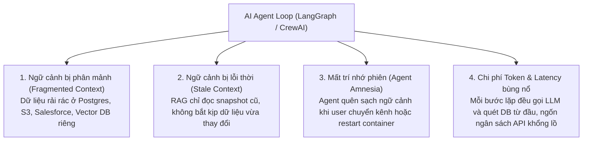
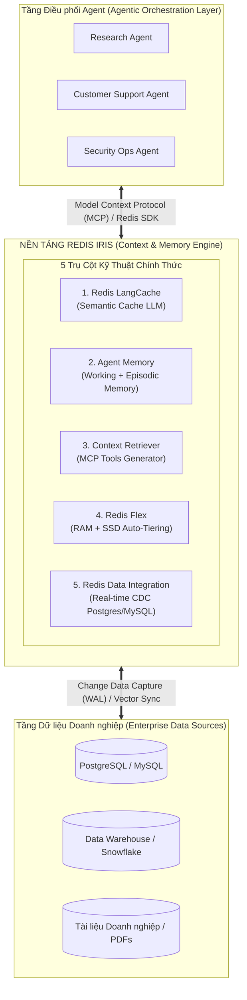
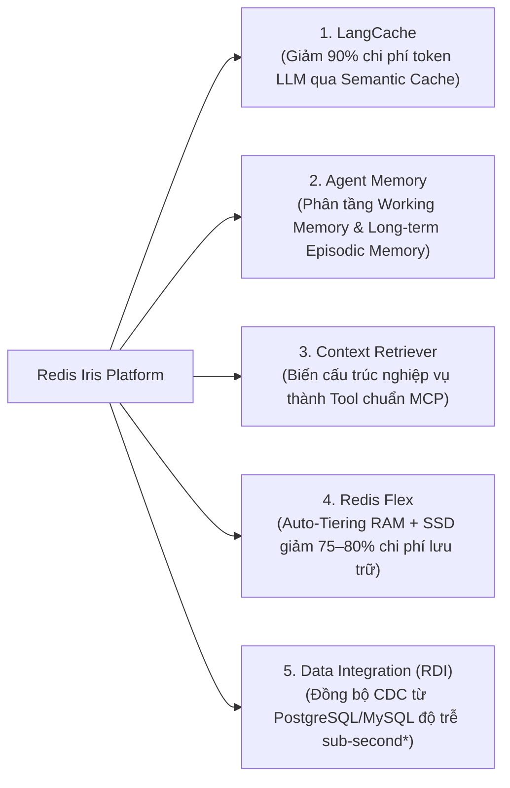

<!--
name: 0-why-iris-context-engine.md
description: Architectural introduction to the Redis Iris AI Platform, explaining the Context Engine concept, why autonomous AI agents need a specialized memory layer, Iris vs DIY manual architecture, and the 5 core pillars of Redis Iris.
-->

# 3.0 — Why Redis Iris? — Động cơ Ngữ cảnh & Bộ nhớ cho Kỷ nguyên AI Agents

Trong hai chương trước, bạn đã học cách tự tay lập trình từng khối hạ tầng cốt lõi trên Redis:
* Dùng **RedisJSON** làm kho lưu trữ trạng thái (**State Store**).
* Dùng **Redis Streams** làm vòng lặp điều phối sự kiện (**Event Loop**).
* Dùng **RediSearch & HNSW** làm cơ sở dữ liệu vector (**Vector DB**).
* Dùng **`FT.SEARCH` & `FT.HYBRID`** để tìm kiếm kết hợp ngữ nghĩa và từ khóa (**Hybrid Search**).

Đến đây, một kỹ sư kiến trúc sẽ đặt ra câu hỏi:
> *"Nếu tôi đã có thể tự code mọi thứ bằng `redis-py` và RediSearch, tại sao Redis lại phải ra mắt **Redis Iris** như một nền tảng AI chuyên biệt riêng?"*

Câu trả lời nằm ở bước chuyển dịch vĩ mô của toàn ngành công nghiệp: **Từ Chatbot hỏi-đáp đơn giản (Q&A RAG) sang Tác tử AI Tự hành Đa bước (Autonomous Multi-Agent Fleet)**.

Khi hàng chục Agent cùng vận hành 24/7, thực hiện hàng trăm bước suy luận (Reasoning Steps) và gọi hàng ngàn Tool Calls mỗi phút, việc tự ghép nối thủ công từng cấu trúc dữ liệu Redis sẽ nhanh chóng dẫn đến **"Khủng hoảng Quản lý Ngữ cảnh" (The Context Crisis)**.

Chương này sẽ giúp bạn hiểu rõ bản chất của **Redis Iris — Động cơ Ngữ cảnh & Bộ nhớ Toàn diện (Context & Memory Engine)** được Redis thiết kế riêng cho kỷ nguyên Agentic AI.

---

## 1. Khủng hoảng Ngữ cảnh trong Hệ thống AI Agent Thực chiến

Trong các hệ thống RAG truyền thống (Human-in-the-loop), người dùng gửi 1 câu hỏi và nhận về 1 câu trả lời. Độ trễ 1 – 2 giây là hoàn toàn chấp nhận được.

Nhưng trong một hệ sinh thái **AI Agent**, một tác vụ duy nhất (ví dụ: *"Kiểm toán và tự động giải quyết các giao dịch thanh toán bất thường trong 24h qua"*) có thể đòi hỏi:
* 5 Agent phối hợp với nhau.
* Thực hiện 40 lượt Tool Calls.
* Tra cứu hàng chục bảng dữ liệu quan hệ, lịch sử trò chuyện và tài liệu quy chế.

### 4 "Căn bệnh nan y" của Agent nếu tự ghép nối thủ công:
1. **Ngữ cảnh phân mảnh (Fragmented Context)**: Agent phải kết nối đồng thời với 4–5 database khác nhau để gom đủ thông tin trước khi ra quyết định.
2. **Dữ liệu lỗi thời (Stale Data)**: Dữ liệu nghiệp vụ trong Postgres đã đổi, nhưng vector DB chuyên dụng chỉ cập nhật qua cron-job ban đêm $\to$ Agent hành động dựa trên thông tin sai lệch.
3. **Mất trí nhớ dài hạn (Agent Amnesia)**: Không có cơ chế phân tầng chuẩn hóa giữa bộ nhớ làm việc tạm thời (Working Memory) và ký ức kinh nghiệm dài hạn (Episodic Memory).
4. **Chi phí & Độ trễ vượt trần**: Agent lặp lại các câu hỏi suy luận tương tự nhau nhiều lần, gây lãng phí hàng ngàn USD tiền token LLM và làm tắc nghẽn toàn bộ quy trình.

---

## 2. Redis Iris là gì? Trạm Trung chuyển Ngữ cảnh Doanh nghiệp

**Redis Iris** không phải là một mô hình AI mới, mà là **Tầng Động cơ Ngữ cảnh (Context Engine)** nằm giữa các Framework điều phối Agent (LangGraph, CrewAI, AutoGen, LlamaIndex) và hệ thống dữ liệu doanh nghiệp:

Thay vì bắt mỗi lập trình viên phải tự viết mã code để đồng bộ dữ liệu, tự cấu hình HNSW, tự xây dựng bộ nhớ đệm ngữ nghĩa, và tự quản lý phiên chat, **Redis Iris chuẩn hóa toàn bộ thành các sản phẩm dịch vụ hoàn chỉnh sẵn sàng cho Production**.

---

## 3. Năm Trụ cột Cốt lõi của Nền tảng Redis Iris

Hệ sinh thái Redis Iris được xây dựng dựa trên 5 sản phẩm chuyên biệt, giải quyết triệt để từng khía cạnh của bài toán quản lý ngữ cảnh:

### 1. Redis LangCache (Semantic Cache)
* **Vấn đề**: Các Agent thường xuyên gửi các prompt truy vấn tương tự hoặc trùng lặp ngữ nghĩa sang OpenAI/Claude, gây tốn kém chi phí và chậm trễ.
* **Giải pháp**: Tận dụng Vector Search với ngưỡng khoảng cách / tương đồng ngữ nghĩa linh hoạt (ví dụ cấu hình khoảng cách $R \le 0.1$ tùy chỉnh theo từng độ nhạy nghiệp vụ) để tạo tầng **Cache Ngữ nghĩa**. Nếu câu hỏi mới có cùng ý nghĩa với câu hỏi trước đó, trả lời ngay tức thì trong $2\text{ms}$ với chi phí token bằng $0$!

### 2. Redis Agent Memory
* **Vấn đề**: Các framework như LangChain/CrewAI có sẵn memory class nhưng chỉ lưu trên RAM máy chạy code (mất sạch khi container restart) hoặc lưu file cục bộ không hỗ trợ multi-agent.
* **Giải pháp**: Một dịch vụ bộ nhớ được quản lý hoàn toàn (Managed Memory Service) phân tách chuẩn mực giữa **Working Memory** (RedisJSON theo session) và **Episodic Long-term Memory** (RediSearch Vector).

### 3. Redis Context Retriever
* **Vấn đề**: Mỗi khi muốn cho Agent tra cứu dữ liệu mới, lập trình viên phải viết thêm một Function Calling Tool riêng biệt, tự viết câu truy vấn SQL/Vector.
* **Giải pháp**: Định nghĩa schema thực thể nghiệp vụ (Khách hàng, Hóa đơn, Vé bảo hành) một lần duy nhất, Context Retriever tự động sinh ra các Tool chuẩn **Model Context Protocol (MCP)** để bất kỳ Agent nào cũng có thể tra cứu và điều hướng tự động.

### 4. Redis Flex (Auto-Tiering RAM + SSD)
* **Vấn đề**: Lưu trữ hàng trăm Gigabytes lịch sử hội thoại, trạng thái Agent và dữ liệu vận hành hoàn toàn trên RAM sẽ tiêu tốn ngân sách hạ tầng khổng lồ.
* **Giải pháp**: Công nghệ phân tầng tự động lưu trữ dữ liệu "nóng" (thường xuyên truy cập) trên RAM và tự động đẩy dữ liệu "lạnh" xuống ổ cứng siêu tốc NVMe SSD, giúp **giảm từ 75% đến 80% chi phí hạ tầng** (theo số liệu từ các báo cáo thử nghiệm của Redis) mà vẫn đảm bảo độ trễ truy vấn ở mức micro-giây.

### 5. Redis Data Integration (RDI)
* **Vấn đề**: Dữ liệu nghiệp vụ liên tục thay đổi trên Postgres/MySQL nhưng vector cache bị lỗi thời.
* **Giải pháp**: Lắng nghe trực tiếp luồng Write-Ahead Log (WAL) qua Change Data Capture (CDC), tự động đồng bộ mọi thay đổi sang Redis ở cấp độ sub-second (*tham khảo thực tế thường dưới 100ms tùy cấu hình hạ tầng mạng và tải database*) mà không gây ảnh hưởng tới hiệu năng của DB chính.

---

## 4. Tự Code Tay (DIY) vs Sử dụng Nền tảng Redis Iris: Bảng So sánh

| Tiêu chí | Tự Code Thủ công (Chương 1 & 2) | Triển khai Nền tảng Redis Iris (Chương 3) |
| :--- | :--- | :--- |
| **Quản lý Bộ nhớ Agent** | Tự thiết kế JSON schema, tự quản lý TTL, tự viết code tìm kiếm vector. | Có sẵn **Agent Memory Service** hỗ trợ tự động tóm tắt, trích xuất sự kiện và phân tầng session. |
| **Semantic Caching** | Tự viết script so sánh vector cosine và tự quản lý invalidate cache. | Dùng **Redis LangCache** cấu hình sẵn các thuật toán eviction, hit-ratio tracking và dashboard giám sát. |
| **Đồng bộ Dữ liệu RDBMS** | Phải viết cron-job Python, đối mặt với race condition và trễ dữ liệu. | Dùng **RDI (Log-based CDC)** Declarative YAML, tự động bắt INSERT/UPDATE/DELETE gần như tức thì (<100ms tham khảo*). |
| **Chuẩn kết nối Tool** | Tự viết custom REST API hoặc custom LangChain tools cho từng bảng. | Hỗ trợ gốc giao thức **Model Context Protocol (MCP)**, cắm là chạy với Claude Desktop, Cursor, LangGraph. |
| **Chi phí Lưu trữ Dữ liệu Lớn** | Toàn bộ dữ liệu trạng thái, session lịch sử phải nằm trên RAM đắt đỏ. | Tận dụng **Redis Flex**, kết hợp RAM + NVMe SSD giảm 75–80% chi phí. |
| **Thời gian Go-to-Market** | Tốn 2 – 3 tháng phát triển hạ tầng và xử lý lỗi phân tán. | **Rút ngắn còn vài ngày**, tập trung 100% vào logic nghiệp vụ của Agent. |

> *\* Ghi chú: Con số độ trễ <100ms của RDI là ước tính kỹ thuật thực tế cho kiến trúc Log-based CDC qua WAL, không phải cam kết SLA cố định của Redis và có thể thay đổi tùy thuộc quy mô hạ tầng mạng và throughput nguồn.*

---

## 5. Lộ trình Bài học trong Chương 3

Để giúp bạn làm chủ toàn bộ nền tảng này, Chương 3 sẽ lần lượt đi sâu vào từng trụ cột kỹ thuật:

1. **[Bài 3.1: Redis LangCache](./1-redis-langcache-semantic-cache.md)** — Semantic Caching giảm 90% chi phí token và đưa latency về dưới 5ms.
2. **[Bài 3.2: Agent Memory Architecture](./2-agent-memory-architecture.md)** — Phân tầng Working Memory & Long-term Vector Memory chuẩn production.
3. **[Bài 3.3: Context Retriever & MCP](./3-context-retriever.md)** — Kết nối dữ liệu doanh nghiệp thời gian thực vào Agent qua giao thức Model Context Protocol.
4. **[Bài 3.4: Redis Flex & Auto-Tiering](./4-redis-flex-tiering-ram-ssd.md)** — Quản lý hàng trăm triệu vector trên RAM + NVMe SSD với chi phí tối ưu.
5. **[Bài 3.5: Redis Data Integration (RDI)](./5-redis-data-integration-rdi.md)** — Streaming CDC từ PostgreSQL/MySQL sang Redis không độ trễ.

---

*← Quay lại: [Chương 2 — Vector Search & RAG](../2-vector-search-and-rag/0-chunking-and-preprocessing.md) | Tiếp theo: [3.1 - Redis LangCache Semantic Cache](./1-redis-langcache-semantic-cache.md) →*
