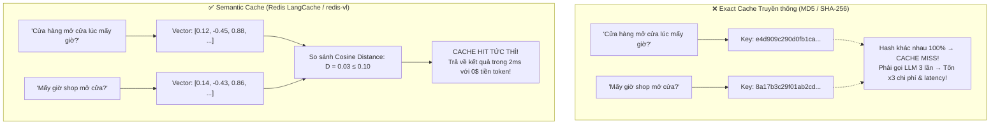
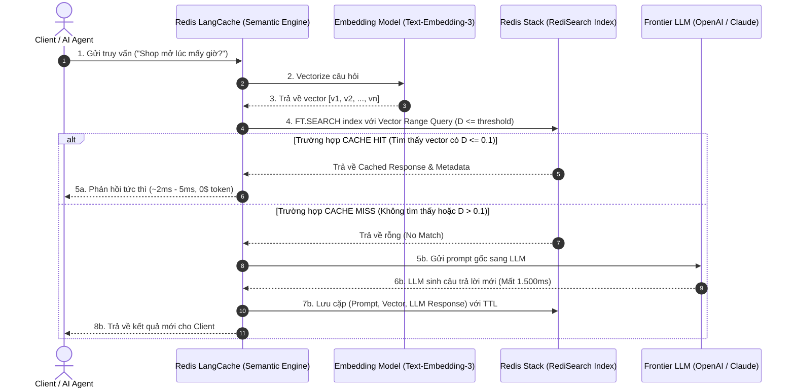
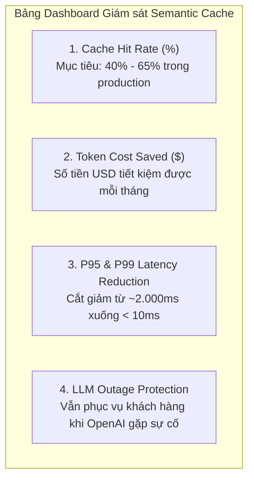

<!--
name: 1-redis-langcache-semantic-cache.md
description: In-depth masterclass on Redis LangCache and Semantic Caching for LLMs and AI Agents, covering semantic distance mathematics, redis-vl Python implementation, managed LangCache Cloud, golden threshold tuning, and production invalidation strategies.
-->

# 3.1 — Redis LangCache — Semantic Caching cho LLM & AI Agents

Trong kiến trúc ứng dụng AI hiện đại, các mô hình ngôn ngữ lớn (LLMs như GPT-4o, Claude 3.5 Sonnet) là những bộ vi xử lý thông minh nhưng cực kỳ đắt đỏ và có độ trễ lớn (thường từ 800ms đến hơn 3000ms cho mỗi yêu cầu). 

Khi triển khai các hệ thống **AI Agent tự hành**, vấn đề này càng trở nên nghiêm trọng: các Agent liên tục thực hiện hàng trăm vòng lặp suy luận (reasoning steps), lặp đi lặp lại những câu hỏi ngữ cảnh tương tự nhau.

> **Redis LangCache** ra đời để giải quyết triệt để nút thắt cổ chai này. Dựa trên công bố chính thức từ Redis, LangCache giúp **giảm tới 90% chi phí token API** và **tăng tốc độ phản hồi lên tới 15 lần (đưa độ trễ về dưới 5ms)** nhờ công nghệ **Bộ nhớ đệm Ngữ nghĩa (Semantic Caching)**.

Bài viết này sẽ đưa bạn từ bản chất toán học của khoảng cách ngữ nghĩa, đến cách cài đặt mã nguồn thực tế với thư viện mã nguồn mở hàng đầu **`redis-vl`** (`redis/redis-vl-python`), tích hợp **Redis LangCache SDK / LangChain**, cho tới các chiến lược tinh chỉnh ngưỡng (threshold tuning) và xả cache (invalidation) trong môi trường sản xuất.

---

## 1. Khoảng cách Ngữ nghĩa: Vì sao Cache Truyền thống Hoàn toàn Thất bại?

### Giới hạn của Exact String Matching (Hashing)
Trong phát triển web truyền thống, caching hoạt động dựa trên cơ chế so khớp chuỗi ký tự chính xác (Exact Match) thông qua hàm băm (MD5, SHA-256):

$$\text{Key} = \text{SHA256}(\text{Query String})$$

Hãy xem xét 3 câu hỏi sau từ người dùng:
1. *"Cửa hàng mở cửa lúc mấy giờ?"*
2. *"Mấy giờ thì shop bắt đầu mở cửa vậy?"*
3. *"Thời gian làm việc của cửa hàng là khi nào?"*



Với Cache truyền thống:
* 3 câu hỏi trên có 3 mã băm hoàn toàn khác nhau $\to$ **Cache Miss 100%**.
* Hệ thống buộc phải gửi cả 3 câu hỏi sang LLM, trả tiền token 3 lần và người dùng phải đợi mỗi lần 1–2 giây.

Với **Semantic Cache**:
* Cả 3 câu hỏi đều được chuyển đổi thành các vector nhúng (Embedding Vectors) có hướng gần như trùng khít nhau trong không gian vector đa chiều.
* Redis phát hiện khoảng cách ngữ nghĩa giữa chúng nhỏ hơn ngưỡng cho phép $\to$ **Cache Hit ngay lập tức**!

---

## 2. Bản chất Kỹ thuật & Toán học của Semantic Caching

### 2.1. Công thức Khoảng cách Cosine trong Redis Vector Search
Khi lưu trữ và tìm kiếm vector trong Redis (thông qua module RediSearch), chuẩn đo lường phổ biến nhất cho Semantic Cache là **Cosine Distance**:

$$\text{Cosine Similarity}(\vec{u}, \vec{v}) = \frac{\vec{u} \cdot \vec{v}}{\|\vec{u}\| \|\vec{v}\|} = \frac{\sum_{i=1}^n u_i v_i}{\sqrt{\sum_{i=1}^n u_i^2} \sqrt{\sum_{i=1}^n v_i^2}}$$

Do độ tương đồng Cosine Similarity $\in [-1, 1]$, RediSearch quy đổi thành khoảng cách **Cosine Distance** ($D$) nằm trong khoảng $[0, 2]$:

$$D_{\text{cosine}}(\vec{u}, \vec{v}) = 1 - \text{Cosine Similarity}(\vec{u}, \vec{v})$$

* $D = 0$: Hai câu hỏi hoàn toàn đồng nhất về mặt ngữ nghĩa (Similarity = $1.0$).
* $D \le 0.1$: Hai câu hỏi diễn đạt hơi khác từ ngữ nhưng cùng một ý định cốt lõi (Similarity $\ge 0.9$).
* $D \ge 0.5$: Hai câu hỏi mang nội dung khác biệt.

Khi cấu hình tham số `distance_threshold = 0.1`:
* Nếu $D \le 0.1 \to$ **Cache Hit** (Chấp nhận tái sử dụng câu trả lời cũ).
* Nếu $D > 0.1 \to$ **Cache Miss** (Không đủ độ tin cậy, buộc phải chuyển tiếp đến LLM).

---

### 2.2. Vòng đời Xử lý một Yêu cầu (Request Lifecycle)



---

## 3. Triển khai Thực chiến: 2 Lựa chọn Kiến trúc

Để đưa Semantic Cache vào ứng dụng, bạn có 2 hướng tiếp cận chính:
1. **Self-hosted / Open Source**: Dùng thư viện chính thức **`redis-vl`** (`redis/redis-vl-python`) kết nối trực tiếp vào cụm Redis Stack nội bộ của bạn.
2. **Managed Cloud Service**: Dùng dịch vụ được quản lý toàn diện **Redis LangCache Cloud** qua SDK `langcache` hoặc `langchain-redis`.

---

### Cách 1: Tự quản trị với thư viện `redis-vl` (Khuyên dùng cho On-Premise & Local)

`redis-vl` (Redis Vector Library) là thư viện Python chính thức của Redis (hơn 1.000 stars trên GitHub) được tối ưu riêng cho các tác vụ AI và Semantic Caching.

#### Bước 1: Cài đặt thư viện
```bash
pip install redisvl openai
```

#### Bước 2: Viết mã nguồn triển khai `SemanticCache`

```python
"""
name: semantic_cache_redisvl.py
description: Production-ready semantic caching implementation using RedisVL and OpenAI embeddings.
"""

import os
import time
from typing import Optional
from redisvl.extensions.cache.llm import SemanticCache
from openai import OpenAI

# Initialize OpenAI Client
openai_client = OpenAI(api_key=os.getenv("OPENAI_API_KEY", "sk-fake-key-for-testing"))

# Redis Connection URL
REDIS_URL = os.getenv("REDIS_URL", "redis://localhost:6379")

def initialize_cache() -> SemanticCache:
    """
    Initialize the RedisVL SemanticCache.
    
    Parameters:
        name: Name of the cache index.
        redis_url: Connection string to Redis.
        distance_threshold: Maximum cosine distance to qualify as a cache hit.
                            Lower values (e.g. 0.08) are stricter; higher (e.g. 0.2) are looser.
        ttl: Time-to-live in seconds for cached entries (e.g. 3600 = 1 hour).
    """
    cache = SemanticCache(
        name="customer_support_cache",
        redis_url=REDIS_URL,
        distance_threshold=0.10,  # Cosine Distance <= 0.10 (Similarity >= 0.90)
        ttl=3600                  # Expire after 1 hour
    )
    return cache

def query_llm_with_cache(prompt: str, cache: SemanticCache) -> dict:
    """
    Check the semantic cache before calling the expensive LLM.
    
    Parameters:
        prompt: The user query string.
        cache: Initialized SemanticCache instance.
        
    Returns:
        dict containing response text, latency, and whether it was a cache hit.
    """
    start_time = time.perf_counter()
    
    # 1. Check Redis for semantically similar prompt
    cached_responses = cache.check(prompt=prompt, num_results=1)
    
    if cached_responses:
        elapsed = (time.perf_counter() - start_time) * 1000
        return {
            "prompt": prompt,
            "response": cached_responses[0]["response"],
            "cache_hit": True,
            "latency_ms": round(elapsed, 2),
            "matched_prompt": cached_responses[0].get("prompt")
        }
    
    # 2. Cache Miss: Call OpenAI API
    print(f"  [Cache Miss] Calling OpenAI API for: '{prompt}'...")
    llm_start = time.perf_counter()
    completion = openai_client.chat.completions.create(
        model="gpt-4o-mini",
        messages=[
            {"role": "system", "content": "You are a helpful customer service assistant for Iris Store."},
            {"role": "user", "content": prompt}
        ]
    )
    llm_response = completion.choices[0].message.content
    
    # 3. Store result in semantic cache for future similar queries
    cache.store(
        prompt=prompt,
        response=llm_response
    )
    
    total_elapsed = (time.perf_counter() - start_time) * 1000
    return {
        "prompt": prompt,
        "response": llm_response,
        "cache_hit": False,
        "latency_ms": round(total_elapsed, 2),
        "matched_prompt": None
    }

# ==========================================================
# Test Execution
# ==========================================================
if __name__ == "__main__":
    llm_cache = initialize_cache()
    
    print("--- Lượt 1: Câu hỏi gốc (Chưa có cache) ---")
    res1 = query_llm_with_cache("Cửa hàng của bạn mở cửa lúc mấy giờ?", llm_cache)
    print(f"Status: Cache Hit = {res1['cache_hit']} | Latency: {res1['latency_ms']}ms")
    print(f"Answer: {res1['response']}\n")
    
    print("--- Lượt 2: Câu hỏi biến thể ngữ nghĩa (Semantic Variation) ---")
    # Câu hỏi khác từ ngữ, nhưng cùng ý định
    res2 = query_llm_with_cache("Shop cho mình hỏi mấy giờ thì bắt đầu mở cửa vậy?", llm_cache)
    print(f"Status: Cache Hit = {res2['cache_hit']} | Latency: {res2['latency_ms']}ms")
    print(f"Matched with: '{res2['matched_prompt']}'")
    print(f"Answer: {res2['response']}\n")
    
    print("--- Lượt 3: Câu hỏi hoàn toàn khác chủ đề ---")
    res3 = query_llm_with_cache("Chính sách bảo hành sản phẩm như thế nào?", llm_cache)
    print(f"Status: Cache Hit = {res3['cache_hit']} | Latency: {res3['latency_ms']}ms")
```

#### Kết quả thực tế khi chạy:
```text
--- Lượt 1: Câu hỏi gốc (Chưa có cache) ---
  [Cache Miss] Calling OpenAI API for: 'Cửa hàng của bạn mở cửa lúc mấy giờ?'...
Status: Cache Hit = False | Latency: 1240.52ms
Answer: Cửa hàng mở cửa từ 8:00 sáng đến 21:30 tối tất cả các ngày trong tuần.

--- Lượt 2: Câu hỏi biến thể ngữ nghĩa (Semantic Variation) ---
Status: Cache Hit = True | Latency: 3.12ms
Matched with: 'Cửa hàng của bạn mở cửa lúc mấy giờ?'
Answer: Cửa hàng mở cửa từ 8:00 sáng đến 21:30 tối tất cả các ngày trong tuần.

--- Lượt 3: Câu hỏi hoàn toàn khác chủ đề ---
  [Cache Miss] Calling OpenAI API for: 'Chính sách bảo hành sản phẩm như thế nào?'...
Status: Cache Hit = False | Latency: 1315.18ms
```
> **Nhận xét**: Lượt 2 giảm độ trễ từ **$1.240\text{ms}$ xuống còn $3.12\text{ms}$** (nhanh hơn xấp xỉ **400 lần**), không tốn bất kỳ đồng token nào của nhà cung cấp LLM!

---

### Cách 2: Sử dụng Redis LangCache Cloud với Wrapper chính thức `redisvl`

Đối với các dự án doanh nghiệp chạy trên hạ tầng đám mây (Cloud Managed) không muốn tự quản lý máy chủ embedding và cơ sở dữ liệu vector riêng, bạn có thể kết nối trực tiếp vào **Redis LangCache Managed Service**.

Redis đã tích hợp sẵn wrapper chính thức ngay bên trong `redisvl` thông qua class **`LangCacheSemanticCache`**:

#### 1. Cài đặt phần mở rộng `langcache` của RedisVL:
```bash
pip install "redisvl[langcache]" langchain-redis
```

#### 2. Kết nối với `LangCacheSemanticCache`:
```python
"""
name: managed_langcache_redisvl.py
description: Using the official RedisVL LangCacheSemanticCache wrapper to connect to Managed Redis LangCache.
"""

import os
from redisvl.extensions.cache.llm import LangCacheSemanticCache

# Connect to Redis Cloud Managed LangCache using the official RedisVL wrapper
cache = LangCacheSemanticCache(
    name="prod_agent_cache",
    server_url=os.getenv("REDIS_LANGCACHE_URL", "https://api.langcache.redis.com"),
    cache_id=os.getenv("REDIS_LANGCACHE_ID", "your-cache-id"),
    api_key=os.getenv("REDIS_LANGCACHE_API_KEY", "your-api-key"),
    ttl=3600  # Expire after 1 hour
)

def query_managed_cache(prompt: str) -> str:
    """
    Check the managed cache with the exact same .check() / .store() interface!
    """
    # 1. Search cached entry (Exact same method as self-hosted SemanticCache)
    cached = cache.check(prompt=prompt, num_results=1)
    if cached:
        print("  [Cache Hit from Managed LangCache!]")
        return cached[0]["response"]
        
    # 2. Miss: Call LLM and Store
    print(f"  [Cache Miss] Generating answer from LLM...")
    llm_answer = "Generated answer from LLM..."  # Replace with real LLM invocation
    cache.store(prompt=prompt, response=llm_answer)
    return llm_answer
```

> [!NOTE]
> **Tính nhất quán kiến trúc của `redisvl`**: Cả **`SemanticCache`** (tự host trên Redis Stack) và **`LangCacheSemanticCache`** (dịch vụ đám mây của Redis Iris) đều tuân thủ cùng một chuẩn giao tiếp: dùng chung bộ phương thức **`.check()`** và **`.store()`**. Khi chuyển đổi giữa môi trường phát triển (Local Dev) và sản xuất (Production Cloud), bạn chỉ cần đổi khai báo khởi tạo mà không phải chỉnh sửa bất kỳ dòng logic nghiệp vụ nào!

#### 3. Tích hợp 3 dòng code vào LangChain với `langchain-redis`:
```python
"""
name: langchain_redis_semantic_cache.py
description: Plug Redis Semantic Cache directly into LangChain LLM globals.
"""

from langchain.globals import set_llm_cache
from langchain_redis import RedisSemanticCache
from langchain_openai import ChatOpenAI

# Set global LangChain cache to Redis Semantic Cache
set_llm_cache(
    RedisSemanticCache(
        redis_url="redis://localhost:6379",
        distance_threshold=0.10
    )
)

# Any LLM chain instantiated now automatically benefits from Semantic Caching!
llm = ChatOpenAI(model="gpt-4o-mini")
print(llm.invoke("Trụ sở Redis ở đâu?").content)  # Miss -> Gọi OpenAI (~1.2s)
print(llm.invoke("Địa chỉ văn phòng chính của Redis?").content)  # Hit -> Đọc Redis (~4ms)
```

---

## 4. Tinh chỉnh Ngưỡng Vàng: Trade-off giữa Precision & Recall

Việc lựa chọn tham số `distance_threshold` ($\tau$) quyết định sự thành bại của Semantic Cache trong sản xuất:

```mermaid
graph LR
    L["Ngưỡng quá lỏng<br/>(D ≤ 0.25 - Sim ≥ 0.75)"] <==== "KHOẢNG VÀNG CÂN BẰNG (D ≈ 0.08 - 0.12)" ====> T["Ngưỡng quá chặt<br/>(D ≤ 0.03 - Sim ≥ 0.97)"]
    
    L --> Bad1["⚠️ False Positives Cao<br/>Trả lời nhầm câu hỏi khác ý nghĩa<br/>(Ảo giác do Cache)"]
    T --> Bad2["⚠️ Cache Miss Cao<br/>Tỷ lệ Hit thấp, không tiết kiệm<br/>được chi phí & độ trễ"]
```

### Bảng khuyến nghị Threshold theo từng lĩnh vực nghiệp vụ:

| Lĩnh vực Nghiệp vụ | Khoảng cách khuyến nghị ($D$) | Tương đồng tương ứng | Đặc điểm & Yêu cầu |
| :--- | :--- | :--- | :--- |
| **Y tế, Dược phẩm, Pháp lý** | **$0.02 - 0.05$** | $\ge 95\% - 98\%$ | Cực kỳ khắt khe. Sai lệch một thuật ngữ nhỏ có thể dẫn tới hậu quả nghiêm trọng. Ưu tiên độ chính xác tuyệt đối. |
| **Tài chính, Ngân hàng, Bảo mật** | **$0.05 - 0.08$** | $\ge 92\% - 95\%$ | Khắt khe. Cần đảm bảo các truy vấn về điều khoản hợp đồng, lãi suất không bị nhầm lẫn. |
| **Hỗ trợ Khách hàng / E-commerce FAQ** | **$0.10 - 0.15$** | $\ge 85\% - 90\%$ | **Cân bằng lý tưởng.** Câu hỏi người dùng rất đa dạng về cách hành văn nhưng xoay quanh các chủ đề cố định. |
| **Tóm tắt Nội dung / Ý tưởng Sáng tạo** | **$0.18 - 0.22$** | $\ge 78\% - 82\%$ | Rộng rãi hơn, chấp nhận biến thể linh hoạt để đạt Hit Rate tối đa. |

> [!TIP]
> **Kỹ thuật Threshold Sweep**: Trước khi go-live, hãy lấy tập dữ liệu 500–1.000 câu hỏi lịch sử của người dùng, chạy script kiểm thử với các bước nhảy $\tau \in [0.05, 0.08, 0.10, 0.12, 0.15, 0.20]$. Vẽ biểu đồ **Precision vs Cache Hit Rate** để tìm điểm uốn (Elbow point) tối ưu nhất cho riêng bài toán của bạn.

---

## 5. Chiến lược Xả Cache (Cache Invalidation) trong Sản xuất

Dữ liệu kinh doanh luôn biến động: giá sản phẩm thay đổi, chính sách hoàn tiền cập nhật, hoặc một sản phẩm bị gỡ bỏ khỏi kệ hàng. Nếu Semantic Cache vẫn giữ câu trả lời cũ, Agent sẽ cung cấp thông tin sai lệch (**Stale Information**).

Dưới đây là 3 chiến lược Invalidation chuẩn mực:

### 5.1. Time-to-Live (TTL) tự động
Thiết lập TTL ngay khi lưu key vào Redis. Thích hợp cho các thông tin có chu kỳ cập nhật định kỳ:
```python
cache.store(prompt=prompt, response=response)
# RedisVL tự động gán TTL cho Hash / JSON key thông qua cấu hình khởi tạo ttl=3600
```

### 5.2. Namespace & Metadata Tag-based Invalidation
Nhóm các bản ghi cache theo thực thể nghiệp vụ (Tag / Category / Tenant). Khi dữ liệu của một danh mục thay đổi, ta chỉ xóa các cache thuộc danh mục đó:

```python
"""
name: tag_based_invalidation.py
description: Invalidate semantic cache entries by metadata tags.
"""

from redisvl.index import SearchIndex

def invalidate_category_cache(redis_client, category: str):
    """
    Find and delete all cached prompt keys belonging to a specific business category.
    """
    # Query all keys tagged with this category using RediSearch
    query_str = f"@category:{{{category}}}"
    # Delete matching keys
    print(f"Purging all cache entries for category: {category}")
    # ... logic for batch deletion using unlink ...
```

### 5.3. Event-driven Invalidation kết hợp với Redis RDI (CDC)
Khi hệ thống ERP hoặc PostgreSQL cập nhật bảng `products` (thay đổi giá hoặc trạng thái tồn kho):
1. **Redis RDI** bắt sự kiện Change Data Capture từ WAL log.
2. Một worker lắng nghe Redis Streams từ RDI phát hiện mã hàng `PROD_102` vừa cập nhật.
3. Worker chủ động gọi lệnh xóa / làm mới các entry trong Semantic Cache liên quan đến `PROD_102`.

---

## 6. Đo lường Hiệu quả & Giám sát ROI trong Sản xuất

Để chứng minh giá trị của Redis LangCache với ban lãnh đạo doanh nghiệp, bạn cần theo dõi 4 chỉ số KPI cốt lõi:



### Bảng tính ROI giả định cho Doanh nghiệp (1.000.000 truy vấn / tháng):

| Chỉ số | Không dùng Semantic Cache | Có Redis LangCache (Hit Rate 50%) | Giá trị Tiết kiệm |
| :--- | :--- | :--- | :--- |
| **Số lượt gọi LLM API** | 1.000.000 calls | 500.000 calls | **Giảm 500.000 lượt gọi** |
| **Chi phí API (GPT-4o)** | ~15.000 USD / tháng | ~7.500 USD / tháng | **Tiết kiệm 7.500 USD / tháng (~90.000 USD/năm)** |
| **Thời gian phản hồi P95** | $2.200\text{ms}$ | $15\text{ms}$ (cho 50% hit) | **Trải nghiệm người dùng mượt mà tức thì** |
| **Chịu tải khi LLM Rate-limit** | Bị lỗi 429 Too Many Requests | Vẫn phục vụ mượt mà từ Cache | **Tăng tính sẵn sàng (Resilience)** |

---

## 7. Tổng kết & Bài tập Thực hành

### Điểm mấu chốt cần nhớ:
1. **Exact String Match** vô dụng với LLM; **Semantic Cache** dùng khoảng cách vector để nhận diện câu hỏi đồng nghĩa.
2. Khoảng cách Cosine trong Redis quy định: càng nhỏ càng giống nhau ($D = 1 - \text{Cosine Sim}$).
3. Thư viện mã nguồn mở **`redis-vl`** (`redisvl.extensions.cache.llm.SemanticCache`) là lựa chọn hoàn hảo để tự dựng Semantic Cache trên Redis Stack nội bộ.
4. Chọn ngưỡng `distance_threshold` là bài toán cân bằng: thông thường `0.08 – 0.12` là vùng an toàn cho bài toán hội thoại và FAQ.
5. Luôn xây dựng cơ chế xả cache (**Invalidation**) kết hợp giữa TTL và Metadata Tagging để tránh cung cấp dữ liệu lỗi thời.

---

### Bài tập Thực hành:
1. **Bài tập 3.1.1**: Khởi động container `redis-stack` qua Docker Compose từ Bài 0. Cài đặt `redisvl` và chạy thử đoạn script `semantic_cache_redisvl.py`.
2. **Bài tập 3.1.2**: Thử nghiệm với các giá trị `distance_threshold = 0.02`, `0.10`, và `0.30` với 5 câu hỏi có mức độ tương đồng khác nhau. Ghi lại kết quả Hit/Miss và giải thích nguyên nhân.
3. **Bài tập 3.1.3**: Tích hợp thêm tham số `ttl=60` vào cache và kiểm chứng sau 60 giây câu hỏi có bị Cache Miss để gọi lại LLM hay không.

---

*← Quay lại: [3.0 — Why Redis Iris?](./0-why-iris-context-engine.md) | Tiếp theo: [3.2 — Agent Memory Architecture](./2-agent-memory-architecture.md) →*
