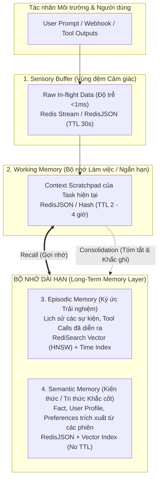
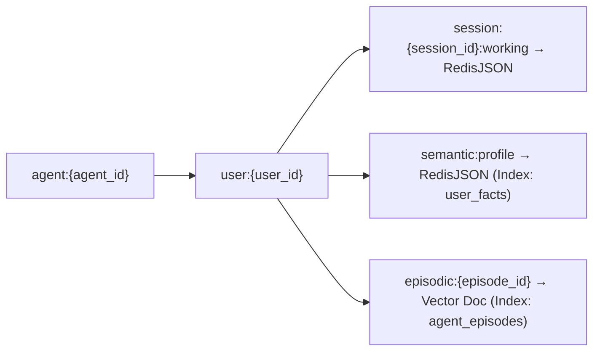
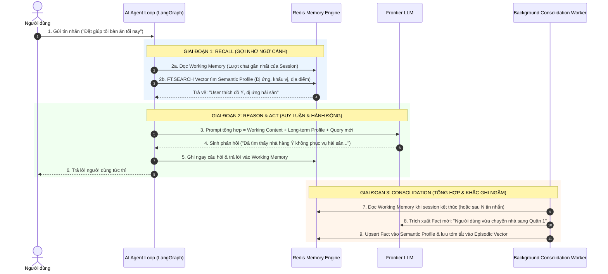
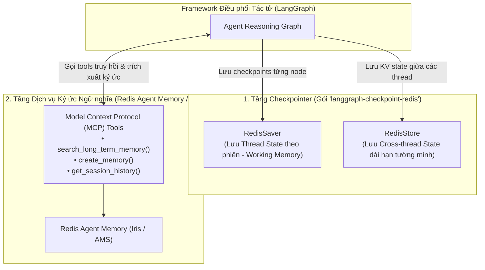
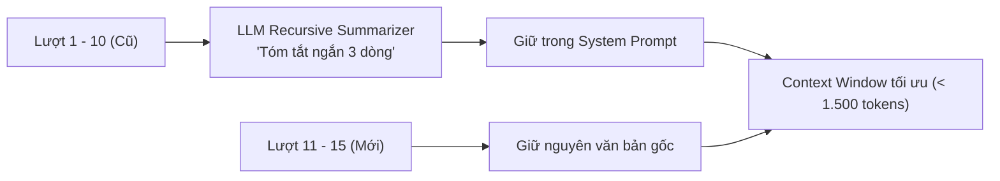

<!--
name: 2-agent-memory-architecture.md
description: Comprehensive architectural guide and hands-on implementation of Agent Memory in Redis Iris, covering human-like cognitive memory tiers (Sensory, Working, Episodic, Semantic), Redis data structures mapping, automated consolidation pipelines, and redis/agent-memory-server integration.
-->

# 3.2 — Agent Memory Architecture — Phân tầng Bộ nhớ cho AI Agent

Trong kỷ nguyên của các mô hình ngôn ngữ lớn (LLM), dù các mô hình thế hệ mới đã mở rộng cửa sổ ngữ cảnh (Context Window) lên tới 128K thậm chí 1M tokens, các kỹ sư AI thực chiến đều nhanh chóng nhận ra một sự thật:
> *"Cửa sổ ngữ cảnh lớn hơn không đồng nghĩa với bộ nhớ thông minh hơn."*

Việc nhồi nhét toàn bộ lịch sử trò chuyện hàng tuần vào một prompt duy nhất dẫn đến 3 "thảm họa" kiến trúc:
1. **Chi phí bùng nổ (Token Cost Explosion)**: Chi phí tỷ lệ thuận với số token gửi đi trong mỗi vòng lặp agent (Reasoning Loop).
2. **Hiện tượng "Lạc trôi ở giữa" (Lost-in-the-Middle Problem)**: Khi prompt quá dài, LLM giảm đáng kể khả năng chú ý tới các chi tiết quan trọng nằm ở giữa ngữ cảnh.
3. **Mất trí nhớ đa phiên (Cross-session Amnesia)**: Khi người dùng bắt đầu một phiên làm việc mới (Session mới), Agent hoàn toàn quên sạch sở thích, thói quen và các quyết định trước đó của người dùng.

Để giải quyết bài toán này, **Redis Iris** và dự án mã nguồn mở chính thức **[`redis/agent-memory-server`](https://github.com/redis/agent-memory-server)** đã hiện thực hóa mô hình **Bộ nhớ Nhận thức Đa tầng (Cognitive Multi-Tier Memory)** lấy cảm hứng từ cấu trúc não bộ con người.

---

## 1. Mô hình Nhận thức: 4 Tầng Bộ nhớ của AI Agent

Não bộ con người không lưu giữ mọi thông tin ở cùng một cấp độ. Chúng ta tiếp nhận âm thanh/hình ảnh tức thời, xử lý thông tin trong lúc làm việc, và chỉ khắc ghi những ký ức quan trọng vào trí nhớ dài hạn.

AI Agent cũng cần đúng 4 tầng bộ nhớ như vậy:



### So sánh Bản chất 4 Tầng Bộ nhớ:

| Tầng Bộ nhớ | Ý nghĩa Nhận thức | Cấu trúc Redis tương ứng | Vòng đời (TTL) | Trường hợp sử dụng điển hình |
| :--- | :--- | :--- | :--- | :--- |
| **1. Sensory Buffer** | Lưu trữ tạm thời luồng dữ liệu input thô đang bay (in-flight). | `Redis Streams` hoặc `RedisJSON` | **$10 - 30$ giây** | Hàng đợi tin nhắn đang chờ gom cụm (debouncing), payload webhook thô từ bên thứ ba. |
| **2. Working Memory** | "Bàn làm việc" của Agent cho phiên trò chuyện / tác vụ hiện hành. | `RedisJSON` hoặc `Redis Hash` | **$2 - 4$ giờ** | Lịch sử 5–10 lượt chat gần nhất, trạng thái biến trung gian của LangGraph state. |
| **3. Episodic Memory** | Nhật ký lưu lại các sự kiện, hành động và kết quả đã diễn ra trong quá khứ. | `RediSearch Vector` (HNSW) + `TAG` filter | **Vĩnh viễn (No TTL)** | *"Hôm qua tôi và bạn đã thống nhất cấu hình port database là bao nhiêu?"* |
| **4. Semantic Memory** | Các sự thật khách quan, sở thích, thông tin hồ sơ được chắt lọc qua thời gian. | `RedisJSON` + `RediSearch` | **Vĩnh viễn (No TTL)** | *"Người dùng HieuTran dị ứng với tôm, thích lập trình bằng Python, ngân sách < 1000$."* |

---

## 2. Thiết kế Key Schema Chuẩn Production trên Redis

Để phục vụ môi trường **Multi-Tenant (Đa khách hàng)** và **Multi-Agent Fleet (Hàng chục agent phối hợp)**, hệ thống khóa Redis phải được quy ước phân tầng rõ ràng:

```text
agent:{agent_id}:user:{user_id}:session:{session_id}:{memory_tier}
```



### Ví dụ quy ước Key cụ thể:
1. **Working Memory**:
   `agent:support_bot:user:usr_99:session:sess_1024:working`
   * Kiểu dữ liệu: `JSON`
   * TTL: `7200` (2 giờ kể từ lượt tương tác cuối cùng).
2. **Semantic Profile (Hồ sơ người dùng)**:
   `agent:support_bot:user:usr_99:semantic:facts`
   * Kiểu dữ liệu: `JSON`
   * Không có TTL.
3. **Episodic Event**:
   `agent:support_bot:user:usr_99:episode:ep_20260911_01`
   * Kiểu dữ liệu: `JSON` chứa embedding vector của đoạn tóm tắt sự kiện.

---

## 3. Kiến trúc Đọc / Ghi Nhận thức: "Recall-Act-Consolidate"

Một Agent thông minh không chỉ ghi nhớ thụ động mà liên tục vận hành theo chu trình nhận thức:



---

## 4. Hiện thực Mã nguồn: Xây dựng Hệ thống Bộ nhớ Đa tầng

Dưới đây là mã nguồn Python hoàn chỉnh, sử dụng `redis-py` và `redisvl`, thể hiện rõ cách thức quản lý **Working Memory** và **Long-term Semantic Memory**:

### 4.1. Cài đặt các thư viện cần thiết
```bash
pip install redis redisvl openai pydantic
```

### 4.2. Mã nguồn triển khai `AgentMemoryManager`

```python
"""
name: agent_memory_manager.py
description: Multi-tier cognitive memory architecture for AI agents using RedisJSON and RedisVL vector search.
"""

import json
import os
import time
from typing import Any, Dict, List, Optional
import redis
from redisvl.index import SearchIndex
from redisvl.schema import IndexSchema
from redisvl.query import VectorQuery
from openai import OpenAI

# Configuration
REDIS_URL = os.getenv("REDIS_URL", "redis://localhost:6379")
OPENAI_API_KEY = os.getenv("OPENAI_API_KEY", "sk-mock-key-for-local-demo")

class AgentMemoryManager:
    """
    Manages multi-tiered cognitive memory (Working, Episodic, Semantic) for AI Agents.
    """

    def __init__(self, agent_id: str, redis_url: str = REDIS_URL):
        self.agent_id = agent_id
        self.r = redis.from_url(redis_url, decode_responses=True)
        self.openai = OpenAI(api_key=OPENAI_API_KEY)
        self._init_vector_indices()

    def _init_vector_indices(self):
        """
        Initialize RediSearch index for Episodic and Semantic Long-Term Memories.
        """
        schema_dict = {
            "index": {
                "name": f"idx:memory:{self.agent_id}",
                "prefix": f"agent:{self.agent_id}:longterm:",
                "storage_type": "json"
            },
            "fields": [
                {"name": "user_id", "type": "tag"},
                {"name": "memory_type", "type": "tag"},  # 'episodic' or 'semantic'
                {"name": "timestamp", "type": "numeric"},
                {"name": "content", "type": "text"},
                {
                    "name": "embedding",
                    "type": "vector",
                    "attrs": {
                        "dims": 1536,
                        "distance_metric": "cosine",
                        "algorithm": "hnsw"
                    }
                }
            ]
        }
        self.index = SearchIndex(IndexSchema.from_dict(schema_dict), redis_client=self.r)
        self.index.create(overwrite=False)

    # -------------------------------------------------------------------------
    # 1. WORKING MEMORY (SHORT-TERM)
    # -------------------------------------------------------------------------
    def append_working_memory(self, user_id: str, session_id: str, role: str, content: str, ttl_seconds: int = 7200):
        """
        Append a conversation turn to the short-term working memory scratchpad.
        
        Parameters:
            user_id: Unique user identifier.
            session_id: Current chat session identifier.
            role: 'user' or 'assistant'.
            content: Message content.
            ttl_seconds: Auto-expiry window (default 2 hours).
        """
        key = f"agent:{self.agent_id}:user:{user_id}:session:{session_id}:working"
        turn = {
            "role": role,
            "content": content,
            "timestamp": time.time()
        }

        # Use RedisJSON to maintain a rolling array of conversation turns
        if not self.r.exists(key):
            self.r.json().set(key, "$", {"turns": [turn], "session_id": session_id, "user_id": user_id})
        else:
            self.r.json().arrappend(key, "$.turns", turn)

        # Refresh TTL on every user interaction
        self.r.expire(key, ttl_seconds)

    def get_working_memory(self, user_id: str, session_id: str, last_n: int = 6) -> List[Dict[str, Any]]:
        """
        Retrieve the most recent N turns from the current working memory session.
        """
        key = f"agent:{self.agent_id}:user:{user_id}:session:{session_id}:working"
        data = self.r.json().get(key, "$.turns")
        if not data or not data[0]:
            return []
        turns = data[0]
        return turns[-last_n:]

    # -------------------------------------------------------------------------
    # 2. LONG-TERM MEMORY (RECALL & SEARCH)
    # -------------------------------------------------------------------------
    def recall_long_term_memory(self, user_id: str, query: str, top_k: int = 3) -> List[str]:
        """
        Recall semantically relevant facts and past experiences from long-term memory.
        
        Parameters:
            user_id: The target user to filter memories for.
            query: The current topic/query to match against.
            top_k: Number of most relevant memory pieces to retrieve.
        """
        # 1. Generate embedding for query
        emb_res = self.openai.embeddings.create(
            model="text-embedding-3-small",
            input=query
        )
        query_vector = emb_res.data[0].embedding

        # 2. Build filtered vector query (Restricted to this specific user)
        v_query = VectorQuery(
            vector=query_vector,
            vector_field_name="embedding",
            return_fields=["content", "memory_type", "timestamp"],
            num_results=top_k,
            filter_expression=f"@user_id:{{{user_id}}}"
        )

        results = self.index.query(v_query)
        return [doc["content"] for doc in results]

    # -------------------------------------------------------------------------
    # 3. CONSOLIDATION (PROMOTE SHORT-TERM TO LONG-TERM)
    # -------------------------------------------------------------------------
    def consolidate_session_to_long_term(self, user_id: str, session_id: str):
        """
        Extract timeless facts and summarize experiences from working memory into long-term storage.
        This simulates the human 'sleep/consolidation' memory phase.
        """
        turns = self.get_working_memory(user_id, session_id, last_n=20)
        if not turns:
            return

        chat_history = "\n".join([f"{t['role']}: {t['content']}" for t in turns])

        # Call LLM to extract durable user facts and episodic summary
        system_prompt = (
            "You are an AI memory consolidation engine. Extract 1-3 core, timeless facts "
            "about the user (preferences, personal info, habits) in bullet points. "
            "If no durable facts are mentioned, return 'NONE'."
        )
        completion = self.openai.chat.completions.create(
            model="gpt-4o-mini",
            messages=[
                {"role": "system", "content": system_prompt},
                {"role": "user", "content": chat_history}
            ]
        )
        extracted_facts = completion.choices[0].message.content.strip()

        if extracted_facts and extracted_facts != "NONE":
            # Save extracted facts to Long-Term Vector Memory
            emb_res = self.openai.embeddings.create(
                model="text-embedding-3-small",
                input=extracted_facts
            )
            vector = emb_res.data[0].embedding

            doc_id = f"agent:{self.agent_id}:longterm:{user_id}:fact_{int(time.time())}"
            memory_doc = {
                "user_id": user_id,
                "memory_type": "semantic",
                "timestamp": time.time(),
                "content": extracted_facts,
                "embedding": vector
            }
            self.r.json().set(doc_id, "$", memory_doc)
            print(f"[Consolidation Engine] Successfully stored durable facts into Long-Term Memory: {doc_id}")
```

## 5. Hệ sinh thái Bộ nhớ Agent: Redis Agent Memory (Iris) & LangGraph Persistence

Khi đưa vào môi trường doanh nghiệp, việc xây dựng và quản trị bộ nhớ cho hàng chục Agent đòi hỏi sự phân định rõ ràng giữa **State Persistence (Lưu trạng thái đồ thị tác tử)** và **Cognitive Memory Service (Dịch vụ bộ nhớ nhận thức dài hạn)**.

### 5.1. Cấu trúc Hiện tại của Repo `redis/agent-memory-server`
Nếu truy cập repo GitHub [`redis/agent-memory-server`](https://github.com/redis/agent-memory-server), bạn sẽ thấy repo vừa được tái cấu trúc gần đây thành 2 phần riêng biệt:
1. **Thư mục `V0/` (Open-Source Reference)**: Lưu giữ phiên bản mã nguồn mở nguyên bản ban đầu của Agent Memory Server. Đây là mã nguồn tham khảo quý giá cho các kỹ sư muốn tự dựng (self-host) một microservice quản lý bộ nhớ cục bộ.
2. **Nhánh chính — Redis Agent Memory trong Nền tảng Iris (Managed Experience)**: Đây là sản phẩm thương mại được quản lý toàn diện (Fully-Managed) thuộc hệ sinh thái Redis Iris trên Redis Cloud. Nó cung cấp REST API sản xuất, quản lý xác thực bằng API key, tự động điều phối vòng đời TTL, và bảng điều khiển giám sát trực quan.

### 5.2. Phân định Vai trò: Checkpointer vs Semantic Memory trong LangGraph
Một hiểu lầm rất phổ biến là đánh đồng dịch vụ bộ nhớ `agent-memory-server` với Checkpointer của LangGraph. Thực tế, Redis chia tách hai vai trò này rất mạch lạc:



| Thành phần | Package / Thư viện | Vai trò Kỹ thuật cụ thể |
| :--- | :--- | :--- |
| **Graph Checkpointer** | `langgraph-checkpoint-redis` (`RedisSaver`) | **Quản lý trạng thái luồng thực thi (Execution State)**: Lưu checkpoint của từng bước rẽ nhánh trong LangGraph, cho phép Agent dừng lại (human-in-the-loop) và tiếp tục thực thi mà không mất state. |
| **Cross-thread Store** | `langgraph-checkpoint-redis` (`RedisStore`) | **Lưu trữ dữ liệu dạng Key-Value giữa các thread**: Dùng cho bộ nhớ tường minh (Explicit memory) của người dùng qua các session. |
| **Cognitive Memory Service** | `redis/agent-memory-server` hoặc **Iris Agent Memory** | **Dịch vụ Ký ức Ngữ nghĩa & Nhận thức (Cognitive & Semantic Memory)**: Đóng vai trò là một dịch vụ độc lập cung cấp các Tool chuẩn **Model Context Protocol (MCP)** để Agent tự chủ động tìm kiếm ký ức kinh nghiệm (`search_long_term_memory`) hoặc lưu sự kiện mới. |

---

## 6. Chiến lược Tóm tắt & Nén Ngữ cảnh (Context Compaction)

Khi phiên hội thoại kéo dài vượt quá ngưỡng an toàn của Working Memory (ví dụ quá 15 lượt trao đổi), ta áp dụng kỹ thuật **Sliding Window với Recursive Summarization**:



1. **Keep Raw for Recent**: 5 lượt gần nhất luôn được giữ nguyên văn bản thô để Agent nắm trọn ngữ điệu và sắc thái tức thời.
2. **Summarize the Tail**: Các lượt cũ hơn được nén thành một đoạn văn súc tích (Paragraph Summary) lưu đè vào trường `summary` trong RedisJSON.
3. **Zero Context Bloat**: Bằng cách này, kích thước prompt gửi tới LLM luôn được giữ ở mức cố định lý tưởng, bất kể cuộc trò chuyện kéo dài 10 phút hay 3 ngày liên tục!

---

## 7. Tổng kết & Lộ trình Bài học

### Ghi nhớ cốt lõi:
* Không bao giờ nhét toàn bộ lịch sử thô vào Context Window của Agent.
* Phân tầng bộ nhớ rõ ràng: **Sensory (Giây)** $\to$ **Working (Giờ)** $\to$ **Episodic & Semantic (Vĩnh viễn)**.
* Thiết kế Key có tiền tố `agent:{id}:user:{id}:session:{id}` để hỗ trợ multi-tenant.
* Sử dụng quy trình **Recall $\to$ Act $\to$ Consolidate** để biến Agent từ một thực thể vô tri sau mỗi phiên thành một trợ lý ngày càng thấu hiểu người dùng.

---

*← Quay lại: [3.1 — Redis LangCache](./1-redis-langcache-semantic-cache.md) | Tiếp theo: [3.3 — Context Retriever & MCP](./3-context-retriever.md) →*
