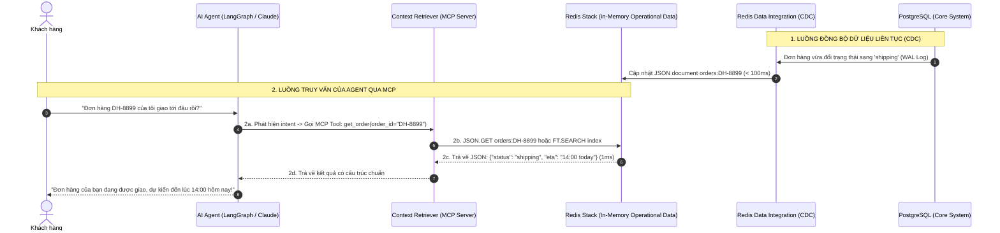

<!--
name: 3-context-retriever.md
description: In-depth masterclass on Redis Context Retriever in Redis Iris, schema-first semantic modeling, auto-generating Model Context Protocol (MCP) tools, replacing error-prone Text-to-SQL, and streaming real-time operational context to AI agents.
-->

# 3.3 — Redis Context Retriever & MCP — Kết nối Dữ liệu Nghiệp vụ Thời gian thực vào AI Agent

Khi một AI Agent nhận được câu hỏi từ người dùng:
> *"Đơn hàng #DH-8899 của tôi đang ở đâu, và trong kho còn mẫu áo size L để đổi không?"*

Agent không thể chỉ dựa vào kiến thức có sẵn trong LLM hay các tài liệu PDF tĩnh của RAG truyền thống. Dữ liệu trạng thái đơn hàng và tồn kho nằm trong cơ sở dữ liệu vận hành (PostgreSQL / MySQL) và **liên tục thay đổi từng giây**.

Làm thế nào để trao cho AI Agent khả năng đọc dữ liệu nghiệp vụ thời gian thực một cách **an toàn, tốc độ cao (< 5ms)** mà không làm vỡ kiến trúc hệ thống?

> **Redis Context Retriever** — trụ cột then chốt của nền tảng **Redis Iris** — cung cấp một **Tầng Ngữ nghĩa Hướng Schema (Schema-First Semantic Layer)**. Nó tự động tạo ra các công cụ chuẩn **Model Context Protocol (MCP)**, cho phép AI Agent truy vấn dữ liệu vận hành từ Redis một cách có kiểm soát (Governed Access), xóa bỏ hoàn toàn sự nguy hiểm của phương pháp **Text-to-SQL**.

---

## 1. Vấn đề Cốt lõi: Vì sao Text-to-SQL và Tool Thủ công Thất bại?

Trong nỗ lực kết nối AI Agent với cơ sở dữ liệu quan hệ, các kỹ sư thường thử 2 con đường:

```mermaid
graph TD
    subgraph Approach1["❌ Cách 1: Text-to-SQL (Cực kỳ Rủi ro)"]
        Agent1["AI Agent"] -->|"Sinh câu lệnh SQL thô"| SQL["SELECT * FROM orders WHERE ..."]
        SQL --> DB1[("PostgreSQL Production")]
        DB1 --> Risk1["• Nguy cơ SQL Injection & Rò rỉ dữ liệu<br/>• LLM bịa tên cột (Hallucination) dẫn tới crash<br/>• Câu JOIN nặng làm tê liệt Database nghiệp vụ"]
    end

    subgraph Approach2["⚠️ Cách 2: Tự code Function Calling thủ công (Bảo trì cực nhọc)"]
        Agent2["AI Agent"] --> Tool["Custom Python @tool"]
        Tool --> API["REST API Endpoint"]
        API --> DB2[("Database")]
        DB2 --> Risk2["• Phải tự viết hàng chục API cho từng bảng<br/>• Mỗi lần đổi schema DB là code tool bị gãy<br/>• Tốn 2-3 tháng phát triển hạ tầng"]
    end

    subgraph Approach3["✅ Cách 3: Redis Context Retriever (Chuẩn hóa & An toàn)"]
        Agent3["AI Agent"] -->|Chuẩn MCP| CR["Redis Context Retriever (Iris)"]
        CR -->|Sub-millisecond| Redis[("Redis Operational Cache (CDC sync qua RDI)")]
        Redis --> Safe["• Governed Access: Chỉ gọi các query được kiểm soát<br/>• Schema-first: Định nghĩa một lần, tự sinh MCP tool<br/>• Độ trễ < 5ms, Zero-impact tới Database chính"]
    end
```



### So sánh 3 Phương pháp Kết nối Dữ liệu:

| Tiêu chí | Text-to-SQL | Tự Code Tool Thủ công | Redis Context Retriever (Iris) |
| :--- | :--- | :--- | :--- |
| **Mức độ An toàn (Security)** | **Cực kỳ nguy hiểm** (Nguy cơ SQL Injection, bypass quyền). | An toàn (do code cố định tham số). | **Tuyệt đối an toàn (Governed Tools qua MCP)**. |
| **Độ chính xác (Reliability)** | Thấp (LLM thường xuyên ảo giác tên bảng/cột). | Cao (Hard-coded logic). | **Rất cao (Schema-driven validation)**. |
| **Độ trễ truy vấn (Latency)** | Chậm ($500\text{ms} - 3.000\text{ms}$ tùy độ phức tạp query). | Trung bình ($100\text{ms} - 500\text{ms}$). | **Siêu tốc ($1\text{ms} - 5\text{ms}$ nhờ in-memory Redis)**. |
| **Ảnh hưởng DB chính** | Nguy cơ làm treo DB chính do query quét toàn bảng. | Tải trực tiếp vào DB chính. | **Zero-impact** (Đọc từ Redis được sync qua CDC). |
| **Chi phí bảo trì** | Rất cao khi cấu trúc bảng thay đổi. | Tốn nhiều tuần công viết và sửa API. | **Tối thiểu** (Định nghĩa Declarative Schema 1 lần). |

---

## 2. Bản chất Kỹ thuật của Redis Context Retriever

### 2.1. Triết lý "Schema-First Semantic Layer"
Thay vì bắt lập trình viên phải viết code imperative (viết từng endpoint, từng router, từng schema JSON), Context Retriever sử dụng phương pháp **Khai báo Hướng Schema (Declarative Schema-First)**:

1. **Entities (Thực thể)**: Định nghĩa các thực thể nghiệp vụ cốt lõi (Khách hàng, Đơn hàng, Sản phẩm, Hóa đơn).
2. **Fields & Data Types**: Khai báo các trường dữ liệu (`TAG`, `TEXT`, `NUMERIC`, `VECTOR`).
3. **Relationships (Mối quan hệ)**: Khai báo cách các thực thể liên kết với nhau (ví dụ: `Customer` *has_many* `Orders`, `Order` *contains* `LineItems`).

Từ bản đặc tả schema duy nhất này, Context Retriever tự động:
* Khởi tạo **RediSearch Index** tối ưu trên cụm Redis.
* Dựng **Model Context Protocol (MCP) Server** cung cấp các Tools chuẩn hóa cho Agent.

---

### 2.2. Giao thức Model Context Protocol (MCP) là gì?
**Model Context Protocol (MCP)** là một chuẩn giao tiếp mở do Anthropic khởi xướng (và được Redis cùng toàn ngành AI công nhận làm chuẩn chung). Nó đóng vai trò như cổng **"USB-C cho AI"**:

```mermaid
graph LR
    subgraph Clients["Tác tử AI & Môi trường Phát triển (MCP Clients)"]
        C1["Claude Desktop"]
        C2["Cursor / Windsurf"]
        C3["LangGraph Agent"]
        C4["CrewAI Fleet"]
    end

    subgraph Protocol["Chuẩn giao tiếp Model Context Protocol (JSON-RPC)"]
        MCP["MCP Standard Protocol<br/>(Tools, Resources, Prompts)"]
    end

    subgraph Server["Redis Context Retriever (MCP Server)"]
        CR["Context Retriever Engine"]
        T1["tool: get_order_by_id(order_id)"]
        T2["tool: query_inventory(product_sku)"]
        T3["tool: search_customer_orders(user_id, status)"]
    end

    Clients <== "Kết nối cắm-là-chạy (Zero Custom Code)" ==> Protocol
    Protocol <==> Server
```



Nhờ chuẩn MCP, một Tool sinh ra từ Context Retriever có thể cắm trực tiếp vào **Claude Desktop, Cursor, LangGraph hoặc CrewAI** mà không cần viết lại mã tích hợp cho từng framework!

---

## 3. Kiến trúc Toàn diện: RDI + Redis + Context Retriever + Agent

Sự kết hợp giữa **Redis Data Integration (RDI)** và **Redis Context Retriever** tạo nên một cỗ máy ngữ cảnh hoàn chỉnh:



---

## 4. Hiện thực Mã nguồn: Xây dựng Hệ thống Context Retriever với Python & MCP

Dưới đây là mã nguồn hoàn chỉnh giúp bạn tự xây dựng một **Tầng Ngữ nghĩa Context Retriever** chuẩn MCP kết nối trực tiếp với Redis.

### 4.1. Cài đặt các thư viện cần thiết
```bash
pip install redis fastmcp pydantic langchain-openai langgraph
```

---

### 4.2. Khởi tạo Dữ liệu Nghiệp vụ & RediSearch Index trên Redis

```python
"""
name: setup_business_context.py
description: Setup operational business data and RediSearch index for Context Retriever.
"""

import redis
from redis.commands.search.field import TagField, TextField, NumericField
from redis.commands.search.index_definition import IndexDefinition, IndexType

# Connect to Redis Stack
r = redis.Redis(host="localhost", port=6379, decode_responses=True)

def initialize_business_indices():
    """
    Create indices for Customers, Orders, and Inventory.
    """
    # 1. Index for Orders
    try:
        r.ft("idx:orders").info()
        print("Index idx:orders already exists.")
    except Exception:
        schema = (
            TagField("$.order_id", as_name="order_id"),
            TagField("$.customer_id", as_name="customer_id"),
            TagField("$.status", as_name="status"),
            NumericField("$.total_amount", as_name="total_amount"),
            TextField("$.shipping_address", as_name="shipping_address"),
            TextField("$.current_location", as_name="current_location")
        )
        r.ft("idx:orders").create_index(
            schema,
            definition=IndexDefinition(prefix=["order:"], index_type=IndexType.JSON)
        )
        print("Created index idx:orders successfully.")

    # 2. Seed Mock Operational Data
    orders_data = [
        {
            "order_id": "DH-8899",
            "customer_id": "CUST-001",
            "status": "shipping",
            "total_amount": 150.0,
            "shipping_address": "123 Le Loi, District 1, HCMC",
            "current_location": "Hub Da Nang - Dang van chuyen den HCMC",
            "estimated_delivery": "2026-09-12 14:00"
        },
        {
            "order_id": "DH-7711",
            "customer_id": "CUST-001",
            "status": "delivered",
            "total_amount": 89.0,
            "shipping_address": "123 Le Loi, District 1, HCMC",
            "current_location": "Giao thanh cong",
            "estimated_delivery": "2026-09-08 10:00"
        }
    ]

    for order in orders_data:
        r.json().set(f"order:{order['order_id']}", "$", order)
    print("Seeded operational business data into Redis.")

if __name__ == "__main__":
    initialize_business_indices()
```

---

### 4.3. Xây dựng MCP Server cho Context Retriever

Đoạn code dưới đây sử dụng thư viện **`fastmcp`** (framework độc lập chuẩn thực tế của cộng đồng MCP, tương thích bền vững với cả MCP spec v1 lẫn v2) để xuất bản các Governed Tools từ Redis:

```python
"""
name: context_retriever_mcp_server.py
description: Model Context Protocol (MCP) Server exposing governed Redis query tools to AI agents using FastMCP.
"""

from fastmcp import FastMCP
import redis
import json

# Initialize FastMCP Server
mcp = FastMCP("Redis-Context-Retriever")

# Connect to Redis
r = redis.Redis(host="localhost", port=6379, decode_responses=True)

@mcp.tool()
def get_order_details(order_id: str) -> str:
    """
    Retrieve live operational details for a specific order by its order ID.
    
    Parameters:
        order_id: The unique order code (e.g., 'DH-8899').
        
    Returns:
        JSON string containing the order status, current location, and estimated delivery.
    """
    key = f"order:{order_id.strip()}"
    data = r.json().get(key)
    if not data:
        return json.dumps({"error": f"Order {order_id} not found."})
    return json.dumps(data)

@mcp.tool()
def search_customer_orders(customer_id: str, status: str = None) -> str:
    """
    Search all orders belonging to a customer with optional status filtering.
    
    Parameters:
        customer_id: Unique customer ID (e.g., 'CUST-001').
        status: Optional filter like 'shipping', 'delivered', 'processing'.
        
    Returns:
        JSON list of matching orders.
    """
    query_str = f"@customer_id:{{{customer_id}}}"
    if status:
        query_str += f" @status:{{{status}}}"
        
    results = r.ft("idx:orders").search(query_str)
    orders = [json.loads(doc.json) for doc in results.docs]
    return json.dumps({"total": results.total, "orders": orders})

if __name__ == "__main__":
    print("Starting Redis Context Retriever MCP Server on stdio...")
    mcp.run()
```

---

### 4.4. Tích hợp vào AI Agent (LangGraph / LangChain)

Bây giờ, Agent chỉ cần được trang bị các tool chuẩn MCP sinh ra từ Context Retriever để suy luận chính xác:

```python
"""
name: ecommerce_support_agent.py
description: LangChain Agent equipped with Context Retriever tools to answer real-time business queries.
"""

import os
from langchain_openai import ChatOpenAI
from langchain.agents import create_openai_tools_agent, AgentExecutor
from langchain_core.prompts import ChatPromptTemplate, MessagesPlaceholder
from langchain_core.tools import tool
import redis
import json

r = redis.Redis(host="localhost", port=6379, decode_responses=True)

# Define Governed Tools mirroring the Context Retriever
@tool
def check_order_status(order_id: str) -> str:
    """Useful to check real-time order status, location, and delivery ETA from Redis."""
    data = r.json().get(f"order:{order_id}")
    if not data:
        return f"Order {order_id} not found."
    return json.dumps(data)

tools = [check_order_status]

# Setup LLM & Agent
llm = ChatOpenAI(model="gpt-4o-mini", temperature=0)
prompt = ChatPromptTemplate.from_messages([
    ("system", "You are a professional customer support agent. Use the provided tools to lookup live business data. Never hallucinate status."),
    ("user", "{input}"),
    MessagesPlaceholder(variable_name="agent_scratchpad"),
])

agent = create_openai_tools_agent(llm, tools, prompt)
agent_executor = AgentExecutor(agent=agent, tools=tools, verbose=True)

if __name__ == "__main__":
    query = "Kiểm tra giúp tôi đơn hàng DH-8899 hiện đang ở đâu và bao giờ giao?"
    response = agent_executor.invoke({"input": query})
    print("\n=== KẾT QUẢ PHẢN HỒI CỦA AGENT ===")
    print(response["output"])
```

#### Kết quả đầu ra từ Terminal:
```text
> Entering new AgentExecutor chain...

Invoking: `check_order_status` with `{'order_id': 'DH-8899'}`

{"order_id": "DH-8899", "customer_id": "CUST-001", "status": "shipping", "current_location": "Hub Da Nang - Dang van chuyen den HCMC", "estimated_delivery": "2026-09-12 14:00"}

Đơn hàng **DH-8899** của bạn hiện đang ở trạng thái **đang vận chuyển (shipping)**.
- **Vị trí hiện tại**: Hub Đà Nẵng (đang trung chuyển vào TP. Hồ Chí Minh).
- **Thời gian giao dự kiến**: 14:00 ngày 12/09/2026.
Nếu bạn cần hỗ trợ gì thêm, xin vui lòng cho tôi biết nhé!

> Finished chain.
```

---

## 5. Các Mẫu Thiết kế Nâng cao trong Context Retriever

### 5.1. Dynamic Entity Traversing (Duyệt Đồ thị Quan hệ)
Khi Agent cần trả lời các câu hỏi đa tầng phức tạp:
> *"Liệt kê tất cả sản phẩm trong các đơn hàng bị trễ giao của khách hàng VIP trong tuần này."*

Thay vì chạy câu lệnh `JOIN` phức tạp 4 bảng trên Postgres, Context Retriever mô hình hóa quan hệ qua các liên kết khóa trên Redis:
* `customer:VIP_01` $\to$ Set các `order_ids`.
* Với mỗi `order_id` có `status == 'delayed'` $\to$ lấy danh sách `product_ids`.
Độ trễ tổng thể thực thi qua Redis chỉ mất **vài mili-giây** nhờ cấu trúc in-memory!

### 5.2. Context Pruning & Attribute Masking (Bảo mật & Tối ưu Token)
Context Retriever không trả về bừa bãi toàn bộ dữ liệu của một bản ghi:
* **Attribute Masking**: Tự động ẩn các trường nhạy cảm (`password_hash`, `credit_card_last4`, `internal_margin`).
* **Context Pruning**: Chỉ trả về đúng các thuộc tính mà prompt của Agent đang yêu cầu, giúp tiết kiệm đáng kể chi phí token (ước tính từ 40% – 70% lượng token đầu vào tùy thuộc vào số lượng cột trong schema gốc).

---

## 6. Tổng kết & Lộ trình Bài học

### Điểm cốt lõi cần nhớ:
1. **Tuyệt đối tránh Text-to-SQL** trong hệ thống sản xuất vì nguy cơ bảo mật, ảo giác tên cột và gây nghẽn database chính.
2. **Redis Context Retriever** trong Redis Iris đóng vai trò là tầng ngữ nghĩa hướng schema (Schema-first), biến cấu trúc dữ liệu thành các Governed Tools an toàn.
3. Hỗ trợ chuẩn **Model Context Protocol (MCP)**, cắm trực tiếp vào mọi Agent runtime hiện đại (Claude Desktop, Cursor, LangGraph).
4. Kết hợp với **Redis Data Integration (RDI)** để dữ liệu trong Redis luôn được đồng bộ thời gian thực từ PostgreSQL/MySQL qua Change Data Capture (CDC).

---

*← Quay lại: [3.2 — Agent Memory Architecture](./2-agent-memory-architecture.md) | Tiếp theo: [3.4 — Redis Flex & Auto-Tiering](./4-redis-flex-tiering-ram-ssd.md) →*
