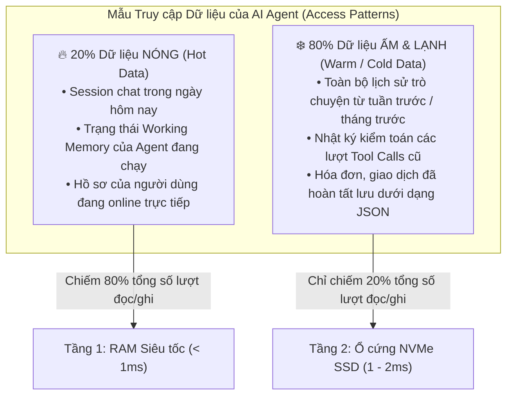
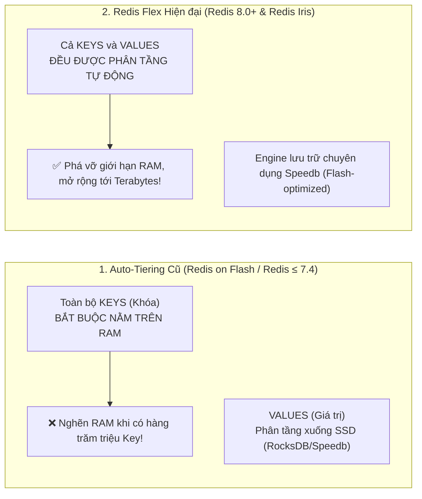
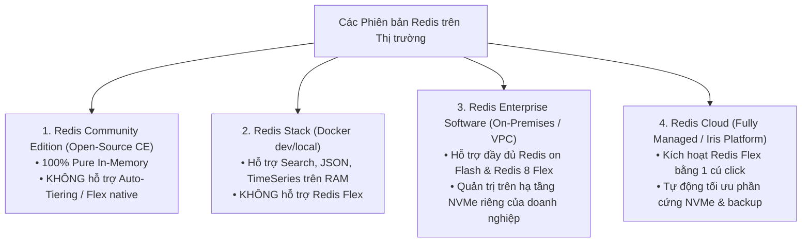
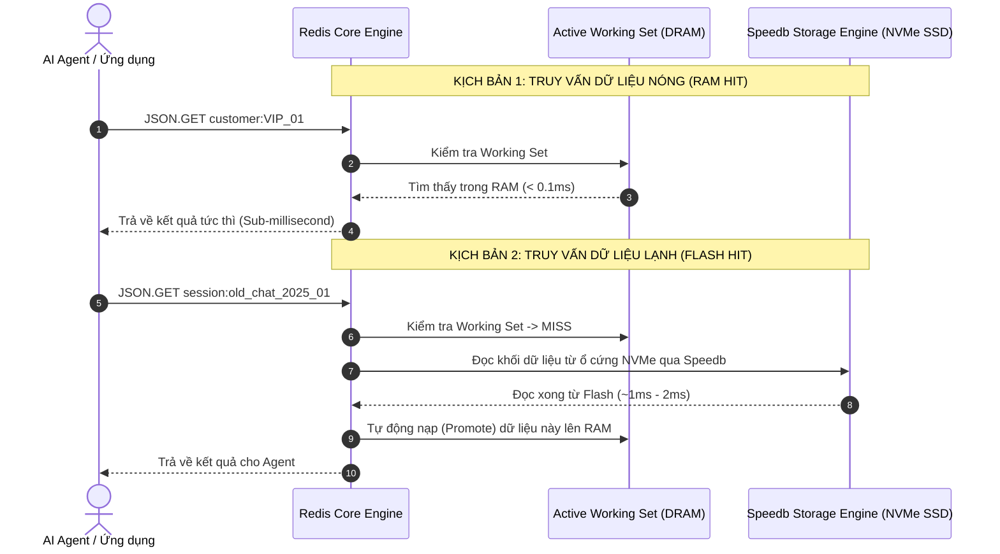
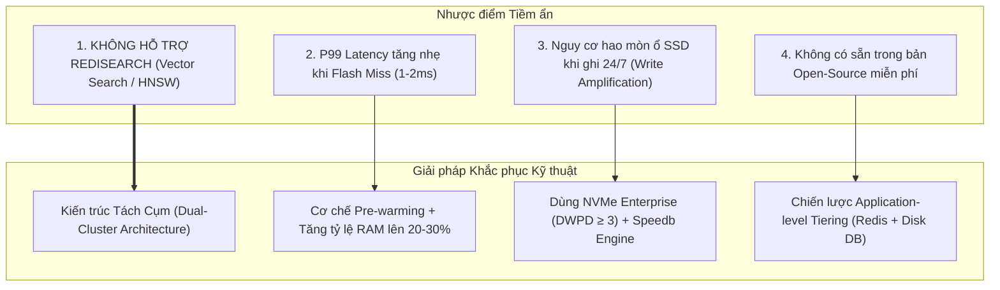
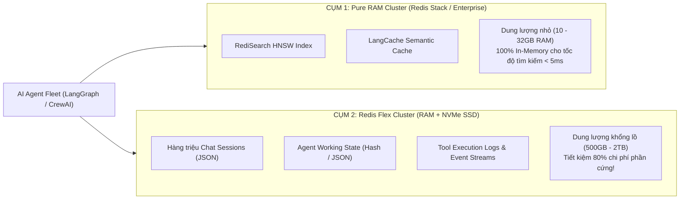
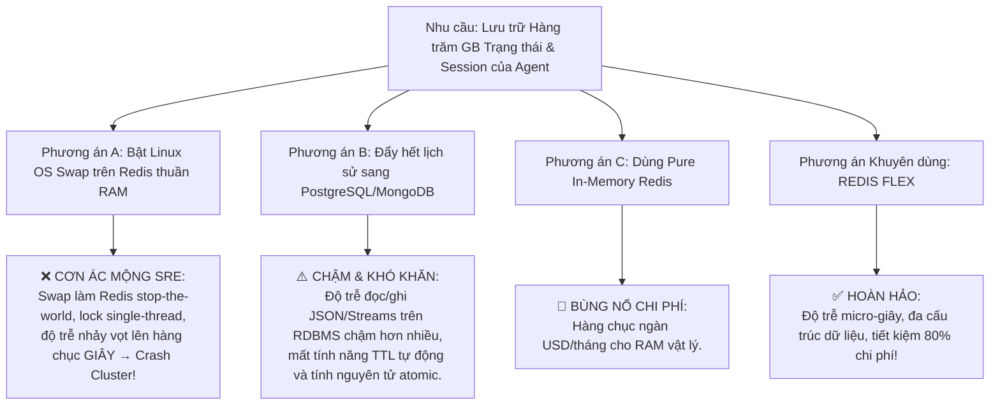
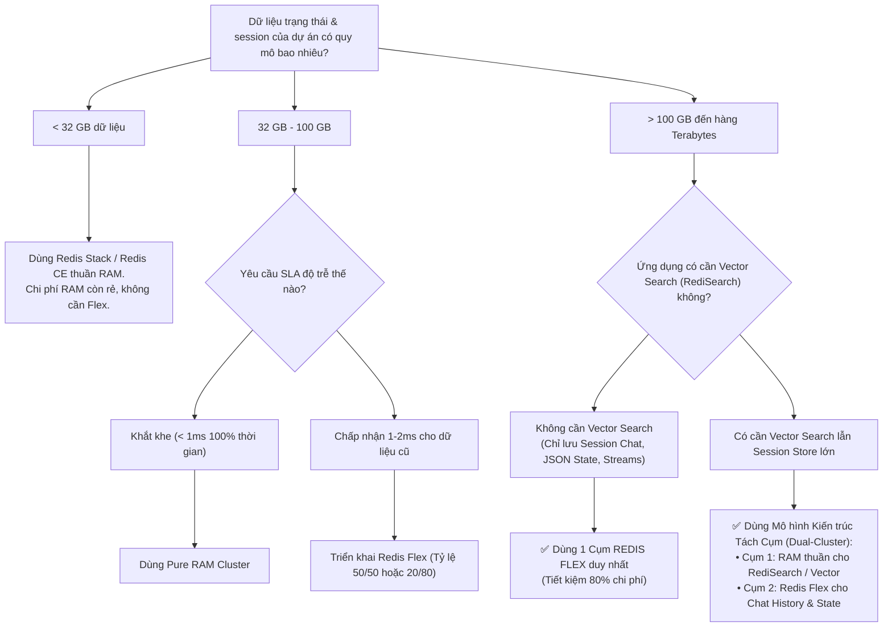

<!--
name: 4-redis-flex-tiering-ram-ssd.md
description: In-depth masterclass on Redis Flex and Auto-Tiering across RAM and NVMe SSD, analyzing the evolution from Redis on Flash to Redis 8 Flex, Speedb storage engine, 80/20 data access patterns, and reducing infrastructure costs by 75-80%.
-->

# 3.4 — Redis Flex — Auto-Tiering RAM & NVMe SSD cho Quy mô Lớn

Trong các hệ sinh thái AI Agent doanh nghiệp, dữ liệu vận hành không ngừng phình to theo cấp số nhân:
* Hàng triệu phiên hội thoại của khách hàng cần được lưu vết xuyên suốt nhiều tháng để phục vụ phân tích hành vi và kiểm toán.
* Hàng trăm Gigabytes trạng thái tác tử (Agent Working States), hồ sơ người dùng (User Profiles), và nhật ký chuỗi Tool Calls (Event Streams) liên tục tích lũy.
* Kích thước cơ sở dữ liệu nhanh chóng chạm mốc hàng trăm Gigabytes, thậm chí hàng Terabytes.

Nếu lưu trữ **100% dữ liệu vận hành trên RAM vật lý**:
* Chi phí hạ tầng điện toán đám mây (AWS EC2 memory-optimized như `r6i.32xlarge`, GCP `m2-ultramem`) sẽ tăng vọt lên hàng chục ngàn USD mỗi tháng.
* Doanh nghiệp vấp phải **"Bức tường Chi phí RAM" (RAM Cost Wall)**, buộc phải xóa bớt lịch sử chat của Agent hoặc giới hạn quy mô mở rộng.

> **Redis Flex** (ra mắt từ Redis 8.0 và là một trong 5 trụ cột của nền tảng **Redis Iris**) là giải pháp đột phá cho bài toán này. Bằng việc tự động phân tầng dữ liệu giữa **RAM siêu tốc** và **ổ cứng thể rắn NVMe SSD**, Redis Flex giúp **cắt giảm từ 75% đến 80% chi phí hạ tầng** mà vẫn duy trì độ trễ truy vấn ở mức micro-giây và không đòi hỏi bất kỳ thay đổi nào trong mã nguồn ứng dụng!

> [!WARNING]
> **LƯU Ý KIẾN TRÚC TỐI QUAN TRỌNG**:
> Theo tài liệu chính thức của Redis, **Redis Flex hiện tại KHÔNG hỗ trợ module RediSearch (Vector Search / HNSW Index), TimeSeries và Active-Active**. 
> Do đó, Redis Flex được thiết kế để giải quyết bài toán lưu trữ quy mô lớn cho **lịch sử hội thoại (Chat Sessions), trạng thái Agent (RedisJSON / Hash), và luồng sự kiện (Redis Streams)** — KHÔNG dùng để lưu trực tiếp Vector Search Index. Nếu dự án của bạn cần cả tìm kiếm vector lẫn tối ưu chi phí, hãy xem chi tiết **Mô hình Kiến trúc Tách Cụm (Dual-Cluster Pattern)** ở Mục 5 của bài này.

---

## 1. Bản chất Vấn đề: Quy luật 80/20 trong Lưu trữ Ngữ cảnh AI

Trong thực tế vận hành của AI Agent, không phải mọi mẩu dữ liệu đều được truy xuất với tần suất như nhau. Các hệ thống nhận thức luôn tuân theo **Quy luật Pareto (80/20)**:



* **20% Dữ liệu Nóng**: Tạo ra **80% lưu lượng truy cập (Traffic)**. Tầng dữ liệu này bắt buộc phải nằm trên RAM để đảm bảo Agent phản hồi tức thì dưới $1\text{ms}$.
* **80% Dữ liệu Lạnh**: Chỉ chiếm **20% lưu lượng truy cập**, thỉnh thoảng mới được đọc lại khi Agent cần tra cứu lịch sử cũ. Nếu bắt doanh nghiệp phải trả tiền RAM đắt đỏ cho 80% dữ liệu ngủ yên này thì đó là một sự lãng phí ngân sách khổng lồ!

---

## 2. Bước Tiến Tiến hóa: Từ Redis on Flash (RoF) đến Redis Flex

Để hiểu được bước nhảy vọt của Redis Flex, chúng ta cần nhìn lại lịch sử công nghệ phân tầng lưu trữ của Redis:



### So sánh Chi tiết:

| Tiêu chí | Auto-Tiering Cũ (Redis on Flash) | Redis Flex (Redis 8.0+ / Iris) |
| :--- | :--- | :--- |
| **Phiên bản hỗ trợ** | Redis 7.4 trở về trước | **Redis 8.0 trở lên & Redis Cloud** |
| **Vị trí lưu trữ Key** | **Bắt buộc 100% trên RAM**. | **Cả Key và Value đều có thể nằm trên SSD**. |
| **Giới hạn số lượng Key** | Bị giới hạn bởi dung lượng RAM vật lý cho Key dictionary. | **Không giới hạn**; mở rộng tới hàng tỷ keys. |
| **Storage Engine** | RocksDB hoặc Speedb đời đầu. | **Speedb thế hệ mới** (tối ưu hóa chuyên sâu cho kiến trúc NVMe). |
| **Mức độ tiết kiệm chi phí** | Giảm khoảng 50% – 60%. | **Giảm từ 75% đến 80% chi phí hạ tầng**. |
| **Hỗ trợ RediSearch** | Có (nhưng index bắt buộc nằm 100% trên RAM). | **Chưa hỗ trợ RediSearch / Vector Search**. |
| **Phù hợp nhất cho** | Bộ dữ liệu lớn nhưng số lượng key vừa phải. | **Lưu trữ Session Chat, JSON Document, Streams quy mô Terabytes**. |

---

## 3. Khả năng Hỗ trợ theo Từng Phiên bản Redis (Hệ sinh thái Redis)

Một câu hỏi cốt tử của các kỹ sư khi bắt tay vào thiết kế: *"Dự án của tôi đang dùng bản Redis nào và có dùng được Redis Flex không?"*



### Ma trận So sánh Tính năng Lưu trữ Phân tầng:

| Phiên bản Redis | Hỗ trợ Redis Flex? | Cách giải quyết khi dữ liệu vượt RAM | Khuyến nghị Môi trường |
| :--- | :---: | :--- | :--- |
| **Redis Community Edition (CE) / Valkey** | ❌ Không | Bị OOM (Out of Memory) hoặc phải bật Eviction Policy (`volatile-lru`, `allkeys-lru`) làm mất dữ liệu. | Môi trường học tập, cache tạm thời, dữ liệu nhỏ < 32GB. |
| **Redis Stack** | ❌ Không | Module Search/JSON chạy hoàn toàn trên RAM. | Môi trường Local Dev, PoC, kiểm thử tính năng RAG / LangCache. |
| **Redis Enterprise (On-Prem / Private Cloud)** | ✅ **Có** | Tự động phân tầng xuống cụm đĩa NVMe cục bộ cấu hình qua Cluster Manager. | Ngân hàng, Viễn thông, Doanh nghiệp lớn bắt buộc On-Premises. |
| **Redis Cloud (Iris Context Engine)** | ✅ **Có sẵn** | Chọn template **Redis Flex**, tùy chỉnh tỷ lệ RAM:SSD từ 10% đến 50%. | **Sản xuất (Production)**, SaaS, AI Startup mở rộng nhanh không cần quản trị Ops. |

---

## 4. Kiến trúc Kỹ thuật & Cơ chế Hoạt động của Redis Flex

Redis Flex được thiết kế với tiêu chí: **Trong suốt hoàn toàn với lập trình viên (Zero Code Changes)**. Ứng dụng client vẫn gọi các lệnh quen thuộc (`GET`, `SET`, `JSON.GET`, `JSON.SET`, `XADD`, `HGETALL`) mà không cần biết một bản ghi cụ thể đang nằm trên RAM hay NVMe SSD.



### Cơ chế Quản lý Bộ nhớ Đệm:
1. **Eviction (Đẩy xuống Flash)**: Khi dung lượng RAM chạm ngưỡng giới hạn cấu hình (ví dụ 20% dung lượng phân bổ), Redis Flex tự động chuyển các bản ghi ít được truy cập nhất (theo thuật toán LFU/LRU) xuống ổ đĩa NVMe SSD.
2. **Promotion (Nạp lại lên RAM)**: Khi một bản ghi lạnh dưới SSD được truy vấn lại, nó lập tức được đưa trở lại RAM để sẵn sàng phục vụ các truy vấn kế tiếp với độ trễ cực thấp.
3. **Speedb Engine**: Khác với các hệ thống cơ sở dữ liệu đĩa truyền thống, Speedb giảm thiểu hiện tượng ghi khuếch đại (Write Amplification) và tận dụng tối đa băng thông I/O song song của ổ đĩa NVMe hiện đại.

---

## 5. Phân tích Chuyên sâu: Ưu điểm, Nhược điểm & Giải pháp Khắc phục

Mọi lựa chọn kiến trúc đều có sự đánh đổi (Trade-off). Dưới đây là phân tích toàn diện giúp bạn đưa ra quyết định kỹ thuật chính xác:

### 5.1. Ưu điểm Vượt trội (Pros)
* **Tiết kiệm 75% – 80% Chi phí Phần cứng**: Giảm tới 4/5 hóa đơn RAM đắt đỏ trên Cloud.
* **Mở rộng Quy mô Vô hạn (Terabyte Scale)**: Vượt qua giới hạn vật lý của RAM máy chủ, lưu trữ hàng trăm triệu bản ghi session chat và state của Agent.
* **100% Tương thích Mã nguồn (Zero Code Changes)**: Toàn bộ code Python (`redis-py`), LangChain checkpointer chạy nguyên vẹn không cần sửa logic.
* **Hỗ trợ đầy đủ Cấu trúc Dữ liệu Cốt lõi**: `String`, `Hash`, `List`, `Set`, `Sorted Set`, `RedisJSON`, và `Redis Streams` hoạt động hoàn hảo trên Flex.

---

### 5.2. Nhược điểm & Giải pháp Khắc phục Triệt để (Cons & Mitigations)



#### Nhược điểm 1 (NGHIÊM TRỌNG NHẤT): Redis Flex không hỗ trợ RediSearch / Vector Index
* **Bản chất**: RediSearch đòi hỏi toàn bộ cấu trúc đồ thị vector HNSW phải nằm liên tục trên RAM để thực hiện các phép duyệt đồ thị đa chiều với độ trễ micro-giây. Thuật toán phân tầng trang của Flex chưa tương thích với đồ thị vector phức tạp này.
* **Giải pháp Khắc phục — Kiến trúc Tách Cụm (Dual-Cluster Pattern)**:
  Đây là mô hình kiến trúc chuẩn được các công ty lớn áp dụng khi xây dựng hệ thống AI Agent:



* **Cụm 1 (Pure RAM)**: Chỉ lưu Vector Embeddings và Metadata để tìm kiếm `FT.SEARCH` và Semantic Caching. Vì chỉ chứa vector nên dung lượng chỉ tốn vài chục GB RAM.
* **Cụm 2 (Redis Flex)**: Đóng vai trò là kho lưu trữ dữ liệu thô khổng lồ (Heavy Storage), chứa nội dung chi tiết các đoạn chat, payload tài liệu, log thực thi. Khi Cụm 1 trả về danh sách IDs liên quan, Agent sẽ dùng `JSON.GET` sang Cụm 2 để lấy nội dung đầy đủ!

#### Nhược điểm 2: Độ trễ P99 tăng nhẹ khi truy vấn trúng dữ liệu lạnh (Flash Miss)
* **Bản chất**: Đọc từ NVMe SSD mất khoảng $1\text{ms} - 2\text{ms}$ (thay vì $0.1\text{ms}$ trên RAM).
* **Cách khắc phục**:
  1. **Tuning Tỷ lệ RAM**: Nâng tỷ lệ RAM từ 10% lên 20% hoặc 25% cho các ứng dụng có SLA khắt khe.
  2. **Cache Pre-warming (Làm ấm bộ nhớ)**: Khi người dùng đăng nhập hệ thống, worker ngầm chủ động gọi `JSON.GET` session gần nhất để kéo dữ liệu từ Flash lên RAM trước khi Agent bắt đầu trò chuyện.
  3. **Tuyệt đối tránh Full-Scan**: Không dùng lệnh `KEYS *` vì sẽ quét toàn bộ ổ đĩa NVMe gây bão I/O (I/O storm).

#### Nhược điểm 3: Nguy cơ hao mòn ổ đĩa thể rắn (SSD Wear-out) khi ghi liên tục
* **Bản chất**: Kiến trúc LSM-tree của các storage engine truyền thống ghi đè nhiều tầng gây hiện tượng Write Amplification.
* **Cách khắc phục**:
  1. **Speedb Engine**: Redis Flex tích hợp sẵn Speedb — engine tối ưu ghi flash giúp giảm 50% Write Amplification so với RocksDB.
  2. **Chọn ổ cứng chuẩn Enterprise**: Luôn chỉ định ổ đĩa NVMe Enterprise có chỉ số **DWPD (Drive Writes Per Day) $\ge 3$**.

#### Nhược điểm 4: Chi phí bản quyền / Không có trong bản Open-Source (CE)
* **Cách khắc phục cho dự án ngân sách hạn hẹp**: Áp dụng mô hình **Application-level Tiering** (xem Mục 7).

---

## 6. Vì sao dùng Redis Flex mà KHÔNG PHẢI các giải pháp khác?

Rất nhiều kỹ sư đặt câu hỏi: *"Tại sao tôi phải dùng Redis Flex mà không dùng Linux Swap hay Database quan hệ truyền thống?"*



### Bảng So sánh Kiến trúc Trực diện:

| Tiêu chí | Linux OS Swap + Redis | Lưu trữ trên RDBMS/MongoDB | Pure In-Memory Redis | **Redis Flex (Redis Iris)** |
| :--- | :--- | :--- | :--- | :--- |
| **Cơ chế Phân tầng** | OS Page Swapping (mù quáng, không hiểu cấu trúc dữ liệu). | Đọc/ghi bảng đĩa qua Buffer Pool. | Không có (100% RAM). | **Phân tầng cấp độ Ứng dụng (Application-aware Speedb)**. |
| **Độ trễ P99 khi đọc lạnh** | **Hàng chục giây (Thảm họa)** do Page Fault block event loop. | $20\text{ms} - 80\text{ms}$. | $< 1\text{ms}$. | **$1\text{ms} - 2\text{ms}$** (Đọc trực tiếp khối NVMe). |
| **Tính đa năng (Multi-model)** | Chỉ làm Key-Value đơn giản. | Cấu trúc bảng hoặc Document. | Toàn diện (Data structures, JSON, Streams). | **Toàn diện các cấu trúc Redis (JSON, Streams, Hash)**. |
| **Chi phí Vận hành (TCO)** | Thấp nhưng rủi ro sập hệ thống cực cao. | Trung bình. | **Cực kỳ đắt đỏ**. | **Tối ưu nhất (Rẻ hơn 75% - 80% so với RAM)**. |

---

## 7. Cây Quyết định: Khi nào nên Triển khai Redis Flex cho Dự án của bạn?

Dựa trên kinh nghiệm kiến trúc thực chiến, hãy sử dụng cây quyết định sau để chọn giải pháp phù hợp nhất cho dự án của bạn:



---

## 8. Hướng dẫn Vận hành & Benchmark Thực nghiệm

### 8.1. Giám sát Hiệu quả Phân tầng qua Redis CLI
Khi kết nối vào cụm hỗ trợ phân tầng (Redis Flex / Auto-Tiering), bạn có thể kiểm tra tỷ lệ phục vụ từ RAM bằng lệnh `INFO`:

```bash
redis-cli INFO memory
```

*(Đoạn trích dưới đây là **ví dụ minh họa** về các trường thông số phân tầng hiển thị trong cụm phân tầng Enterprise/Cloud)*:
```text
# Memory
used_memory:107374182400          # Dung lượng đang nằm trên RAM (ví dụ: 100 GB)
used_memory_human:100.00G
maxmemory:107374182400

# Flash / Flex Storage Metrics (Minh họa)
flash_used_memory:429496729600    # Dung lượng đang nằm an toàn trên NVMe SSD (ví dụ: 400 GB)
flash_used_memory_human:400.00G
flash_hit_rate:0.86               # 86% truy vấn được phục vụ thẳng từ RAM!
```

---

### 8.2. Script Python Đo đạc Độ trễ Phân tầng trong Dự án

Dưới đây là script Python đo lường thực nghiệm giúp bạn đánh giá độ trễ giữa dữ liệu nóng trên RAM và dữ liệu lạnh dưới SSD:

```python
"""
name: benchmark_redis_flex.py
description: Measure latency for hot (RAM) vs cold (NVMe Flash) memory retrievals in Redis Flex.
"""

import os
import time
import redis

# Connect to Redis Flex cluster
r = redis.Redis(
    host=os.getenv("REDIS_HOST", "localhost"),
    port=int(os.getenv("REDIS_PORT", 6379)),
    decode_responses=True
)

def benchmark_access_latency(key: str, label: str, iterations: int = 5):
    """
    Measure end-to-end access latency for a specific memory key.
    """
    latencies = []
    for _ in range(iterations):
        start = time.perf_counter()
        _ = r.json().get(key)
        elapsed_ms = (time.perf_counter() - start) * 1000
        latencies.append(elapsed_ms)
        
    avg_latency = sum(latencies) / len(latencies)
    min_latency = min(latencies)
    max_latency = max(latencies)
    print(f"[{label}] Key: {key}")
    print(f"  -> Avg: {avg_latency:.3f} ms | Min: {min_latency:.3f} ms | Max: {max_latency:.3f} ms\n")

if __name__ == "__main__":
    print("=== BẮT ĐẦU BENCHMARK TRUY XUẤT REDIS FLEX ===")
    
    # 1. Đo lường bản ghi NÓNG (vừa truy cập liên tục, nằm trên RAM)
    benchmark_access_latency("agent:support:session:active_today:working", "HOT WORKING MEMORY (RAM)")
    
    # 2. Đo lường bản ghi LẠNH (ký ức từ 6 tháng trước, nằm dưới NVMe SSD)
    benchmark_access_latency("agent:support:session:archive_2025_01:data", "COLD SESSION HISTORY (NVMe SSD)")
```

---

## 9. Tổng kết & Lộ trình Bài học

### Bảng tóm lược giá trị kỹ thuật của Redis Flex:
1. **Bản chất**: Công nghệ tự động phân tầng dữ liệu thông minh giữa DRAM và NVMe SSD sử dụng storage engine Speedb (Redis 8.0+).
2. **Quy luật 80/20**: 20% dữ liệu nóng trên RAM xử lý 80% lưu lượng; 80% dữ liệu lạnh nằm trên SSD.
3. **Ưu điểm lớn nhất**: Tiết kiệm **75% – 80% chi phí hạ tầng**, mở rộng tới hàng tỷ keys cho các cấu trúc `RedisJSON`, `Hashes`, `Streams`.
4. **Giới hạn quan trọng**: **Chưa hỗ trợ RediSearch / Vector Search**. Cần áp dụng **Kiến trúc Tách Cụm (Dual-Cluster)** nếu dự án vừa cần Vector Search vừa cần lưu trữ Session quy mô lớn.
5. **Độ trễ thực tế**: Tăng thêm $\sim 1\text{ms}$ khi trúng dữ liệu lạnh — hoàn toàn vô hình đối với các ứng dụng AI Agent vốn có thời gian gọi LLM từ $800\text{ms} - 2.500\text{ms}$.

---

*← Quay lại: [3.3 — Context Retriever & MCP](./3-context-retriever.md) | Tiếp theo: [3.5 — Redis Data Integration (RDI)](./5-redis-data-integration-rdi.md) →*
