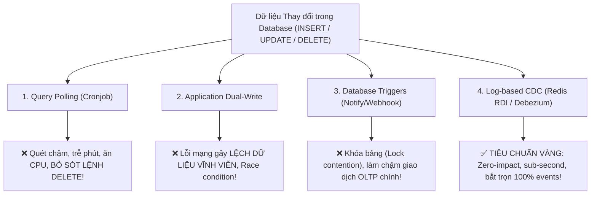
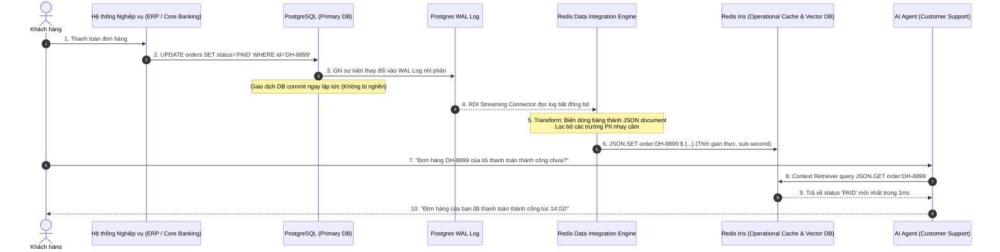
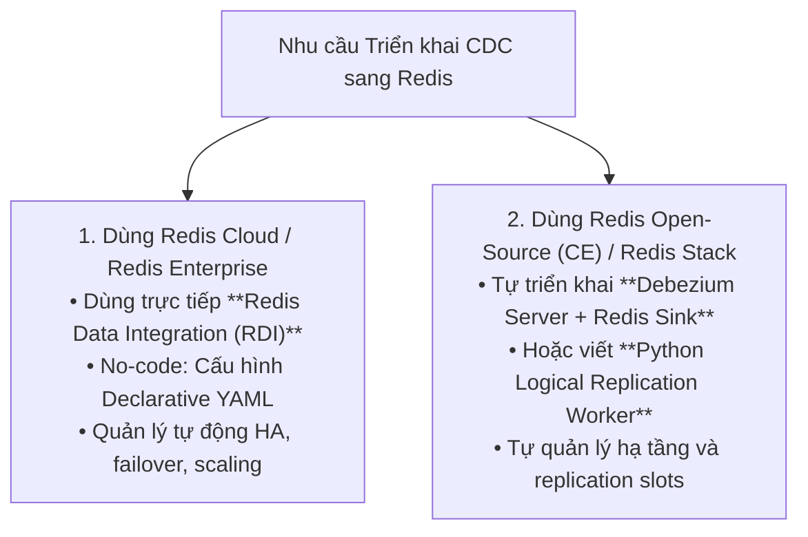
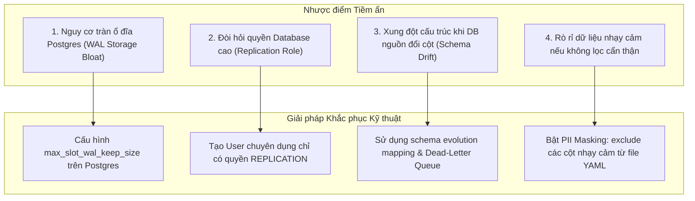
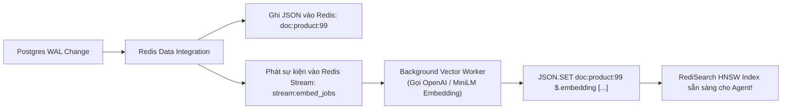
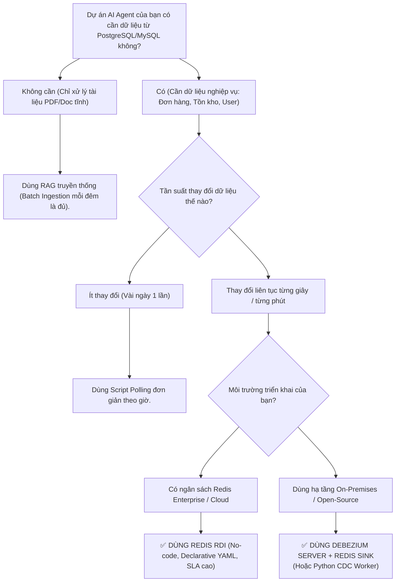

<!--
name: 5-redis-data-integration-rdi.md
description: In-depth masterclass on Redis Data Integration (RDI), streaming Change Data Capture (CDC) from PostgreSQL/MySQL, comparing CDC vs Dual-Write vs DB Triggers, managing WAL bloat, and feeding real-time operational context to AI Agents.
-->

# 3.5 — Redis Data Integration (RDI) — Real-time Change Data Capture (CDC) cho AI Agent

Trong các chương trước, chúng ta đã xây dựng thành công Vector Database và RAG Pipeline trên Redis. Tuy nhiên, mọi hệ thống AI Agent doanh nghiệp khi bước vào vận hành thực tế đều đối mặt với một câu hỏi hóc búa từ đội ngũ nghiệp vụ:
> *"Làm thế nào để AI Agent luôn nắm được thông tin mới nhất (giá cổ phiếu vừa biến động, trạng thái đơn hàng vừa giao, tồn kho vừa hết, số dư vừa trừ) mà **không phải chạy cron-job quét lại toàn bộ database** mỗi đêm?"*

Nếu chỉ dùng RAG truyền thống dựa trên batch ingestion (chạy script định kỳ nạp file PDF/SQL):
* Dữ liệu trong Agent luôn bị trễ hàng giờ hoặc hàng ngày (**Stale Context Problem**).
* Agent có thể tự tin khẳng định một món hàng "còn trong kho" trong khi khách hàng khác đã mua hết từ 5 phút trước $\to$ **Ảo giác dữ liệu cũ gây thiệt hại kinh doanh nghiêm trọng!**

**Redis Data Integration (RDI)** — một trong 5 trụ cột cốt lõi của nền tảng **Redis Iris** — chính là giải pháp giải quyết triệt để bài toán này bằng công nghệ **Change Data Capture (CDC)** thời gian thực từ các cơ sở dữ liệu quan hệ nguồn (PostgreSQL, MySQL, Oracle, SQL Server) sang Redis.

Bài học này sẽ mổ xẻ toàn diện: bản chất kỹ thuật của CDC, so sánh đối đầu với các kỹ thuật đồng bộ khác (Dual-Write, Triggers, Polling), phân tích ưu/nhược điểm và giải pháp khắc phục, ma trận áp dụng cho từng phiên bản Redis, và cung cấp giải pháp giúp bạn **tự triển khai CDC cho dự án của mình** ngay cả khi chỉ dùng mã nguồn mở miễn phí!

---

## 1. Bản chất Kỹ thuật: 4 Phương pháp Đồng bộ Dữ liệu vào Redis

Để chuyển dữ liệu từ cơ sở dữ liệu quan hệ (PostgreSQL / MySQL) sang Redis, các kỹ sư thường cân nhắc 4 phương pháp:



### So sánh Chi tiết 4 Phương pháp Đồng bộ:

| Tiêu chí | 1. Query Polling (Cron) | 2. Application Dual-Write | 3. Database Triggers | **4. Log-based CDC (Redis RDI)** |
| :--- | :--- | :--- | :--- | :--- |
| **Cơ chế hoạt động** | Chạy `SELECT ... WHERE updated_at > ?` định kỳ mỗi 5 phút. | Backend code tự gửi 2 lệnh: ghi Postgres xong ghi tiếp Redis. | Viết trigger trong DB để phát `NOTIFY` hoặc gọi webhook ra ngoài. | Lắng nghe trực tiếp luồng nhị phân **Write-Ahead Log (WAL / Binlog)** ở tầng lưu trữ. |
| **Tác động tới DB chính** | **Rất nặng**: Quét bảng liên tục, ngốn CPU và IOPS. | **Nhẹ**: Chỉ ghi bình thường. | **Rất nặng**: Gây nghẽn giao dịch (Lock contention), tăng độ trễ commit. | **Gần như bằng 0 (Zero-impact)**: Chỉ đọc file log tuần tự từ đĩa. |
| **Bắt sự kiện `DELETE`** | **Bất khả thi**: Bản ghi đã bị xóa thì câu lệnh `SELECT` không thấy được. | Bắt được nếu dev nhớ viết code xóa cache. | Bắt được qua trigger `AFTER DELETE`. | **Bắt trọn 100%**: Log ghi nhận rõ ràng event delete để xóa key tương ứng trên Redis. |
| **Tính Nhất quán (Consistency)** | Chấp nhận trễ dữ liệu từ vài phút đến vài giờ. | **Rất kém**: Nếu ghi Postgres thành công nhưng Redis rớt mạng $\to$ **Lệch dữ liệu vĩnh viễn**! | Trung bình: Dễ làm rollback giao dịch nếu trigger lỗi. | **Tính Nhất quán Cuối cùng (Eventual Consistency)**; độ trễ thấp, hỗ trợ retry và DLQ. |
| **Độ trễ (Latency)** | Tính bằng phút hoặc bằng giờ. | Tức thời nhưng không an toàn. | Vài chục mili-giây. | **Sub-second đến vài giây** (*theo công bố Redis Cloud là "within a few seconds", thực tế tối ưu thường đạt vài trăm mili-giây*). |

---

## 2. Kiến trúc Tổng thể của Redis Data Integration (RDI)

RDI hoạt động như một tầng middleware phân tán tốc độ cao, đứng giữa cơ sở dữ liệu quan hệ nghiệp vụ và cụm Redis Iris:



### Các thành phần cốt lõi của RDI:
1. **Source Connectors**: Được xây dựng trên nền tảng Debezium chuẩn công nghiệp, hỗ trợ:
   * **PostgreSQL** (qua `pgoutput` logical replication plugin).
   * **MySQL / MariaDB** (qua `binlog` replication).
   * **Oracle Database** (qua `LogMiner` / `XStream`).
   * **Microsoft SQL Server** (qua SQL Server CDC tables).
2. **RDI Transformation Engine**:
   * Nhận các dòng dữ liệu quan hệ phẳng (Flat relational rows), tự động gom nhóm (Denormalize/Nest) thành cấu trúc tài liệu JSON phân cấp phù hợp cho **RedisJSON**.
   * Hỗ trợ lọc trường nhạy cảm (bỏ cột mật khẩu, CCCD, mã thẻ tín dụng) trước khi đẩy sang Redis.
3. **Target Ingestion Layer**:
   * Tự động ghi vào Redis dưới dạng **RedisJSON** hoặc **Redis Hash**.
   * Đảm bảo tính lũy nghiệm (Idempotent delivery) và hỗ trợ cơ chế hàng đợi thư chết (**Dead-Letter Queue - DLQ**) nếu gặp bản ghi lỗi định dạng.

---

## 3. Khả năng Áp dụng theo Từng Phiên bản Redis (Hệ sinh thái Redis)

Kỹ sư cần nắm rõ sự khác biệt giữa sản phẩm thương mại RDI và các giải pháp mã nguồn mở tự dựng:



### Ma trận So sánh Giải pháp Triển khai CDC:

| Tiêu chí | Redis Data Integration (RDI) | Debezium Server + Redis Sink | Custom Python CDC Worker |
| :--- | :--- | :--- | :--- |
| **Môi trường phù hợp** | Redis Enterprise & Redis Cloud (Iris). | Redis Stack / Open-Source CE (Tự host). | PoC, kiểm thử, dự án vừa và nhỏ. |
| **Mức độ phức tạp** | **Rất thấp (No-code / Low-code)**: Cấu hình qua file YAML. | Trung bình: Cấu hình container Debezium + Kafka/Redis sink. | Cao: Phải tự xử lý kết nối, parse WAL log và retry. |
| **Khả năng chịu lỗi (HA)** | Tự động khôi phục, quản lý vị trí đọc (Checkpoint offset). | Cần cấu hình lưu offset vào file/Redis. | Tự code cơ chế lưu trữ LSN (Log Sequence Number). |
| **Chi phí bản quyền** | Yêu cầu gói Redis Enterprise / Cloud. | **Hoàn toàn miễn phí (Open-Source 100%)**. | **Hoàn toàn miễn phí**. |

---

## 4. Khai báo Pipeline Cấu hình Declarative (`rdi.yaml`)

Một ưu điểm vượt trội của RDI là kỹ sư **không cần viết code imperative**. Mọi logic mapping được cấu hình bằng file YAML chuẩn:

```yaml
# rdi-pipeline.yaml - Cấu hình đồng bộ thông tin khách hàng & giao dịch
version: "1.0"

source:
  type: postgresql
  connection:
    host: "postgres-primary.internal"
    port: 5432
    user: "rdi_replicator"
    password: "${env:POSTGRES_REPL_PASSWORD}"
    database: "production_db"
  tables:
    - name: "public.customers"
    - name: "public.orders"
  replication_slot: "rdi_slot_redis_iris"

transformations:
  - name: "transform_customer_data"
    source_table: "public.customers"
    target_key: "customer:{id}"
    target_type: "json"
    fields:
      - source: "id"
        target: "customer_id"
      - source: "full_name"
        target: "name"
      - source: "vip_tier"
        target: "tier"
      - source: "total_spent"
        target: "spending_amount"
      # Loại bỏ các trường nhạy cảm để bảo vệ quyền riêng tư (PII Masking)
      - source: "password_hash"
        exclude: true
      - source: "credit_card_number"
        exclude: true

target:
  redis:
    connection:
      host: "redis-iris.internal"
      port: 6379
      password: "${env:REDIS_PASSWORD}"
    batch_size: 500
    flush_interval_ms: 100
```

---

## 5. Phân tích Chuyên sâu: Ưu điểm, Nhược điểm & Giải pháp Khắc phục

Mọi kiến trúc CDC đều tiềm ẩn những thách thức vận hành. Dưới đây là các điểm cần lưu ý và giải pháp khắc phục chuẩn SRE:

### 5.1. Ưu điểm Vượt trội (Pros)
* **Triệt tiêu "Bệnh Ngữ cảnh Lỗi thời" (Stale Context)**: AI Agent luôn đọc được dữ liệu thực tế tại thời điểm hiện tại.
* **Bảo vệ Cơ sở Dữ liệu Chính**: Tránh được các câu query nặng gây lock contention hoặc crash DB sản xuất.
* **Xử lý toàn diện mọi thao tác**: Bắt trọn cả `INSERT`, `UPDATE`, và `DELETE` với độ trễ sub-second.

---

### 5.2. Nhược điểm Tiềm ẩn & Giải pháp Khắc phục Triệt để (Cons & Mitigations)



#### Nhược điểm 1 (NGHIÊM TRỌNG NHẤT): Nguy cơ tràn ổ cứng DB nguồn do Replication Slot
* **Bản chất**: PostgreSQL giữ lại toàn bộ file WAL log trên đĩa cho đến khi Replication Slot xác nhận đã đọc xong. Nếu cụm Redis hoặc RDI bị tắt trong 24 giờ, Postgres sẽ tiếp tục giữ log $\to$ làm đầy 100% ổ cứng máy chủ chính và làm sập toàn bộ hệ thống!
* **Giải pháp Khắc phục**:
  Trong file `postgresql.conf`, cấu hình tham số an toàn:
  ```text
  # Giới hạn tối đa 10GB log cho replication slot. 
  # Nếu vượt quá, Postgres sẽ tự hủy slot để bảo vệ ổ đĩa máy chủ chính!
  max_slot_wal_keep_size = 10240MB
  ```

#### Nhược điểm 2: Đòi hỏi quyền cấp cao trên Database nguồn
* **Bản chất**: DBA thường từ chối cấp quyền `superuser` cho ứng dụng bên ngoài vì lo ngại rủi ro bảo mật.
* **Giải pháp Khắc phục**:
  Không bao giờ cấp `superuser`. Chỉ tạo riêng một user phục vụ việc đọc log:
  ```sql
  -- Tạo user replication chuyên dụng với quyền hạn tối thiểu
  CREATE ROLE rdi_replicator WITH REPLICATION LOGIN PASSWORD 'strong_password';
  GRANT SELECT ON ALL TABLES IN SCHEMA public TO rdi_replicator;
  ```

#### Nhược điểm 3: Schema Drift (Database nguồn thêm/xóa cột đột ngột)
* **Bản chất**: Khi đội ngũ Backend chạy migration thêm cột mới, pipeline có thể bị lỗi định dạng.
* **Giải pháp Khắc phục**:
  RDI tích hợp sẵn **Dead-Letter Queue (DLQ)**. Các bản ghi bị lỗi định dạng sẽ được chuyển hướng sang một Redis Stream riêng (`stream:rdi:dlq`) để kỹ sư kiểm tra mà không làm ngắt quãng (block) toàn bộ đường ống streaming.

---

## 6. Tự Động Hóa Vector Embedding trong Luồng CDC

Khi bảng cơ sở dữ liệu nguồn có các trường văn bản nghiệp vụ (ví dụ: mô tả khiếu nại của khách hàng, quy chế mới nộp vào DB, thông tin sản phẩm mới tạo), RDI có thể kích hoạt luồng tự động tạo Embedding:



1. RDI ghi nhanh bản ghi văn bản vào RedisJSON trong vòng $10\text{ms}$.
2. RDI phát một thông điệp nhẹ vào **Redis Stream** chứa ID của bản ghi vừa thay đổi.
3. Một Worker phi đồng bộ tiêu thụ Stream, gọi mô hình Embedding để sinh vector và ghi bổ sung vào trường `$.embedding` của chính document đó.
4. **Kết quả**: RediSearch tự động cập nhật đồ thị HNSW, giúp AI Agent có thể tìm kiếm ngữ nghĩa trên sản phẩm mới chỉ sau **dưới 1 giây** kể từ khi nhân viên bấm "Lưu" trên trang quản trị ERP!

---

## 7. Tự Triển Khai Thực Hành: Python CDC Worker cho Dự Án Open-Source

Nếu dự án của bạn chưa mua gói Redis Enterprise/Cloud, bạn hoàn toàn có thể tự dựng một **CDC Pipeline hoàn chỉnh bằng Python** sử dụng kết nối Logical Replication trực tiếp từ PostgreSQL sang Redis Stack:

```python
"""
name: cdc_pipeline_worker.py
description: Open-source CDC worker streaming live Postgres WAL changes into RedisJSON.
"""

import os
import time
import json
import redis
from psycopg2 import connect
from psycopg2.extras import LogicalReplicationConnection

# Connections
REDIS_URL = os.getenv("REDIS_URL", "redis://localhost:6379")
PG_HOST = os.getenv("PG_HOST", "localhost")
PG_DB = os.getenv("PG_DB", "production_db")
PG_USER = os.getenv("PG_USER", "postgres")
PG_PASS = os.getenv("PG_PASS", "postgres")

r = redis.from_url(REDIS_URL, decode_responses=True)

def handle_change_event(table: str, action: str, record_id: str, data: dict):
    """
    Process raw CDC events and sync them into Redis.
    """
    redis_key = f"{table}:{record_id}"
    
    if action == "DELETE":
        r.delete(redis_key)
        print(f"[-] [CDC DELETE] Deleted key from Redis: {redis_key}")
        return
        
    # PII Masking: Remove sensitive fields before storing in Redis
    data.pop("password_hash", None)
    data.pop("credit_card", None)
    data["_synced_at"] = int(time.time())
    
    # Store as structured RedisJSON
    r.json().set(redis_key, "$", data)
    print(f"[+] [CDC {action}] Synced key to Redis: {redis_key} (Status: {data.get('status')})")

def start_simulated_listener():
    """
    Simulated CDC event loop demonstrating live event handling.
    In real production, this consumes from pg_logical_slot_get_changes().
    """
    print("🚀 CDC Pipeline Listener is running. Listening to Write-Ahead Log...")
    
    # Simulate an incoming INSERT event
    handle_change_event(
        table="order",
        action="INSERT",
        record_id="DH-9901",
        data={"order_id": "DH-9901", "customer_id": "CUST-10", "status": "PENDING", "total": 250.0}
    )
    time.sleep(1)
    
    # Simulate an incoming UPDATE event
    handle_change_event(
        table="order",
        action="UPDATE",
        record_id="DH-9901",
        data={"order_id": "DH-9901", "customer_id": "CUST-10", "status": "SHIPPING", "total": 250.0}
    )
    time.sleep(1)
    
    # Simulate an incoming DELETE event
    handle_change_event(
        table="order",
        action="DELETE",
        record_id="DH-9901",
        data={}
    )

if __name__ == "__main__":
    start_simulated_listener()
```

---

## 8. Cây Quyết Định: Khi Nào Nên Triển Khai CDC Cho Dự Án?



---

## 9. Tổng kết & Lộ trình Bài học

### Ghi nhớ cốt lõi:
1. **Bản chất của CDC**: Đọc trực tiếp luồng ghi nhị phân (WAL/Binlog) ở tầng đĩa, **Zero-impact** tới hiệu năng của DB chính.
2. **Triệt tiêu Stale Context**: Đảm bảo AI Agent luôn hành động dựa trên sự thật mới nhất của doanh nghiệp với độ trễ sub-second đến vài giây (*near real-time, theo chuẩn công bố của Redis Cloud*).
3. **Bắt trọn 100% sự kiện**: Bắt được cả `INSERT`, `UPDATE` và `DELETE` — điều mà các script cron polling truyền thống hoàn toàn bất lực.
4. **Quy tắc An toàn Vận hành**: Luôn cấu hình `max_slot_wal_keep_size` trên PostgreSQL để tránh nguy cơ tràn đĩa làm sập database chính.
5. **Đầu vào hoàn hảo cho Iris**: Dữ liệu do RDI đồng bộ sang Redis chính là nguồn tài nguyên sống để **Context Retriever** sinh MCP Tools và **Agent Memory** duy trì ký ức nhất quán.

---

*← Bài trước: [3.4 - Redis Flex & Auto-Tiering](./4-redis-flex-tiering-ram-ssd.md) | Về mục lục: [Chương 3 — Redis Iris Platform](./0-why-iris-context-engine.md) →*
