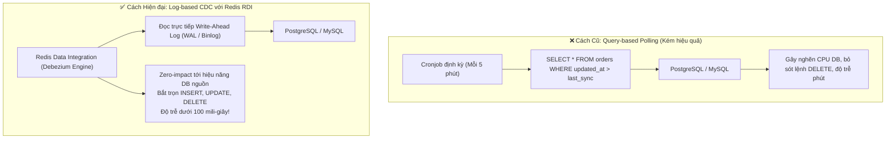
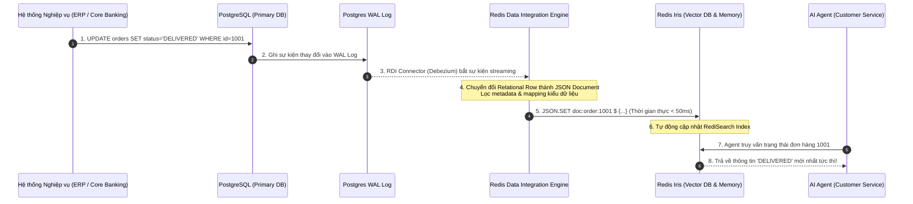
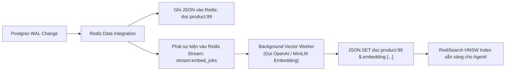

<!--
name: 5-redis-data-integration-rdi.md
description: In-depth masterclass on Redis Data Integration (RDI), streaming Change Data Capture (CDC) from PostgreSQL/MySQL, sub-second operational data synchronization, declarative transformation pipelines, and feeding real-time context to AI Agents.
-->

# 3.5 — Redis Data Integration (RDI) — Real-time Change Data Capture (CDC) cho AI Agent

Trong các chương trước, chúng ta đã xây dựng thành công Vector Database và RAG Pipeline trên Redis. Tuy nhiên, mọi hệ thống AI Agent doanh nghiệp khi bước vào vận hành thực tế đều đối mặt với một câu hỏi hóc búa từ đội ngũ nghiệp vụ:
> *"Làm thế nào để AI Agent luôn nắm được thông tin mới nhất (giá cổ phiếu vừa biến động, trạng thái đơn hàng vừa giao, tồn kho vừa hết, số dư vừa trừ) mà **không phải chạy cron-job quét lại toàn bộ database** mỗi đêm?"*

Nếu chỉ dùng RAG truyền thống dựa trên batch ingestion (chạy script định kỳ nạp file PDF/SQL):
* Dữ liệu trong Agent luôn bị trễ hàng giờ hoặc hàng ngày (**Stale Context Problem**).
* Agent có thể tự tin khẳng định một món hàng "còn trong kho" trong khi khách hàng khác đã mua hết từ 5 phút trước $\to$ Ảo giác dữ liệu cũ gây thiệt hại kinh doanh nghiêm trọng!

**Redis Data Integration (RDI)** — một trong 5 trụ cột cốt lõi của nền tảng **Redis Iris** — chính là giải pháp giải quyết triệt để bài toán này bằng công nghệ **Change Data Capture (CDC)** thời gian thực từ các cơ sở dữ liệu quan hệ nguồn (PostgreSQL, MySQL, Oracle, SQL Server) sang Redis.

---

## 1. Bản chất Kỹ thuật: Query Polling vs Log-based CDC

Có 2 cách để đưa dữ liệu từ cơ sở dữ liệu quan hệ (RDBMS) sang Redis:



### So sánh chi tiết hai phương pháp:

| Tiêu chí | Query-based Polling (Cron script) | Log-based CDC (Redis RDI) |
| :--- | :--- | :--- |
| **Cơ chế đọc** | Chạy câu lệnh `SELECT ... WHERE updated_at > ?` | Lắng nghe trực tiếp luồng nhị phân **Write-Ahead Log (WAL)** của Postgres hoặc **Binlog** của MySQL. |
| **Tác động tới DB nguồn** | Gây khóa bảng (Lock contention), ăn CPU và ngốn IOPS của DB chính. | **Gần như bằng 0 (Zero-impact)**, vì chỉ đọc file log tuần tự ở tầng lưu trữ. |
| **Bắt sự kiện `DELETE`** | **Rất khó / Bất khả thi** (bản ghi đã bị xóa khỏi bảng thì câu lệnh `SELECT` không thể thấy được). | **Bắt trọn 100%**, log ghi nhận rõ ràng event delete để xóa key tương ứng trên Redis. |
| **Độ trễ dữ liệu (Latency)** | Tính bằng phút hoặc bằng giờ. | **Thời gian thực (Sub-second, thường < 100ms)**. |
| **Mức độ phức tạp code** | Phải tự viết script xử lý lỗi, retry, pagination, schema mapping. | **Khai báo Declarative (No-code / Low-code)** qua file cấu hình YAML. |

---

## 2. Kiến trúc Tổng thể của Redis Data Integration (RDI)

RDI hoạt động như một tầng middleware phân tán tốc độ cao, đứng giữa cơ sở dữ liệu quan hệ nghiệp vụ và cụm Redis Stack / Redis Iris:



### Các thành phần cốt lõi của RDI:
1. **Source Connectors**: Được xây dựng trên nền tảng Debezium chuẩn công nghiệp, hỗ trợ:
   * **PostgreSQL** (qua `pgoutput` logical replication plugin).
   * **MySQL / MariaDB** (qua `binlog` replication).
   * **Oracle Database** (qua `LogMiner` / `XStream`).
   * **Microsoft SQL Server** (qua SQL Server CDC tables).
2. **RDI Transformation Engine**:
   * Nhận các dòng dữ liệu quan hệ phẳng (Flat relational rows), tự động gom nhóm (Nest/Denormalize) thành cấu trúc tài liệu JSON phân cấp phù hợp cho **RedisJSON**.
   * Hỗ trợ lọc trường nhạy cảm (bỏ cột mật khẩu, CCCD, mã thẻ tín dụng) trước khi đẩy sang Redis.
3. **Target Ingestion Layer**:
   * Tự động ghi vào Redis dưới dạng **RedisJSON** hoặc **Redis Hash**.
   * Đảm bảo tính nhất quán (Idempotent delivery) và hỗ trợ cơ chế hàng đợi thư chết (**Dead-Letter Queue - DLQ**) nếu gặp bản ghi lỗi định dạng.

---

## 3. Khai báo Pipeline Cấu hình Declarative (`rdi.yaml`)

Một ưu điểm vượt trội của RDI là kỹ sư **không cần viết code Python hay Java** để duy trì pipeline đồng bộ. Mọi logic mapping được cấu hình bằng file YAML chuẩn:

```yaml
# rdi-pipeline.yaml - Cấu hình đồng bộ thông tin khách hàng & giao dịch
version: "1.0"

source:
  type: postgresql
  connection:
    host: "postgres-primary.internal"
    port: 5432
    user: "rdi_replicator"
    password: "${env:POSTGRES_REPL_PASSWORD}"
    database: "production_db"
  tables:
    - name: "public.customers"
    - name: "public.orders"
  replication_slot: "rdi_slot_redis_iris"

transformations:
  - name: "transform_customer_data"
    source_table: "public.customers"
    target_key: "customer:{id}"
    target_type: "json"
    fields:
      - source: "id"
        target: "customer_id"
      - source: "full_name"
        target: "name"
      - source: "vip_tier"
        target: "tier"
      - source: "total_spent"
        target: "spending_amount"
      # Loại bỏ trường password_hash và ssn vì lý do an toàn bảo mật
      - source: "password_hash"
        exclude: true

target:
  redis:
    connection:
      host: "redis-iris.internal"
      port: 6379
      password: "${env:REDIS_PASSWORD}"
    batch_size: 500
    flush_interval_ms: 100
```

---

## 4. Tự động hóa Vector Embedding trong Luồng CDC

Khi bảng cơ sở dữ liệu nguồn có các trường văn bản nghiệp vụ (ví dụ: mô tả khiếu nại của khách hàng, quy chế mới nộp vào DB, thông tin sản phẩm mới tạo), RDI có thể kích hoạt luồng tự động tạo Embedding:



1. RDI ghi nhanh bản ghi văn bản vào RedisJSON trong vòng $10\text{ms}$.
2. RDI phát một thông điệp nhẹ vào **Redis Stream** chứa ID của bản ghi vừa thay đổi.
3. Một Worker phi đồng bộ tiêu thụ Stream, gọi mô hình Embedding để sinh vector và ghi bổ sung vào trường `$.embedding` của chính document đó.
4. **Kết quả**: RediSearch tự động cập nhật đồ thị HNSW, giúp AI Agent có thể tìm kiếm ngữ nghĩa trên sản phẩm mới chỉ sau **dưới 1 giây** kể từ khi nhân viên bấm "Lưu" trên trang quản trị ERP!

---

## 5. Quản trị & Vận hành RDI bằng `rdi-cli`

Redis cung cấp công cụ dòng lệnh chuyên dụng **`rdi-cli`** để quản lý vòng đời của các data pipeline:

### 5.1. Triển khai Pipeline
```bash
# Xác thực file cấu hình
rdi-cli validate -f rdi-pipeline.yaml

# Deploy pipeline lên cluster
rdi-cli deploy -f rdi-pipeline.yaml --name customer-sync-pipeline
```

### 5.2. Giám sát Trạng thái & Độ trễ (Replication Lag)
```bash
rdi-cli status --name customer-sync-pipeline
```

Output giám sát mẫu:
```text
● Pipeline: customer-sync-pipeline [RUNNING]
  Source: PostgreSQL (production_db) -> Target: Redis (redis-iris.internal)
  -------------------------------------------------------------
  Throughput:           1,420 events/sec
  Replication Lag:      42 ms (Near Real-time)
  Processed Events:     12,850,400
  Failed / DLQ Events:  0
  Uptime:               14 days, 6 hours
```

> [!IMPORTANT]
> Nếu tham số **Replication Lag** vượt quá $1,000\text{ms}$, cần kiểm tra ngay băng thông mạng giữa cơ sở dữ liệu nguồn và Redis hoặc tăng tham số `batch_size` trong file cấu hình RDI.

---

## 6. Thực hành Python Lab: Giả lập CDC Pipeline từ RDBMS sang Redis

Nếu chưa triển khai cụm RDI Enterprise hoàn chỉnh, bạn hoàn toàn có thể viết một CDC worker nhẹ bằng Python để hiểu trọn vẹn nguyên lý chuyển dịch dữ liệu từ quan hệ sang RedisJSON:

```python
"""
name: simulate_cdc_pipeline.py
description: Simulated Change Data Capture (CDC) worker replicating Postgres row changes 
             into RedisJSON with automatic RediSearch Vector Index updates.
"""

import time
import json
import numpy as np
import redis
from sentence_transformers import SentenceTransformer

client = redis.Redis(host="localhost", port=6379, decode_responses=False)
embedder = SentenceTransformer("all-MiniLM-L6-v2")

def handle_cdc_event(event_type: str, table: str, record_id: str, row_data: dict):
    """
    Xử lý sự kiện CDC từ Transaction Log của DB quan hệ:
    - INSERT / UPDATE: Chuyển đổi thành RedisJSON và cập nhật vector.
    - DELETE: Xóa key tương ứng khỏi Redis.
    """
    redis_key = f"rdi:{table}:{record_id}"

    if event_type == "DELETE":
        client.delete(redis_key)
        print(f"[-] [CDC DELETE] Đã xóa key khỏi Redis: {redis_key}")
        return

    # Với INSERT hoặc UPDATE:
    # 1. Sinh vector embedding tự động cho nội dung mới
    text_content = f"{row_data.get('title', '')}: {row_data.get('description', '')}"
    vec = embedder.encode(text_content, normalize_embeddings=True).tolist()

    # 2. Đóng gói JSON document hoàn chỉnh
    document = {
        "id": record_id,
        "table": table,
        "title": row_data.get("title", ""),
        "description": row_data.get("description", ""),
        "status": row_data.get("status", "active"),
        "updated_at": int(time.time()),
        "embedding": vec
    }

    # 3. Ghi vào RedisJSON
    client.json().set(redis_key, "$", document)
    print(f"[+] [CDC {event_type}] Đồng bộ thành công: {redis_key} (Status: {document['status']})")

# Demo giả lập các sự kiện phát sinh từ Postgres WAL:
if __name__ == "__main__":
    print("🚀 Khởi động CDC Pipeline Listener...")

    # Sự kiện 1: Đơn hàng mới được tạo trong Postgres
    handle_cdc_event(
        event_type="INSERT",
        table="orders",
        record_id="ord_9901",
        row_data={
            "title": "Đơn hàng máy chủ Dell R750",
            "description": "Đơn hàng thanh toán bằng thẻ tín dụng doanh nghiệp, chuyển phát hỏa tốc.",
            "status": "PROCESSING"
        }
    )

    # Sự kiện 2: Trạng thái đơn hàng đổi thành DELIVERED sau 2 giây
    time.sleep(1)
    handle_cdc_event(
        event_type="UPDATE",
        table="orders",
        record_id="ord_9901",
        row_data={
            "title": "Đơn hàng máy chủ Dell R750",
            "description": "Đơn hàng đã được giao thành công tới phòng Server Hà Nội.",
            "status": "DELIVERED"
        }
    )

    # Sự kiện 3: Đơn hàng bị hủy/xóa
    time.sleep(1)
    handle_cdc_event(
        event_type="DELETE",
        table="orders",
        record_id="ord_9901",
        row_data={}
    )
```

---

## 7. Production Checklist cho CDC Pipeline

1. **Cấu hình Logical Replication trên DB Nguồn**: Đảm bảo Postgres có tham số `wal_level = logical` và `max_replication_slots >= 5` trong file `postgresql.conf`.
2. **Quyền riêng tư & Bảo mật (PII Masking)**: Luôn sử dụng bộ lọc `exclude` trong file cấu hình RDI để ngăn chặn việc đưa các trường nhạy cảm (thẻ ngân hàng, mật khẩu, thông tin y tế) sang vùng nhớ của AI Agent.
3. **Giám sát Replication Slot Size**: Đảm bảo Replication Slot trên Postgres không bị phình to làm cạn kiệt ổ đĩa DB chính nếu cụm Redis gặp sự cố tạm dừng kết nối.
4. **Kết nối liền mạch với Redis Iris**: Dữ liệu do RDI nạp vào chính là đầu vào thời gian thực cho **Context Retriever** và **Agent Memory** mà chúng ta sẽ khai thác ở các bài học tiếp theo!

---

*← Bài trước: [3.4 - Redis Flex & Auto-Tiering](./4-redis-flex-tiering-ram-ssd.md) | Về mục lục: [Chương 3 — Redis Iris Platform](./0-why-iris-context-engine.md) →*
